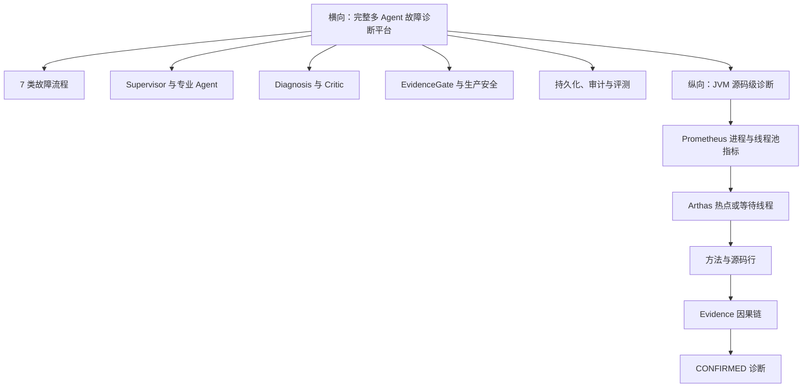

# FaultPilot T 型五天项目掌握计划

## 1. 文档定位

本计划采用 T 型掌握方式：

- 横向：掌握 FaultPilot 整体多 Agent 架构、统一诊断链路和 7 类故障流程。
- 纵向：深入 JVM 诊断，能够把指标、线程、方法、源码行和最终结论完整串联。

本文是新的学习路线，不替代已有的《FaultPilot 五天项目掌握计划》和《FaultPilot 第 1 天细分学习计划》。

详细的第一天执行表见：[FaultPilot T 型第 1 天细分学习计划](FaultPilot-T型第1天细分学习计划.md)。

## 2. 五天后的目标

完成本计划后，应达到以下水平：

1. 能画出 FaultPilot、业务服务、Prometheus、Arthas、PostgreSQL、Redis、GLM-5 之间的关系。
2. 能用统一模板讲清 7 类故障的信号、工具、Evidence、Agent、CauseCode 和可信等级。
3. 能深入讲清 CPU 热点与线程池耗尽两条 JVM 源码级诊断链。
4. 能解释 Supervisor、Specialist、Diagnosis、Critic、EvidenceGate 的职责和循环条件。
5. 能解释为什么数据库、Redis 和下游依赖当前主要是组件级定位，以及缺少哪些生产证据。
6. 能解释生产只读、权限、审计、模型失败和安全处置边界。
7. 能独立完成一个 JVM 方向的小型端到端增强，并补齐测试与验证记录。

## 3. T 型知识结构



### 3.1 学习投入比例

| 方向 | 比例 | 掌握深度 |
|---|---:|---|
| JVM 源码级诊断 | 40% | 能从指标追到线程、方法、源码行和结论 |
| 多 Agent 编排与反思 | 30% | 能解释模型角色、工具循环、修订和第二轮补证 |
| Evidence 与生产安全 | 15% | 能解释证据约束、可信度、权限和只读边界 |
| 数据库、Redis、依赖扩展点 | 15% | 能讲清当前组件级能力和生产级补强方向 |

## 4. 当前能力边界

| 领域 | 当前已实现 | 当前定位层级 | 进一步生产化需要 |
|---|---|---|---|
| JVM CPU | 进程 CPU、Arthas 热点线程、应用方法和源码行 | 源码级 | 持续剖析、火焰图、跨实例聚合 |
| JVM 线程池 | Executor 饱和、WAITING 线程、阻塞操作和源码行 | 源码级 | 多线程池目录、死锁与锁竞争专项分析 |
| 数据库慢查询 | SQL 指纹、调用次数、均值/最大耗时 | SQL 指纹级 | Trace 时间相关、执行计划、锁等待分析 |
| 数据库连接池 | Hikari 活跃/最大连接、等待、PostgreSQL 持有者查询 | 连接池级 | 连接泄漏追踪、事务归因和完整持有链 |
| Redis 服务端 | 命令路径延迟、服务检查、Slow Log 接入点 | 组件级 | 内存、淘汰、热点 Key、集群拓扑关联 |
| Redis 客户端池 | 活跃连接、最大连接、等待请求 | 客户端池级 | 调用方归因、连接泄漏和 Trace 关联 |
| 下游依赖 | 下游服务延迟和可用性 | 服务级 | Jaeger Span、具体接口和调用代码映射 |

重要表达：缺失 Trace、执行计划或高价值补强证据时，系统会返回 `SUPPORTED` 或 `INCONCLUSIVE`，不会根据模型自然语言伪造 `CONFIRMED`。

## 5. 横向统一分析模板

学习任何一种故障，都使用同一组问题：

```text
用户看到什么现象？
业务服务暴露什么指标或诊断数据？
哪个只读工具采集数据？
生成什么 EvidenceType？
RoutingAdvisor 生成什么信号？
Supervisor 调度哪个 Agent？
Agent 还会调用哪些工具？
Diagnosis 提出什么 CauseCode？
Critic 检查什么？
EvidenceGate 需要哪些直接证据、补强证据和反证？
最终为什么是 SUPPORTED、CONFIRMED 或 INCONCLUSIVE？
生产环境还需要接入什么？
```

## 6. 七类故障总表

| 故障场景 | 主要 Agent | 直接 Evidence | 补强 Evidence | 根因 |
|---|---|---|---|---|
| CPU 热点 | `JVM_AGENT` | `PROCESS_CPU_HIGH` | `CPU_HOT_METHOD_FOUND` 或 `REPEATED_RUNNABLE_STACK` | `JVM_CPU_HOTSPOT` |
| 线程池耗尽 | `JVM_AGENT` | `THREAD_POOL_ACTIVE_AT_MAX` 或队列增长 | `BLOCKING_TASK_FOUND` | `JVM_THREAD_POOL_EXHAUSTED` |
| 慢 SQL | `DATABASE_AGENT` | `SLOW_SQL_FOUND` | `API_AND_SQL_TIME_CORRELATED` 或 `ABNORMAL_EXECUTION_PLAN` | `DB_SLOW_QUERY` |
| 数据库连接池耗尽 | `DATABASE_AGENT` | `DB_POOL_ACTIVE_AT_MAX` 或等待升高 | `CONNECTION_HOLDING_QUERY_FOUND` | `DB_POOL_EXHAUSTED` |
| Redis 服务端延迟 | `CACHE_AGENT` | `REDIS_COMMAND_LATENCY_HIGH` | `REDIS_SLOW_COMMAND_FOUND` 或 Trace 相关证据 | `REDIS_SERVER_LATENCY` |
| Redis 客户端池耗尽 | `CACHE_AGENT` | `REDIS_CLIENT_POOL_PENDING_HIGH` | `REDIS_COMMAND_LATENCY_NORMAL` 用于隔离服务端问题 | `REDIS_CLIENT_POOL_EXHAUSTED` |
| 下游依赖超时 | `DEPENDENCY_AGENT` | `DOWNSTREAM_LATENCY_HIGH` | `SLOW_CHILD_SPAN_FOUND` | `DEPENDENCY_TIMEOUT` |

## 7. 五天总览

| 天数 | T 型位置 | 核心主题 | 当日成果 |
|---|---|---|---|
| 第 1 天 | 横向全景 | 架构、统一主链路、7 类故障矩阵 | 全景架构图、七类故障表、统一流程图 |
| 第 2 天 | JVM 纵向 | CPU 与线程池两条源码级诊断链 | 两张 JVM 因果链、Arthas 证据解读 |
| 第 3 天 | 核心横梁 | 多 Agent 编排、模型约束、自我反思 | Agent 状态图、修订/补证案例 |
| 第 4 天 | 横向边界 | Evidence、生产安全、DB/Redis/依赖扩展 | 能力边界表、异常降级与安全表 |
| 第 5 天 | 综合验证 | JVM 增强、闭卷讲解、面试表达 | 代码增量、测试、验证记录、讲稿 |

## 8. 第 1 天：横向掌握完整系统

### 8.1 学习重点

- 建立运行时组件地图，不深入每个工具实现。
- 跟踪一条代表性 CPU Incident 的完整生命周期。
- 从枚举、路由和 EvidenceGate 规则中整理 7 类故障流程。
- 明确每类故障当前定位层级和缺失证据。

### 8.2 主要源码

- `IncidentController`
- `IncidentService`
- `IncidentOrchestrator`
- `BaselineCollector`
- `RoutingAdvisor`
- `EvidenceType`、`CauseCode`、`AgentType`
- `EvidenceGate`
- order/inventory 两个 `ScenarioCode`
- `docs/verification-record.md`

### 8.3 当日输出

- 系统运行时架构图。
- 一张统一 Incident 主链路图。
- 一张完整的 7 类故障矩阵。
- 一段两分钟的“当前能力与边界”说明。

详细步骤见 T 型第 1 天细分计划。

## 9. 第 2 天：JVM 源码级诊断

### 9.1 CPU 热点链

```text
CPU_HOTSPOT 注入
→ process_cpu_usage 上升
→ PROCESS_CPU_HIGH
→ JVM_AGENT
→ Arthas hot threads
→ CPU_HOT_METHOD_FOUND
→ 应用方法与源码行
→ JVM_CPU_HOTSPOT / CONFIRMED
```

### 9.2 线程池耗尽链

```text
THREAD_POOL_EXHAUSTED 注入
→ Executor active 接近 max
→ THREAD_POOL_ACTIVE_AT_MAX
→ JVM_AGENT
→ Arthas WAITING threads
→ BLOCKING_TASK_FOUND
→ LockSupport.park 与源码行
→ JVM_THREAD_POOL_EXHAUSTED / CONFIRMED
```

### 9.3 深入源码

- `faultpilot-lab-order/fault/FaultScenarioManager.java`
- `triage/BaselineCollector.java`
- `observability/PrometheusClient.java`
- `observability/ArthasClient.java`
- `tool/http/ProductionDiagnosticToolsConfiguration.java`
- `agent/runner/SpecialistAgentRunner.java`
- `diagnosis/EvidenceGate.java`

### 9.4 当日验收

- 能解释进程 CPU 高和热点方法之间为何需要两份独立证据。
- 能解释线程池饱和、WAITING 线程和阻塞位置之间的因果关系。
- 能读懂 Arthas 返回并指出应用栈过滤、结果条数限制和只读命令约束。
- 能解释为什么 CPU 正常是 CPU 热点根因的反证。

## 10. 第 3 天：多 Agent 编排与自我反思

### 10.1 学习链路

```text
Baseline Evidence
→ RoutingAdvisor 本地信号
→ GLM Supervisor 规划
→ Specialist Agent 多步工具调用
→ GLM Diagnosis Proposal
→ GLM Critic 审查
→ 本地 EvidenceGate
→ 修订、第二轮补证或结束
```

### 10.2 深入源码

- `RoutingAdvisor.java`
- `SupervisorPlanner.java`
- `PlanValidator.java`
- `SpecialistAgentRunner.java`
- `ToolInvocationGuard.java`
- `RemoteModelClient.java`
- `DiagnosisSynthesizer.java`
- `DiagnosisCritic.java`
- `EvidenceGate.java`
- `IncidentOrchestrator.java`

### 10.3 必须掌握的分支

- `PASS`：进入 EvidenceGate。
- `REVISE`：Diagnosis 根据 Critic 意见修订一次，再次审查。
- `FOLLOW_UP`：回到 Supervisor，规划针对性的下一轮 Agent。
- `REJECT`：没有可执行补证时结束为不可信结果。
- 模型超时或非法结构化输出：记录模型角色并结束为 `INCONCLUSIVE`，不使用本地模型替代。
- 调查最多两轮，防止无限循环和成本失控。

### 10.4 当日实验

- 模糊 symptom。
- 与真实指标矛盾的 symptom。
- 缺少 Arthas 或 Trace 的补证案例。
- 复盘一次模型超时事件和 90 秒修复记录。

### 10.5 当日验收

能独立回答：为什么这是多 Agent、反思由谁执行、本地规则做什么、不合格后何时修订、何时重新规划、何时结束。

## 11. 第 4 天：Evidence、生产安全与横向扩展

### 11.1 Evidence 与可信度

- Evidence ID 白名单。
- source、entity、时间窗、摘要、原始引用和内容哈希。
- 直接证据、补强证据和反证。
- `SUPPORTED`、`CONFIRMED`、`CONTRADICTED`、`INCONCLUSIVE`。

### 11.2 数据库

重点掌握：

- Hikari 指标与 PostgreSQL 内部状态的区别。
- SQL 指纹为什么避免直接暴露完整敏感 SQL。
- 累计慢 SQL 为什么不能证明当前事故相关。
- Trace、锁和执行计划怎样把组件级诊断提升到更精确归因。

### 11.3 Redis

重点掌握：

- 服务端命令延迟与客户端连接池等待的区别。
- 正常命令延迟如何成为客户端池耗尽的隔离证据。
- 内存、淘汰、命中率、热点 Key 属于后续工具扩展，而不是模型自由推断。

### 11.4 下游依赖

重点掌握：

- Prometheus 服务级延迟与 Jaeger Span 的区别。
- 没有 Trace 时为什么不能断言具体接口或代码位置。
- Service Catalog 如何限制允许调查的服务和后端。

### 11.5 生产安全

- `PRODUCTION_READ_ONLY`。
- 预注册工具与固定参数。
- CSRF、角色权限和审计事件。
- Action Catalog、人工确认和恢复验证。
- 密钥与租户地址不进入 Git、Prompt 或 Evidence。

### 11.6 当日验收

随机选择数据库、Redis 或依赖场景，能解释当前结论、缺失证据、可信等级和生产接入方案，而不是只背 CauseCode。

## 12. 第 5 天：综合改造与闭卷验收

### 12.1 推荐 JVM 增强题目

新增一个受控的 `JVM_GC_PRESSURE` 诊断切片：

1. 实验服务增加有 TTL、可恢复的内存分配压力。
2. Prometheus 采集 GC pause 或 allocation pressure 指标。
3. 增加对应 EvidenceType 和 CauseCode。
4. RoutingAdvisor 将信号路由给 `JVM_AGENT`。
5. Specialist 通过受控工具补充 JVM Evidence。
6. EvidenceGate 定义直接信号、补强证据和反证。
7. 增加单元测试、端到端验证和文档记录。

当天不要求把 GC 诊断做成生产级平台，但必须形成完整垂直切片，不能只添加枚举或 Prompt。

### 12.2 闭卷讲解

准备四段内容：

1. 5 分钟项目整体介绍。
2. 10 分钟 JVM 源码级诊断案例。
3. 5 分钟多 Agent 反思与 EvidenceGate。
4. 5 分钟生产能力边界和后续扩展。

### 12.3 最终验收

- 随机抽取 7 类故障中的任意一种，完整回答横向模板。
- 闭卷画出 Agent 状态图和 JVM 两条因果链。
- 根据一个 `INCONCLUSIVE` Incident 判断失败阶段。
- 独立运行测试、恢复实验环境并检查 Git 变更。
- 能说明新增故障需要修改哪些层以及为什么。

## 13. 每日学习方法

每个学习单元使用同一个循环：

```text
先预测系统行为
→ 运行或阅读真实记录
→ 根据 Event/Evidence 验证
→ 回到源码定位责任类
→ 画出因果链
→ 闭卷复述
→ 记录仍然缺失的证据
```

每天结束前必须完成：

- 一份图或表。
- 一个真实 Incident 或验证记录。
- 一次闭卷复述。
- 一组未解决问题。
- 一次环境恢复检查。

## 14. 面试表达基线

推荐表述：

> 我独立完成了多 Agent 故障诊断框架和生产只读证据链，其中重点将 JVM 故障打通到线程、方法和源码行级定位；数据库、Redis 和下游依赖完成了组件级只读诊断。对于尚未接入的 Trace 时间相关、异常执行计划等高价值证据，系统会通过 EvidenceGate 降级可信度，而不是让模型根据自然语言伪造结论。

避免声称：

- 所有组件都已经达到源码级定位。
- 系统可以在生产环境自动修改代码、索引或配置。
- 大模型可以直接执行任意诊断命令。
- `SUPPORTED` 等同于已经完整确认根因链。

## 15. 后续使用方式

后续直接使用：

```text
开始 T 型第 1 天
继续 T 型第 1 天
进行 T 型第 1 天验收
开始 T 型第 2 天
```

每一天通过当日验收后再进入下一天。
