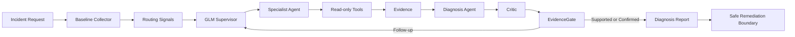

# FaultPilot 五天项目掌握计划

## 1. 计划目标

本计划面向已经具备 Java、Spring Boot、数据库、Redis 和微服务基础的开发者。五天内不重复学习通用知识，而是以真实运行、源码跟踪、故障实验和独立修改为主，达到以下结果：

1. 能脱离源码讲清 FaultPilot 的模块划分、核心数据结构和完整诊断链路。
2. 能解释每一种故障的监控数据、Evidence、Agent 路由和最终诊断等级。
3. 能说明 Supervisor、专业 Agent、Diagnosis Agent、Critic 和 EvidenceGate 的边界。
4. 能定位模型、工具、证据或编排流程失败的具体阶段。
5. 能独立增加一种故障诊断能力，并补齐测试与验证记录。
6. 能完成 5 分钟项目介绍、15 分钟源码讲解和常见面试追问。

建议每天投入 4 到 6 小时。每天必须同时包含源码阅读、运行验证、主动复述和书面输出，不能只看文档。

## 2. 最终知识地图



贯穿五天的核心原则：

- 用户描述是弱先验，结构化 Evidence 优先。
- 模型负责规划、选择工具、归纳和批判，不直接创造事实。
- 工具负责从受控数据源采集事实。
- Evidence ID 是模型结论与可审计事实之间的引用关系。
- EvidenceGate 是最终可信度权威，不由模型自行宣告 `CONFIRMED`。
- 生产模式默认只读，模型文本不能直接变成生产操作。

## 3. 五天总览

| 天数 | 主题 | 当日核心产出 |
|---|---|---|
| 第 1 天 | 架构与 Incident 主链路 | 架构图、Incident 时序图、核心对象说明 |
| 第 2 天 | 可观测性、工具与 Evidence | 故障场景对照表、Evidence 来源表 |
| 第 3 天 | 多 Agent、模型约束与自我反思 | Agent 决策图、两轮补证案例分析 |
| 第 4 天 | 生产安全、持久化、可靠性与测试 | 安全边界表、异常降级表、测试地图 |
| 第 5 天 | 独立改造与闭卷验收 | 一个端到端增量功能、项目讲稿、问答清单 |

## 4. 第 1 天：架构与 Incident 主链路

### 4.1 学习目标

- 认识四个 Maven 模块及其运行关系。
- 掌握 Incident 从 HTTP 请求到最终报告的状态变化。
- 理解 LangGraph4j 编排节点、条件边和 PostgreSQL checkpoint。
- 理解 Incident、Snapshot、Evidence、AgentTask、Proposal、Critique 和 Decision 的关系。

### 4.2 源码阅读顺序

1. `pom.xml`
2. `faultpilot-server/src/main/java/com/astrayzjt/faultpilot/FaultPilotApplication.java`
3. `incident/api/IncidentController.java`
4. `incident/application/IncidentService.java`
5. `incident/persistence/IncidentRepository.java`
6. `orchestration/IncidentGraphState.java`
7. `orchestration/IncidentOrchestrator.java`
8. `incident/event/IncidentEventService.java`
9. `common/domain` 下的核心 record 和 enum

### 4.3 必须跟踪的调用链

以 CPU 或线程池场景创建一个 Incident，在以下位置设置断点或日志观察点：

```text
IncidentController.create
IncidentService.create
IncidentOrchestrator.start
IncidentOrchestrator.collectBaselineNode
IncidentOrchestrator.supervisorNode
IncidentOrchestrator.dispatchNode
IncidentOrchestrator.synthesizeNode
IncidentOrchestrator.critiqueNode
IncidentOrchestrator.gateNode
```

重点回答：

- 为什么创建接口立即返回 `202 Accepted`？
- Incident 的规范化快照为什么创建后不再随意变化？
- 为什么事件流可以在页面刷新后重放？
- 第一轮与第二轮怎样保存在同一 Incident 中？
- 哪些状态属于终态，`FAILED` 与 `INCONCLUSIVE` 有什么区别？

### 4.4 当日实操

1. 检查 8080、8081、18082 和 9090 的运行状态。
2. 注入一次 `CPU_HOTSPOT` 或 `THREAD_POOL_EXHAUSTED`。
3. 使用模糊描述创建 Incident。
4. 对照页面 Event stream，逐个找到事件产生的源码位置。
5. 查询数据库中的 Incident、AgentTask、模型调用和事件记录。
6. 恢复故障，确认实验服务诊断标志全部回到 `false`。

### 4.5 当日输出

- 一张模块架构图。
- 一张 Incident 时序图。
- 一页核心领域对象说明。
- 一段不超过 3 分钟的口头流程复述。

### 4.6 验收标准

不看代码，能够从 `POST /api/incidents` 一直讲到 `DIAGNOSIS_COMPLETED`，并说明每个中间对象由谁生成、保存在哪里、供谁使用。

## 5. 第 2 天：可观测性、工具与 Evidence

### 5.1 学习目标

- 理解业务服务如何通过 Actuator 和 Micrometer 暴露指标。
- 理解 Prometheus、Arthas、PostgreSQL、Redis 和 Jaeger 的职责边界。
- 能从一条 Evidence 反向定位到数据源、工具和转换代码。
- 理解直接证据、反证、缺失证据和不可用数据的区别。

### 5.2 源码阅读顺序

1. `triage/BaselineCollector.java`
2. `observability/PrometheusClient.java`
3. `observability/ActuatorClient.java`
4. `observability/ArthasClient.java`
5. `observability/PostgresDiagnosticsClient.java`
6. `observability/RedisDiagnosticsClient.java`
7. `observability/JaegerTraceDiagnosticsClient.java`
8. `tool/http/ProductionDiagnosticToolsConfiguration.java`
9. `tool/registry/ToolRegistry.java`
10. `evidence/EvidenceService.java`
11. `faultpilot-lab-order` 和 `faultpilot-lab-inventory` 中的 `FaultScenarioManager`

### 5.3 场景对照表

| 场景 | 主要 Agent | 关键 Evidence | 期望根因 |
|---|---|---|---|
| `CPU_HOTSPOT` | `JVM_AGENT` | `PROCESS_CPU_HIGH`、`CPU_HOT_METHOD_FOUND` | `JVM_CPU_HOTSPOT` |
| `THREAD_POOL_EXHAUSTED` | `JVM_AGENT` | `THREAD_POOL_ACTIVE_AT_MAX`、`BLOCKING_TASK_FOUND` | `JVM_THREAD_POOL_EXHAUSTED` |
| `DB_POOL_EXHAUSTED` | `DATABASE_AGENT` | `DB_POOL_ACTIVE_AT_MAX` | `DB_POOL_EXHAUSTED` |
| `SLOW_SQL` | `DATABASE_AGENT` | `SLOW_SQL_FOUND` | `DB_SLOW_QUERY` |
| `REDIS_LATENCY` | `CACHE_AGENT` | `REDIS_COMMAND_LATENCY_HIGH` | `REDIS_SERVER_LATENCY` |
| `REDIS_CLIENT_POOL_EXHAUSTED` | `CACHE_AGENT` | `REDIS_CLIENT_POOL_PENDING_HIGH` | `REDIS_CLIENT_POOL_EXHAUSTED` |
| `DEPENDENCY_TIMEOUT` | `DEPENDENCY_AGENT` | `DOWNSTREAM_LATENCY_HIGH` | `DEPENDENCY_TIMEOUT` |

### 5.4 当日实操

1. 至少运行 JVM、数据库、缓存、下游依赖各一个场景。
2. 在 Prometheus 页面执行对应查询，确认 FaultPilot 读取的不是模拟常量。
3. 对 CPU 或线程场景查看 Arthas 输出，定位线程、方法和源码行。
4. 对数据库场景区分 Hikari 指标与 PostgreSQL 内部视图。
5. 对慢 SQL 解释为什么累计 `pg_stat_statements` 不等于本次事故时间相关。
6. 对缺少 Jaeger 的结果解释为什么只能得到 `SUPPORTED`。
7. 查看工具调用参数如何被固定和校验，确认模型不能提交任意 PromQL、URL 或 SQL。

### 5.5 当日输出

建立完整表格：

```text
故障场景
→ 业务层现象
→ 原始指标或诊断数据
→ DiagnosticTool
→ EvidenceType
→ AgentType
→ CauseCode
→ 预期可信等级
```

### 5.6 验收标准

随机给出一条页面 Evidence，能够说明：数据来自哪里、由哪个类采集、是否足以单独确认根因、还需要什么补充证据。

## 6. 第 3 天：多 Agent、模型约束与自我反思

### 6.1 学习目标

- 明确每一个模型角色的输入、输出和权限。
- 理解为什么 Supervisor 不会默认调用全部 Agent。
- 掌握 Specialist 的多步工具调用循环。
- 掌握 Proposal、Critic、修订、补证和 EvidenceGate 的完整闭环。
- 理解结构化输出解析、枚举归一化和 Evidence ID 白名单。

### 6.2 源码阅读顺序

1. `triage/RoutingAdvisor.java`
2. `orchestration/SupervisorPlanner.java`
3. `orchestration/PlanValidator.java`
4. `agent/runner/SpecialistAgentRunner.java`
5. `agent/runner/ToolInvocationGuard.java`
6. `common/model/RemoteModelClient.java`
7. `common/model/RemoteModelConfiguration.java`
8. `diagnosis/DiagnosisSynthesizer.java`
9. `diagnosis/DiagnosisCritic.java`
10. `diagnosis/DiagnosisPolicy.java`
11. `diagnosis/EvidenceGate.java`

### 6.3 必须掌握的角色边界

| 角色 | 主要职责 | 不能做的事 |
|---|---|---|
| RoutingAdvisor | 从结构化 Evidence 生成路由信号 | 不调用模型、不下最终结论 |
| Supervisor | 选择本轮 Agent 和调查目标 | 不直接执行工具、不确认根因 |
| Specialist | 多步选择受控工具并形成 Finding | 不创建不存在的 Evidence |
| Diagnosis Agent | 综合 Evidence 和 Finding 生成 Proposal | 不决定最终可信等级 |
| Critic | 查找证据缺口、矛盾和越界陈述 | 不执行生产修复 |
| EvidenceGate | 按证据规则确定最终等级 | 不依赖自由文本补全事实 |

### 6.4 当日实验

依次创建四个 Incident：

1. 描述准确：观察正常单轮诊断。
2. 描述模糊：例如“接口偶尔卡住，不确定原因”。
3. 描述错误：故障是线程池耗尽，但描述怀疑 Redis。
4. 缺少高价值工具：观察 Critic 是否要求补证以及最终如何降级。

对每个 Incident 记录：

- Routing Signals
- Supervisor 选择的 Agent 和 reason
- 每一步工具选择理由
- Proposal 引用的 Evidence ID
- Critic verdict
- 是否触发第二轮
- EvidenceGate 最终状态

### 6.5 重点案例

使用数据库连接池场景解释：即使 Specialist 自身返回 `INSUFFICIENT_EVIDENCE`，Diagnosis Agent 仍可依据直接的 `DB_POOL_ACTIVE_AT_MAX` 提出 `DB_POOL_EXHAUSTED`；EvidenceGate 再因为缺少连接持有证据将结果限制为 `SUPPORTED`。这体现了角色之间相互独立，而不是简单投票。

### 6.6 当日输出

- 一张多 Agent 决策图。
- 一份两轮补证案例分析。
- 一份模型角色输入输出表。
- 一段“如何防止模型幻觉进入最终报告”的说明。

### 6.7 验收标准

能够回答：为什么不调用全部 Agent、证据不足由谁判断、Critic 与 EvidenceGate 为什么不能合并、用户描述错误时为什么仍能诊断。

## 7. 第 4 天：生产安全、持久化、可靠性与测试

### 7.1 学习目标

- 理解 `LAB` 与 `PRODUCTION_READ_ONLY` 的差异。
- 理解模型文本为什么不能直接触发生产动作。
- 掌握安全认证、CSRF、权限和只读工具约束。
- 掌握 Incident、Event、Agent Step、模型调用和 checkpoint 的持久化。
- 能根据 Event stream 和模型调用轨迹定位失败阶段。

### 7.2 源码阅读顺序

1. `incident/config/IntegrationProperties.java`
2. `security/SecurityConfiguration.java`
3. `security/CsrfController.java`
4. `action/ActionCatalog.java`
5. `action/RemediationService.java`
6. `action/LabRemediationActionsConfiguration.java`
7. `incident/event/IncidentEventStreamService.java`
8. `orchestration/persistence` 下的 Repository
9. `src/main/resources/db/migration` 下的迁移脚本
10. `evaluation/EvaluationService.java`
11. `faultpilot-server/src/test` 下的测试类

### 7.3 必须理解的安全边界

- 生产工具必须是预注册、参数受限、只读的。
- 模型不能生成任意 SQL、PromQL、URL 或 Shell 命令并直接执行。
- Action 来自确定性的 Action Catalog，不来自模型自由文本。
- `allowRemediation=true` 不等于自动执行。
- `PRODUCTION_READ_ONLY` 下即使诊断确认，也不会调用实验恢复接口。
- 凭据、租户 URL 和数据库密码不能进入 Git、Prompt、Evidence 摘要或日志。

### 7.4 故障降级分析

| 故障 | 页面或事件表现 | 应有行为 |
|---|---|---|
| 模型未配置 | 启动失败或 `MODEL_NOT_CONFIGURED` | 不使用本地模型替代 |
| 模型超时 | `MODEL_CALL_FAILED`、`INCONCLUSIVE` | 有界重试并记录角色 |
| 模型 JSON 非法 | 修复调用或 `MODEL_OUTPUT_INVALID` | 不接受非约束输出 |
| Prometheus 无数据 | `DATA_UNAVAILABLE` | 不伪造正常或异常指标 |
| Arthas 未配置 | 缺少线程或方法证据 | 降级可信度 |
| Jaeger 未配置 | 缺少时间相关证据 | 通常停留在 `SUPPORTED` |
| 工具参数越界 | Guard 拒绝 | 不执行调用 |
| 普通代码异常 | `FAILED` | 与证据不足区分 |

### 7.5 当日实操

1. 阅读一次成功 Incident 和一次 `INCONCLUSIVE` Incident 的完整 Event stream。
2. 查询 `model_call_trace`，解释每个模型角色的耗时和状态。
3. 复盘 45 秒模型超时案例以及为什么调整为 90 秒。
4. 运行 `mvn -pl faultpilot-server test`，将每个测试类映射到对应生产能力。
5. 检查生产只读模式下 `Pending action: None` 的原因。
6. 查看服务重启后未完成 Incident 的恢复逻辑和 checkpoint。

### 7.6 当日输出

- 一张生产安全边界表。
- 一张异常类型与降级行为表。
- 一张测试类与功能覆盖关系图。
- 一份真实问题排查记录：现象、证据、根因、修复、验证。

### 7.7 验收标准

给出任意一个 `INCONCLUSIVE` 或 `FAILED` 页面，能够在 10 分钟内判断是证据问题、模型问题、工具问题还是程序错误，并指出下一步查哪个事件、表或日志。

## 8. 第 5 天：独立改造与闭卷验收

### 8.1 学习目标

- 用一次端到端改造验证自己真正理解扩展点。
- 能独立完成代码、测试、运行验证和文档记录。
- 形成面向面试官的稳定表达。

### 8.2 推荐改造题目

新增 `JVM_GC_PRESSURE` 诊断能力，建议至少覆盖：

1. 新增 CauseCode 和必要的 EvidenceType。
2. 在实验服务增加有 TTL、可恢复的受控 GC 压力场景。
3. 通过 Micrometer/Prometheus 暴露并采集 GC 暂停或分配压力指标。
4. 将正向信号路由给 `JVM_AGENT`。
5. 注册受控诊断工具或复用已有 Prometheus 工具。
6. 在 DiagnosisPolicy 中定义直接证据、补强证据和反证。
7. 验证 Diagnosis、Critic 和 EvidenceGate 的结果。
8. 增加单元测试、场景测试和验证记录。
9. 在 `PRODUCTION_READ_ONLY` 下确认没有自动恢复动作。

如果当天时间不足，可将完成标准缩小为：代码实现、单元测试通过、设计出完整验证步骤；但不能只修改枚举或 Prompt。

### 8.3 闭卷讲解

不打开代码，完成以下讲解：

1. 1 分钟：项目解决什么问题。
2. 3 分钟：整体架构和技术选型。
3. 5 分钟：一次 CPU 或线程池故障的完整诊断流程。
4. 3 分钟：多 Agent 与自我反思如何实现。
5. 3 分钟：生产安全与模型幻觉控制。
6. 5 分钟：自己新增功能时修改了哪些模块。

### 8.4 最终验收问题

- 为什么 Incident 创建采用异步执行？
- 为什么用户 symptom 只能作为弱先验？
- RoutingAdvisor 和 Supervisor 各解决什么问题？
- Specialist Agent 如何决定下一步工具？
- 模型如何引用 Evidence，又如何防止引用伪造 ID？
- Proposal、Critique 和 EvidenceGate 的职责为何必须分离？
- `SUPPORTED` 与 `CONFIRMED` 的规则差异是什么？
- 为什么 `DB_POOL_ACTIVE_AT_MAX` 可以支持连接池耗尽，却不能证明是哪条 SQL 导致？
- Arthas 如何从高 CPU 定位到方法和源码行？
- 为什么慢 SQL 的累计统计不能证明与当前 Incident 时间相关？
- 生产环境如何接入 Prometheus、Arthas、PostgreSQL、Redis 和 Jaeger？
- 为什么生产只读模式下 `Pending action` 是 `None`？
- 模型超时、非法 JSON 和工具无数据分别如何处理？
- 服务重启后 Incident 如何恢复？
- 新增一个 Agent 或故障类型需要修改哪些层？

全部能够结合源码和真实 Incident 回答，才算完成五天计划。

## 9. 每日固定执行模板

每天按以下顺序学习：

```text
20 分钟：回顾昨天的图和结论
60 分钟：按指定顺序阅读源码
90 分钟：运行场景并跟踪调用链
60 分钟：断点、日志或数据库验证
45 分钟：整理当日图表和笔记
30 分钟：闭卷复述和自测
剩余时间：补齐疑问或完成代码实验
```

每日笔记至少包含：

```text
今日目标：
关键类与职责：
完整调用链：
运行的场景：
看到的 Evidence：
模型做出的决策：
最终可信等级及原因：
遇到的问题和定位过程：
仍不理解的问题：
闭卷复述结果：
```

## 10. 五天结束后的成果清单

- FaultPilot 总体架构图。
- Incident 完整时序图。
- 七类故障场景对照表。
- Evidence 与工具来源表。
- 多 Agent 与自我反思决策图。
- 生产安全边界和异常降级表。
- 一个独立完成的端到端增量功能。
- 一份完整验证记录。
- 5 分钟项目介绍稿。
- 15 个高频面试问题及自己的答案。

## 11. 后续学习方式

后续按天推进时，直接使用以下指令：

```text
开始第 1 天
继续第 1 天
进行第 1 天验收
开始第 2 天
```

每一天应在完成当日输出并通过验收后再进入下一天。遇到源码问题时，以当前运行结果、Event stream、Evidence 和实际代码为准，不依赖记忆猜测。
