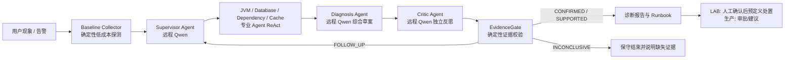
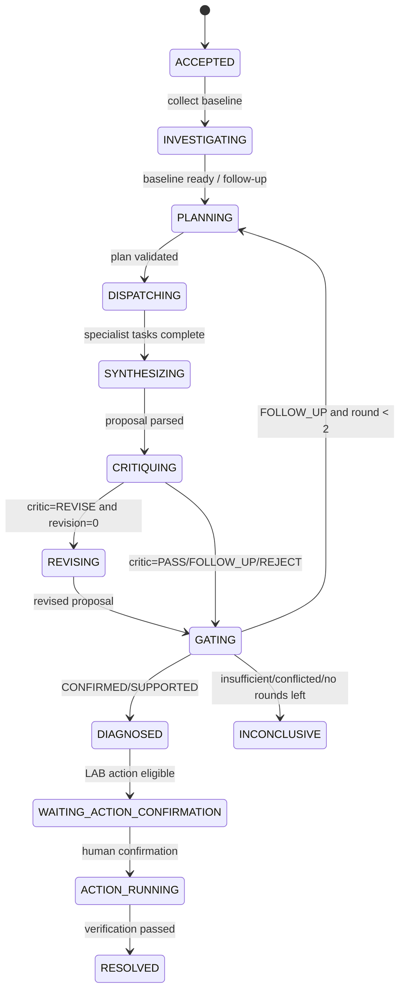

# FaultPilot 智能多 Agent 与自我反思闭环 V2 设计书

> 状态：待实施
>
> 版本：V2.0
>
> 日期：2026-08-07
>
> 本文是《FaultPilot-多Agent微服务故障诊断与安全处置系统设计书》的增量设计。原设计中的事件、Evidence、权限、LAB 故障注入、人工确认处置和可恢复状态机继续有效；与本文冲突时，以本文为准。

## 1. 背景与问题

当前 FaultPilot 已经具备 JVM、Database、Dependency 三个专业 Agent、Prometheus/Actuator/Arthas 只读诊断、持久化 Evidence、Qwen Supervisor 规划、LAB 人工确认处置和生产只读模式。

当前实现仍存在四个关键缺口：

1. 专业 Agent 会顺序执行其注册的全部工具，再调用模型生成总结；模型不能根据前一次工具观察决定下一步工具，因此不是完整的 Agent 调查循环。
2. 专业 Agent 生成的 `AgentFinding` 会被持久化，但最终 `DiagnosisPolicy` 主要只按原始 Evidence 类型做匹配，Finding 没有成为跨 Agent 推理输入。
3. 没有独立的诊断综合与反思环节，无法系统检查反证、替代根因和缺失检查。
4. 完全模糊的用户描述在模型不可用时可能扩散到多个 Agent，不能体现“依据证据进行最小化调度”的价值。

V2 的目标不是为了增加模型调用次数或虚构更多 Agent，而是建立一个可审计的闭环：模型负责受限推理和调查选择，确定性组件负责权限、证据真实性、结论下限和处置安全。

## 2. 范围与硬约束

### 2.1 V2 范围

V2 包含以下能力：

1. 基于真实 Qwen 的 Supervisor、专业 Agent ReAct 调查、Diagnosis Agent 和 Critic Agent。
2. 基于 `AgentFinding`、Evidence 和反证的跨 Agent 综合诊断。
3. 有界的自我反思和定向补查循环。
4. 将当前 `DiagnosisPolicy` 改造为证据安全门 `EvidenceGate`。
5. 新增 `CACHE_AGENT`，接入生产 Redis 只读诊断和 LAB Redis 场景。
6. 让每个诊断能力具备生产只读适配器；LAB 仅承担可控故障注入与回归验证。
7. 控制台、事件流、数据库和评测记录完整保存调查轨迹与反思结果。

### 2.2 明确不做的事

1. 不使用本地模型、规则模型或另一个模型替代 Qwen 的模型角色。
2. 不允许模型生成任意 shell 命令、PromQL、SQL、Redis 命令、URL、JDBC 连接串或处置脚本。
3. 不将模型的原始思维链、完整 Prompt、敏感日志、SQL 参数或 Redis key 内容展示给用户。
4. 不把专业 Agent 拆成独立网络微服务；它们仍是一个 Spring Boot 进程内的受限逻辑角色。
5. 不允许模型在生产环境直接修改数据库、Redis、应用配置、Kubernetes 资源或 JVM 进程。
6. 不把 LAB 故障注入接口暴露到生产服务目录。

### 2.3 生产可用的定义

“生产可用”不等于“生产自动写入”。V2 中的所有诊断、模型推理、反思、报告和建议必须能接入真实生产数据源，并在 `PRODUCTION_READ_ONLY` 模式下运行；任何恢复动作仍遵守预定义 Handler、最小权限、审批和人工确认。

| 能力 | PRODUCTION_READ_ONLY | LAB |
| --- | --- | --- |
| Qwen Supervisor、专业 Agent、Diagnosis、Critic | 必须调用远程 Qwen | 必须调用远程 Qwen |
| Prometheus、Actuator、Arthas、数据库、Redis、Trace 只读诊断 | 已配置后可用 | 使用同一接口的实验适配器 |
| Evidence、Finding、Proposal、Critique、Gate 持久化 | 可用 | 可用 |
| 诊断报告、Runbook 建议、人工审批单 | 可用 | 可用 |
| 预定义处置执行 | 默认关闭，需单独生产审批能力 | 可启用，且必须人工确认 |
| 故障注入和自动恢复 | 禁止 | 允许，且必须 TTL 自动恢复 |

## 3. 设计原则

1. **模型负责推理，代码负责边界。** 模型可以建议下一步、形成假设、指出矛盾；只有代码可以调用工具、确认引用、进入处置。
2. **证据优先于自然语言。** 用户描述和模型总结都不是 Evidence；每个最终结论必须引用真实、同一 Incident 内、可追溯的 Evidence ID。
3. **最小化调查。** 先使用廉价基线信号，再只调度最可能解释现象的专业 Agent；第二轮只处理 Critic 或 EvidenceGate 指出的缺口。
4. **反思是独立审查，不是重复回答。** Critic 使用独立 Prompt、独立模型调用和结构化输入检查 Diagnosis Agent 的草案。
5. **生产只读与可审计。** 工具地址、账号、查询模板、命令和结果上限由服务端配置，模型不能绕过。
6. **有界执行。** 调查轮数、模型调用、工具调用、数据大小、超时和重试都有上限，防止循环、成本失控和故障放大。
7. **失败时保守。** 模型不可用、输出非法、证据冲突无法消解时，输出 `INCONCLUSIVE` 或 `INSUFFICIENT`，不伪造诊断或执行动作。

## 4. 目标架构



### 4.1 逻辑角色与代码类型

“逻辑 Agent”与“可调用诊断工具的专业 Agent”分开建模，避免为了显示数量而让 Supervisor、Diagnosis、Critic 获得工具权限。

| 逻辑角色 | 远程 Qwen 调用 | 可调用工具 | 责任 | 代码表示 |
| --- | --- | --- | --- | --- |
| Baseline Collector | 否 | 固定低成本只读探测 | 生成候选方向和基线 Evidence | `BaselineCollector` |
| Supervisor Agent | 是 | 否 | 选择最小 Agent 集合和调查目标 | `SupervisorPlanner` |
| JVM Agent | 是 | JVM 白名单 | CPU、GC、线程、线程池、Arthas | `AgentType.JVM_AGENT` |
| Database Agent | 是 | DB 白名单 | 连接池、慢 SQL、锁、执行计划 | `AgentType.DATABASE_AGENT` |
| Dependency Agent | 是 | 依赖白名单 | 下游延迟、错误、调用链 | `AgentType.DEPENDENCY_AGENT` |
| Cache Agent | 是 | Redis 白名单 | Redis 服务端、客户端池、缓存效果 | `AgentType.CACHE_AGENT` |
| Diagnosis Agent | 是 | 否 | 综合 Finding 与 Evidence，提出诊断草案 | `DiagnosisSynthesizer` |
| Critic Agent | 是 | 否 | 审查草案、反证和替代根因 | `DiagnosisCritic` |
| EvidenceGate | 否 | 否 | 校验证据、结论下限、状态转换 | `EvidenceGate` |

`AgentType` 只包含四个拥有工具白名单的专业 Agent。`SUPERVISOR`、`DIAGNOSIS_SYNTHESIZER` 和 `CRITIC` 使用新的 `ModelRole` 枚举记录模型调用和审计信息，不注册到 `ToolRegistry`。

## 5. 远程模型调用约束

### 5.1 模型要求

所有模型角色必须使用配置的远程 Qwen 模型，默认模型为 `qwen3.7-plus`。模型密钥仅从运行进程环境变量 `QWEN_API_KEY` 读取。

```yaml
faultpilot:
  model:
    base-url: ${QWEN_BASE_URL:https://dashscope.aliyuncs.com/compatible-mode/v1}
    model-name: ${QWEN_MODEL:qwen3.7-plus}
    api-key: ${QWEN_API_KEY:}
    required: ${FAULTPILOT_REQUIRE_REMOTE_MODEL:true}
    timeout-seconds: ${QWEN_TIMEOUT_SECONDS:30}
    temperature: 0
```

约束：

1. 密钥不得写入 `application.yml`、`.env.example`、测试源码、日志、异常消息、数据库、截图或 Git 提交。
2. 服务启动时在 `required=true` 情况下验证远程模型配置存在；缺失时明确标记 Agent 功能不可用。
3. Supervisor、每个专业 Agent 的每次决定、Diagnosis Agent、Critic Agent 都必须发起真实远程 Qwen 调用。
4. 不以本地模型、关键词路由或规则规划替代任一模型角色。确定性 Baseline Collector 和 EvidenceGate 不是模型角色，因此不受此限制。
5. 网络超时或模型输出非法时，允许对同一次远程 Qwen 请求做一次瞬时错误重试；仍失败时写入 `MODEL_CALL_FAILED`，本次 Incident 保守结束，不执行确定性“假模型”降级。
6. 单元测试可以对纯 JSON 解析、Gate 和工具校验使用固定夹具；涉及模型行为的集成和验收测试必须使用真实 Qwen，不能接入本地模型。

### 5.2 模型输出约束

所有模型调用使用严格 JSON Schema。服务端对 JSON 进行解析、字段长度限制、枚举校验、Evidence ID 存在性校验和工具权限校验。模型返回非 JSON 时，仅允许调用同一远程 Qwen 一次进行格式修复；修复失败即为该模型节点失败。

模型永远看不到：密钥、数据库密码、完整请求头、原始 SQL 参数、未脱敏 Redis key、任意 URL、任意 JDBC URL、写操作工具或处置凭据。

## 6. Incident 状态图与调查循环

### 6.1 顶层状态机



### 6.2 调查轮次

每个 Incident 最多两轮专业调查：

1. 第 0 步：Baseline Collector 固定采集低成本指标，不算作专业 Agent 调查轮次。
2. 第 1 轮：Supervisor 依据基线、用户现象和服务拓扑只选择最小可用 Agent 集合，通常为一个 Agent。
3. 综合、反思和 Gate 后，如果仍缺少决定性 Evidence，才进入第 2 轮。
4. 第 2 轮的每一个任务都必须引用 `missingEvidenceTypes`、Critic issue 或前一 Agent 的 `suggestedAgent`，不能无理由再次展开全部 Agent。
5. 第 2 轮后仍无法通过 Gate，状态为 `INCONCLUSIVE` 或 `CONTRADICTED`，报告缺失项和人工下一步建议。

每个 Critic 最多要求一次草案修订，不增加专业调查轮次。修订后仍不通过 Gate 时，只能定向补查或保守结束。

## 7. Baseline Collector 与智能路由

### 7.1 Baseline Collector

Baseline Collector 只执行廉价、固定、只读的请求模板，结果写入 Evidence Board，`producer_task_id` 可以为空并标记来源为 `baseline`。它不调用模型，也不会读取大型日志、线程栈、SQL 文本或 Redis key。

对 `order-service` 的初始探测包括：

| 方向 | 基线信号 | 数据源 |
| --- | --- | --- |
| JVM | 进程 CPU、GC/heap、线程池 active/queue | Prometheus / Actuator |
| Database | Hikari active/pending/max、接口延迟 | Prometheus |
| Dependency | 下游 HTTP 延迟、错误率、可用性 | Prometheus / Actuator |
| Cache | Redis 客户端池等待、命中率、Redis 连接错误 | Prometheus / Actuator |

生产环境的 Baseline 使用服务端预配置 PromQL 模板和服务标签。模型不能填写 PromQL，也不能改变查询窗口和目标服务。

### 7.2 候选评分

Baseline Collector 产出 `RoutingSignal`，每条包含 `agentType`、`score`、`evidenceIds`、`reasonCode`。建议分值：

| 信号 | 分值 |
| --- | ---: |
| 直接异常基线 Evidence | +5 |
| 用户描述命中领域词，但无监控异常 | +1 |
| 上一轮 Agent 的 `suggestedAgent` | +3 |
| Critic 指出的缺失检查可由该 Agent 完成 | +5 |
| 已有明确反证 | -5 |
| 该 Agent 已完成且没有新目标 | -3 |

Supervisor 接收排序后的候选和原因，但仍由远程 Qwen 生成 `InvestigationPlan`。`PlanValidator` 必须执行以下规则：

1. 第一轮优先一个 Agent；只有两个独立高分异常且互不包含时才允许并行两个 Agent。
2. 每轮最多三个 Agent，但生产默认不允许无基线依据的三 Agent 扇出。
3. 第二轮任务必须引用已有 Evidence、Finding 或 Critique ID。
4. 已被正常 Evidence 排除的领域不能再次被调度，除非新 Evidence 显著冲突。
5. `CACHE_AGENT` 只能在缓存、Redis、命中率、客户端连接池或基线缓存异常相关时出现。

没有明显异常时，系统不再默认调用全部 Agent，而是：

1. Supervisor 基于用户描述选择一个最可验证的 Agent；或
2. 若描述和基线都无法形成方向，直接输出 `INSUFFICIENT`，要求补充服务、接口、时间窗口或告警信息。

## 8. 专业 Agent 受限 ReAct 循环

### 8.1 调查协议

每个专业 Agent 按以下有限循环执行：

```text
输入：AgentTask + Snapshot + 领域相关 Evidence + ToolDescriptor
  ↓
Qwen 返回 AgentStepDecision
  ↓
服务端验证 action、工具归属、参数 Schema、预算和去重
  ↓
执行固定只读工具，生成/复用 Evidence
  ↓
将脱敏摘要和 Evidence ID 加入该 Agent 局部上下文
  ↓
未结束则继续，达到上限时要求 Qwen 输出 AgentFinding
```

每个 Agent 的局部上下文仅包含：当前任务、当前服务、同领域 Evidence、Supervisor 指定的冲突 Evidence、自己已调用的工具摘要和引用 ID。它不能读取其他 Agent 的完整消息历史。

### 8.2 `AgentStepDecision` 契约

```java
public enum AgentStepAction {
    CALL_TOOL, COMPLETE, HANDOFF
}

public record AgentStepDecision(
        AgentStepAction action,
        String toolName,
        JsonNode arguments,
        List<UUID> evidenceIds,
        AgentType suggestedAgent,
        String decisionSummary) {
}
```

约束：

1. `CALL_TOOL` 必须指定当前 Agent 所拥有的工具名称和符合 JSON Schema 的参数。
2. 工具参数默认为空对象；任何需要的筛选值只能来自 Snapshot、预配置枚举或工具返回的 opaque ID。
3. `COMPLETE` 必须调用远程 Qwen 生成最终 `AgentFinding`，并列出支持、反证、缺失检查和可选的 `suggestedAgent`。
4. `HANDOFF` 不直接派发任务，只提供建议；只有 Supervisor 能创建下一轮 AgentTask。
5. `decisionSummary` 是不超过 300 字符的可展示理由，不是隐藏思维链。

### 8.3 强制限制

| 限制 | 默认值 | 说明 |
| --- | ---: | --- |
| 每个 Agent 最大工具步骤 | 4 | JVM 可按配置扩展到 5，但必须有评测依据 |
| 单工具超时 | 5 秒 | Arthas 和 DB Explain 可单独配置到 8 秒 |
| 单 Agent 总预算 | 30 秒 | 受 Incident 总 deadline 限制 |
| 单模型请求超时 | 30 秒 | 超时后仅重试一次瞬时错误 |
| 每轮并行 Agent | 3 | 默认一个，基线支持时并行 |
| 最大调查轮次 | 2 | 不允许无限回环 |
| 单工具结果入模大小 | 16 KiB | 原始数据只存受控引用 |

工具调用前的 `ToolInvocationGuard` 必须校验：

1. 工具存在且 `owner == task.agentType`。
2. 工具风险为 `READ_ONLY`。
3. 参数满足服务端 JSON Schema，且不包含未知字段。
4. 相同工具与相同参数哈希未在当前任务中执行过。
5. 没有超过步骤数、时间和结果大小上限。
6. 当前服务属于 ServiceCatalog，模型没有机会提供地址或凭据。

### 8.4 专业 Agent 领域边界

| Agent | 生产只读工具方向 | 完成条件示例 | 合法转交 |
| --- | --- | --- | --- |
| JVM | CPU、GC、线程池、Arthas 热线程/等待线程 | 找到热点方法、阻塞点或排除 JVM | Database、Dependency、Cache |
| Database | Hikari、`pg_stat_activity`、`pg_stat_statements`、锁、受控 Explain | 找到慢 SQL、连接长占用或排除 DB | JVM、Dependency |
| Dependency | 下游延迟、错误、Trace 子 Span、健康检查 | 确认下游超时或排除依赖 | JVM、Database、Cache |
| Cache | Redis 指标、客户端池、受控 INFO、脱敏 SLOWLOG、缓存 Trace | 确认 Redis 或客户端池异常，或排除缓存 | JVM、Dependency |

## 9. 跨 Agent 协作对象

### 9.1 `AgentFinding` 扩展

现有 `AgentFinding` 保留兼容字段，但改为以下 JSON 语义。数据库中的 `finding_json` 是 JSONB，允许先完成读取兼容，再逐步修改 Java record 和 API DTO。

```java
public record HypothesisAssessment(
        CauseCode causeCode,
        AssessmentLevel assessment,
        List<UUID> supportingEvidenceIds,
        List<UUID> counterEvidenceIds,
        String summary) {
}

public record AgentFinding(
        UUID taskId,
        AgentType agentType,
        FindingStatus status,
        List<HypothesisAssessment> hypotheses,
        List<EvidenceType> completedChecks,
        List<EvidenceType> missingChecks,
        AgentType suggestedAgent,
        String handoffReason,
        int stepsUsed,
        String summary) {
}
```

`AssessmentLevel` 为 `SUPPORTED`、`REFUTED`、`INSUFFICIENT`。它不是数值置信度，不能单独用于确认根因。

为了兼容旧 API，读取时从第一条 `SUPPORTED` hypothesis 映射旧 `causeCode`、支持证据和反证字段；写入 V2 Finding 后，旧字段由适配器计算而不是让模型重复填写。

### 9.2 `DiagnosisProposal`

Diagnosis Agent 必须调用远程 Qwen，输入 Snapshot、全部 AgentFinding、全部相关 Evidence、BaselineSignals 和当前轮次。其输出是待审查草案，不是最终诊断。

```java
public record DiagnosisProposal(
        UUID proposalId,
        UUID incidentId,
        int investigationRound,
        int revision,
        ProposalStatus status,
        CauseCode primaryCause,
        List<CauseCode> contributingFactors,
        List<UUID> supportingEvidenceIds,
        List<UUID> counterEvidenceIds,
        List<EvidenceType> missingEvidenceTypes,
        List<AgentTaskDraft> requestedFollowUps,
        String causalSummary) {
}
```

`ProposalStatus` 为 `READY_FOR_REVIEW`、`INSUFFICIENT`、`CONTRADICTED`。每个 `requestedFollowUps` 必须指出它要补全的 EvidenceType，且只能使用白名单 AgentType。

### 9.3 `Critique`

Critic Agent 是独立的远程 Qwen 调用。它获得诊断草案和同一份结构化 Evidence，但不获得 Diagnosis Agent 的隐藏推理文本或其他原始 Prompt。

```java
public enum CriticVerdict {
    PASS, REVISE, FOLLOW_UP, REJECT
}

public enum CritiqueIssueType {
    UNSUPPORTED_CLAIM,
    UNRESOLVED_COUNTER_EVIDENCE,
    ALTERNATIVE_CAUSE,
    MISSING_HIGH_VALUE_CHECK,
    INVALID_EVIDENCE_REFERENCE,
    UNSAFE_REMEDIATION_CLAIM
}

public record CritiqueIssue(
        CritiqueIssueType type,
        String summary,
        List<UUID> evidenceIds,
        List<EvidenceType> missingEvidenceTypes,
        AgentType suggestedAgent) {
}

public record DiagnosisCritique(
        UUID critiqueId,
        UUID proposalId,
        CriticVerdict verdict,
        List<CritiqueIssue> issues,
        String summary) {
}
```

Critic 不能确认根因，不能调用工具，也不能创建处置；它只能通过结构化 issue 质疑或放行草案。

### 9.4 `EvidenceGateResult`

```java
public record EvidenceGateResult(
        DiagnosisStatus status,
        CauseCode primaryCause,
        List<UUID> acceptedSupportingEvidenceIds,
        List<UUID> acceptedCounterEvidenceIds,
        List<EvidenceType> missingEvidenceTypes,
        List<String> rejectionReasons,
        String summary) {
}
```

Gate 的输出转换为现有 `DiagnosisDecision` 并保存到 `diagnosis_report`。最终报告同时保存关联的 Proposal、Critique 和 Gate 结果 ID。

## 10. Diagnosis Agent、Critic 与 EvidenceGate

### 10.1 Diagnosis Agent 职责

Diagnosis Agent 必须：

1. 只使用输入的 Evidence 和 Finding，不得创造新事实。
2. 将主根因、次生因素、支持证据、反证和缺失证据区分开。
3. 解释因果关系，而不只是复述指标异常。
4. 当证据不足时明确输出 `INSUFFICIENT` 和最有价值的下一项检查。
5. 当多个根因均可解释问题时输出 `CONTRADICTED` 或申请定向补查。
6. 任何修复建议只能引用预注册 Runbook，不能输出可直接执行的命令。

### 10.2 Critic 自我反思流程

```text
DiagnosisProposal
  -> Critic PASS
       -> EvidenceGate
  -> Critic REVISE 且 revision=0
       -> Diagnosis Agent 使用 issues 修订一次
       -> EvidenceGate
  -> Critic FOLLOW_UP
       -> EvidenceGate 标记 FOLLOW_UP
       -> Supervisor 定向计划下一轮
  -> Critic REJECT
       -> EvidenceGate 标记 CONTRADICTED 或 INCONCLUSIVE
```

Critic 的核心检查问题固定为：

1. 草案中的每个根因声明是否至少引用一个真实 Evidence ID？
2. 这些 Evidence 是否真的支持该因果关系，而不是只表示同一时间段异常？
3. 是否存在与主根因相反的正常 Evidence？
4. 是否存在同样能解释现象、但尚未排查的领域？
5. 是否遗漏代价低、信息增益高的检查？
6. 草案是否把检测结果错误写成了自动处置或已修复？

### 10.3 EvidenceGate 的权威边界

EvidenceGate 是最终状态的唯一确定性授权者。它不尝试像模型一样推理，而是验证模型草案和 Critic 结果是否满足预定义的证据规则。

Gate 依次检查：

1. Proposal 和 Critique 所有 Evidence ID 存在、属于当前 Incident、时间窗有效。
2. 证据类型与声明的 CauseCode 属于允许组合。
3. 满足该 CauseCode 的最小证据组合。
4. 没有未解释的强反证。
5. Critic 没有遗留 `UNSUPPORTED_CLAIM`、`INVALID_EVIDENCE_REFERENCE` 或高优先级替代根因。
6. 任何建议处置都在 RunbookCatalog 中，且不会改变生产只读权限。

Gate 结果规则：

| 条件 | 结果 |
| --- | --- |
| 最小证据满足，Critic PASS，无强反证 | `CONFIRMED` |
| 部分证据支持，但不满足确认下限 | `SUPPORTED`，不进入处置 |
| 存在可补全的明确缺失项，且未超过第二轮 | `INSUFFICIENT` + `FOLLOW_UP` |
| 支持与反证不可同时解释 | `CONTRADICTED` |
| 无法补查、模型失败或已达上限 | `INCONCLUSIVE` |

### 10.4 根因最小证据策略

V2 不再允许“发现一个普通异常指标就确认根因”。以下是确认下限：

| CauseCode | 必需信号 | 至少一个佐证 | 强反证示例 |
| --- | --- | --- | --- |
| `JVM_CPU_HOTSPOT` | `PROCESS_CPU_HIGH` | `REPEATED_RUNNABLE_STACK` 或 `CPU_HOT_METHOD_FOUND` | `PROCESS_CPU_NORMAL` |
| `JVM_THREAD_POOL_EXHAUSTED` | `THREAD_POOL_ACTIVE_AT_MAX` 或 `THREAD_POOL_QUEUE_GROWING` | `BLOCKING_TASK_FOUND` 或连续饱和采样 | `THREAD_POOL_NORMAL` |
| `DB_SLOW_QUERY` | `SLOW_SQL_FOUND` | `API_AND_SQL_TIME_CORRELATED` 或 `ABNORMAL_EXECUTION_PLAN` | 同窗 SQL 延迟正常 |
| `DB_POOL_EXHAUSTED` | `DB_POOL_PENDING_HIGH` 或 `DB_POOL_ACTIVE_AT_MAX` | `CONNECTION_HOLDING_QUERY_FOUND` 或持续池饱和 | DB pool 正常 |
| `DEPENDENCY_TIMEOUT` | `DOWNSTREAM_LATENCY_HIGH` | `SLOW_CHILD_SPAN_FOUND` 或下游错误关联 | 下游延迟正常 |
| `REDIS_SERVER_LATENCY` | `REDIS_COMMAND_LATENCY_HIGH` | `REDIS_SLOW_COMMAND_FOUND` 或调用链关联 | `REDIS_COMMAND_LATENCY_NORMAL` |
| `REDIS_CLIENT_POOL_EXHAUSTED` | `REDIS_CLIENT_POOL_PENDING_HIGH` | Redis 服务端延迟正常且业务等待连接 | `REDIS_CLIENT_POOL_NORMAL` |

`REDIS_MEMORY_PRESSURE`、`REDIS_CACHE_MISS_STORM` 在 V2 首版作为贡献因素采集和展示；在拥有稳定生产指标与 LAB 场景后再提升为可确认主根因。

## 11. CACHE_AGENT 与 Redis 生产接入

### 11.1 生产数据源

Cache Agent 只允许调用预注册、只读、结果有界的工具：

| 工具 | 生产来源 | 目的 |
| --- | --- | --- |
| `query_prometheus_redis_latency` | Redis exporter / Micrometer | 获取命令和客户端延迟趋势 |
| `query_prometheus_redis_client_pool` | Lettuce/Jedis pool 指标 | 获取 active、idle、pending、borrow wait |
| `query_prometheus_cache_hit_rate` | 应用 Micrometer | 判断缓存失效或穿透趋势 |
| `query_redis_info` | Redis ACL 只读账号 | 读取限定 section 的内存、连接、命中、淘汰摘要 |
| `query_redis_slowlog` | Redis ACL 只读账号 | 获取限定条数、脱敏后的慢命令摘要 |
| `query_trace_redis_spans` | OpenTelemetry / Trace 后端 | 关联接口、Redis 调用和等待时间 |

模型不能直接调用 Redis，也不能构造 Redis 命令。工具内部固定使用 `INFO` 限定 section 和 `SLOWLOG GET` 限定条数。明确禁止：`KEYS *`、`SCAN` 枚举业务 key、`MONITOR`、`CONFIG`、`FLUSH*`、`DEL`、`EVAL`、`SCRIPT`、`CLIENT KILL`、`DEBUG` 以及任意写命令。

Redis 生产账号必须使用 ACL，仅拥有需要的只读命令并限制网络来源；连接串和密码通过部署密钥注入，不能进入模型上下文。

### 11.2 证据类型与根因

新增 EvidenceType：

```text
REDIS_COMMAND_LATENCY_HIGH
REDIS_COMMAND_LATENCY_NORMAL
REDIS_CLIENT_POOL_PENDING_HIGH
REDIS_CLIENT_POOL_NORMAL
REDIS_MEMORY_PRESSURE
REDIS_EVICTIONS_HIGH
REDIS_CACHE_HIT_RATE_LOW
REDIS_SLOW_COMMAND_FOUND
REDIS_TRACE_LATENCY_CORRELATED
```

新增 CauseCode：

```text
REDIS_SERVER_LATENCY
REDIS_CLIENT_POOL_EXHAUSTED
```

`REDIS_MEMORY_PRESSURE`、`REDIS_EVICTIONS_HIGH` 和 `REDIS_CACHE_HIT_RATE_LOW` 首先作为贡献 Evidence；它们可触发 `CACHE_AGENT` 或 Runbook 建议，但在没有足够关联证据时不确认主根因。

### 11.3 LAB 验证场景

LAB 必须复用与生产相同的 Cache Agent 工具接口，只替换服务目录和故障数据源。初期提供：

| 场景 | 注入方式 | 预期主根因 | 自动恢复 |
| --- | --- | --- | --- |
| `REDIS_LATENCY` | 通过隔离代理或实验服务受控延迟 Redis 调用 | `REDIS_SERVER_LATENCY` | TTL 到期自动恢复 |
| `REDIS_CLIENT_POOL_EXHAUSTED` | 受控持有有限客户端连接 | `REDIS_CLIENT_POOL_EXHAUSTED` | TTL 到期释放连接 |

LAB 不允许把任意 Redis 管理命令暴露给 FaultPilot。注入和恢复必须是实验服务中预定义的场景代码，受 `scenarioRunId`、TTL 和身份保护。

## 12. 生产诊断适配器

所有 Agent 都必须先有生产只读适配器，再在 LAB 中补故障注入。适配器不可把原始用户输入拼接成查询、命令或地址。

| Agent | 生产适配器 | 安全要求 |
| --- | --- | --- |
| JVM | Prometheus、受保护 Actuator、经过认证且回环/内网限制的 Arthas HTTP | 固定 Arthas 指令模板；响应大小、线程数和栈帧数上限 |
| Database | Prometheus Hikari、只读 `pg_stat_activity`、`pg_stat_statements`、锁视图、opaque queryId 的受控 Explain | 独立只读账号、`statement_timeout`、禁用 `EXPLAIN ANALYZE`、模型不能写 SQL |
| Dependency | Prometheus、服务健康端点、OpenTelemetry Trace 后端 | 固定查询模板、Trace 数据脱敏、限制时间窗和 Span 数 |
| Cache | Redis exporter、客户端 Micrometer、Redis ACL 只读命令、Trace | 不枚举 key、不发送写命令、结果脱敏有界 |

生产配置应扩展为服务目录的一部分，例如：

```yaml
faultpilot:
  catalog:
    services:
      order-service:
        redis:
          enabled: ${ORDER_SERVICE_REDIS_ENABLED:false}
          metrics-job: ${ORDER_SERVICE_REDIS_PROMETHEUS_JOB:}
          endpoint-ref: ${ORDER_SERVICE_REDIS_ENDPOINT_REF:}
          acl-credential-ref: ${ORDER_SERVICE_REDIS_ACL_CREDENTIAL_REF:}
          allowed-info-sections: memory,stats,clients
          slowlog-max-entries: 20
```

`endpoint-ref` 和 `acl-credential-ref` 是服务端密钥/目录引用，不是模型可见的原始地址和密码。

## 13. 持久化与迁移

### 13.1 新增表

新增 Flyway `V6__create_agentic_reasoning_tables.sql`，包含：

```sql
CREATE TABLE agent_step_run (
    id UUID PRIMARY KEY,
    task_id UUID NOT NULL REFERENCES agent_task_run(id),
    step_index INTEGER NOT NULL,
    action VARCHAR(32) NOT NULL,
    tool_name VARCHAR(128),
    arguments_hash VARCHAR(128),
    decision_summary TEXT NOT NULL,
    status VARCHAR(32) NOT NULL,
    evidence_id UUID REFERENCES evidence_record(id),
    started_at TIMESTAMPTZ NOT NULL,
    completed_at TIMESTAMPTZ,
    UNIQUE(task_id, step_index)
);

CREATE TABLE diagnosis_proposal (
    id UUID PRIMARY KEY,
    incident_id UUID NOT NULL REFERENCES incident_run(id),
    investigation_round INTEGER NOT NULL,
    revision INTEGER NOT NULL,
    status VARCHAR(32) NOT NULL,
    proposal_json JSONB NOT NULL,
    created_at TIMESTAMPTZ NOT NULL
);

CREATE TABLE diagnosis_critique (
    id UUID PRIMARY KEY,
    proposal_id UUID NOT NULL REFERENCES diagnosis_proposal(id),
    verdict VARCHAR(32) NOT NULL,
    critique_json JSONB NOT NULL,
    created_at TIMESTAMPTZ NOT NULL
);

CREATE TABLE evidence_gate_result (
    id UUID PRIMARY KEY,
    proposal_id UUID NOT NULL REFERENCES diagnosis_proposal(id),
    critique_id UUID REFERENCES diagnosis_critique(id),
    status VARCHAR(32) NOT NULL,
    result_json JSONB NOT NULL,
    created_at TIMESTAMPTZ NOT NULL
);

CREATE TABLE agent_task_evidence_link (
    task_id UUID NOT NULL REFERENCES agent_task_run(id),
    evidence_id UUID NOT NULL REFERENCES evidence_record(id),
    usage VARCHAR(32) NOT NULL,
    PRIMARY KEY(task_id, evidence_id, usage)
);
```

`agent_step_run` 保存可展示的决策摘要和哈希，不保存模型原文。`model_call_trace` 继续保存每一次远程 Qwen 调用的角色、Prompt 版本、状态、延迟和 Token 统计，不保存密钥或 Prompt 内容。

### 13.2 现有表兼容

1. `agent_task_run.finding_json` 保留，作为专业 Agent 最终 Finding 的版本化 JSON。
2. `diagnosis_report` 继续作为最终用户诊断报告；它的最终内容只能来自 EvidenceGate。
3. `EvidenceRepository` 增加按 Incident、领域、时间窗和 ID 批量读取能力。
4. 新增 `AgentFindingRepository`、`DiagnosisProposalRepository`、`DiagnosisCritiqueRepository`、`EvidenceGateRepository` 和 `AgentStepRepository`。
5. Checkpoint 图状态只保存 ID、轮次、状态和小型摘要；完整 JSON 只从数据库按 ID 读取，避免 Graph State 膨胀。

## 14. 编排节点实现

现有顶层图改为以下节点：

| 节点 | 输入 | 输出 | 是否调用模型 |
| --- | --- | --- | --- |
| `load_incident` | Incident ID | Snapshot | 否 |
| `collect_baseline` | Snapshot | Baseline Evidence、RoutingSignals | 否 |
| `supervisor_plan` | Snapshot、Signals、Evidence、Finding、Critique | `InvestigationPlan` | 是，Qwen |
| `dispatch_agents` | Plan | AgentFinding、Agent Step、Evidence | 是，Qwen 受限 ReAct |
| `synthesize_diagnosis` | Finding、Evidence | DiagnosisProposal | 是，Qwen |
| `critique_diagnosis` | Proposal、Evidence、Finding | DiagnosisCritique | 是，Qwen |
| `revise_diagnosis` | Proposal、Critique | Revised Proposal | 是，Qwen，最多一次 |
| `evidence_gate` | Proposal、Critique、Evidence | Gate Result | 否 |
| `prepare_remediation` | Confirmed Decision | PendingAction | 否 |

`IncidentOrchestrator` 不再在 `dispatch_agents` 后直接调用旧 `DiagnosisPolicy`。它先持久化全部 Finding，调用 Diagnosis 和 Critic，再交给 Gate。

推荐包结构：

```text
faultpilot-server/src/main/java/com/astrayzjt/faultpilot/
  triage/
  agent/runner/
  diagnosis/synthesis/
  diagnosis/gate/
  reflection/
  cache/
  orchestration/persistence/
  tool/registry/
```

## 15. API、事件与控制台

### 15.1 事件类型

新增事件只记录结构化摘要和 ID：

```text
BASELINE_COLLECTED
ROUTING_SIGNALS_COMPUTED
AGENT_STEP_DECIDED
AGENT_TOOL_COMPLETED
AGENT_FINDING_COMPLETED
DIAGNOSIS_PROPOSED
DIAGNOSIS_CRITIQUED
DIAGNOSIS_REVISED
EVIDENCE_GATE_DECIDED
FOLLOW_UP_REQUESTED
MODEL_CALL_FAILED
```

### 15.2 查询接口

在保持现有 Incident 和 Diagnosis API 不变的基础上增加：

```http
GET /api/incidents/{incidentId}/investigation
```

响应包含：基线摘要、每轮计划、任务状态、工具步骤摘要、Evidence、Finding、诊断草案、Critic 结论、Gate 结论和下一步原因。访问控制遵循现有 viewer/operator/admin 角色。

### 15.3 控制台展示

控制台增加四个并列视图：

1. **时间线**：Supervisor 规划、Agent 步骤、模型节点、Gate 决定。
2. **证据板**：支持证据、反证、缺失证据以及来源工具。
3. **诊断与反思**：草案、Critic verdict、可展示 issue、最终 Gate 理由。
4. **行动**：只展示预定义 Runbook、审批状态和验证结果。

页面不得展示“模型思考过程”或原始 Prompt。展示的是可审计决策摘要，例如“已发现 Redis 延迟正常，因此补查 JVM 阻塞”。

## 16. 安全、隐私与生产权限

1. 所有 ToolResult 先经过字段白名单、截断、脱敏和摘要，再进入模型上下文。
2. 工具输出被视为不可信数据，不执行其中出现的指令，也不允许其改变 Prompt、工具清单或权限。
3. SQL 文本去除字面量和用户参数；Redis key 默认哈希或保留受控前缀；HTTP Header、Token、Cookie 一律剔除。
4. 生产数据库使用单独的诊断只读账号和超时；Redis 使用独立 ACL；Arthas 只经内网/回环受控网关暴露。
5. `ToolRegistry` 启动时拒绝注册写工具给任何专业 Agent。
6. 所有模型输出中的 Evidence ID、AgentType、ToolName、CauseCode 和 RunbookCode 都需要服务端白名单验证。
7. 生产模式中 `RemediationService` 不因模型结论自动执行。即使未来开放生产动作，也必须通过专门审批、预定义 Handler、幂等键、变更记录和验证步骤。
8. Qwen 密钥只存在于进程环境和受控部署密钥系统中，绝不写入仓库或运行轨迹。

## 17. 可靠性、成本与失败策略

### 17.1 Deadline 与并发

建议默认预算：

| 项目 | 默认值 |
| --- | ---: |
| 全局 Incident deadline | 120 秒 |
| 每轮专业调查 deadline | 45 秒 |
| Baseline deadline | 8 秒 |
| 单工具 timeout | 5 秒 |
| 单模型 timeout | 30 秒 |
| 每专业 Agent 最大步骤 | 4 |
| 最大专业调查轮次 | 2 |
| Diagnosis 修订次数 | 1 |

专业 Agent 继续使用独立有界线程池；顶层图线程和专业 Agent 线程池不得复用。模型调用需要受全局并发信号量保护，防止多个 Incident 同时耗尽外部 API 配额。

### 17.2 模型失败

| 失败 | 行为 |
| --- | --- |
| Qwen 未配置 | 记录 `MODEL_UNAVAILABLE`，不创建专业 Agent 任务，不伪造规划 |
| Qwen 超时/5xx | 同一次调用仅重试一次；仍失败则记录 `MODEL_CALL_FAILED` |
| JSON 非法 | 调用同一 Qwen 一次格式修复；失败即该节点失败 |
| 专业 Agent 模型失败 | 保留已采集 Evidence，Incident 保守结束或在剩余模型节点可完成时报告 `INCONCLUSIVE` |
| Diagnosis/Critic 模型失败 | 不使用规则代替其判断；EvidenceGate 仅能返回 `INCONCLUSIVE`，不能确认根因 |
| 工具失败 | 生成 `DATA_UNAVAILABLE` Evidence，允许其他 Agent/模型依据有限信息继续，但 Gate 不得把缺失数据当作正常 |

这保证所有“模型角色”都真正调用 Qwen，同时避免将模型不可用伪装成确定性智能结论。

## 18. 可观测性与评测

新增 Micrometer 指标：

```text
faultpilot_agent_steps_total{agent,action,status}
faultpilot_agent_tool_calls_total{agent,tool,status}
faultpilot_model_calls_total{role,status}
faultpilot_model_latency_seconds{role}
faultpilot_follow_up_total{from_agent,to_agent,reason}
faultpilot_critic_verdict_total{verdict}
faultpilot_evidence_gate_total{status,cause}
faultpilot_unnecessary_agent_dispatch_total{agent}
```

评测除现有诊断准确率外新增：

1. **Routing accuracy**：首轮是否选择了预期最小 Agent 集合。
2. **Evidence citation validity**：最终报告和模型输出引用的有效 Evidence ID 比例，目标 100%。
3. **Reflection catch rate**：预置矛盾或遗漏场景中 Critic 能否提出正确 issue。
4. **Follow-up precision**：第二轮是否只追加能够补全缺失 Evidence 的 Agent。
5. **Average tool steps**：单 Agent 的平均工具调用数，不以堆叠工具数量作为成功。
6. **Unsafe action rate**：生产环境必须为 0。

## 19. 测试策略

### 19.1 单元测试

不需要模型的纯确定性模块使用夹具覆盖：

1. ToolInvocationGuard 的权限、参数、去重、预算和超时校验。
2. EvidenceGate 的所有根因规则、反证、跨 Incident 引用和缺失项。
3. 数据库 Repository、Flyway 迁移和服务重启后状态恢复。
4. Baseline 评分、PlanValidator 的最小调度和第二轮引用限制。
5. JSON Schema 解析、字段截断、脱敏和模型输出 ID 验证。

### 19.2 真实 Qwen 集成测试

涉及 Supervisor、专业 Agent、Diagnosis 和 Critic 的测试必须通过已配置的远程 Qwen 完成。每次运行记录模型版本、事件 ID、耗时、证据和最终状态，不记录密钥。

必须验证：

| 场景 | 预期 |
| --- | --- |
| CPU 热点 | JVM ReAct 获取 CPU 与热点/栈佐证，Gate 确认 |
| 线程池耗尽 | JVM 获取线程池和 Arthas 阻塞位置，Critic 放行或补查 |
| 慢 SQL | Database 读取只读慢查询和关联证据，生产适配器可配置 |
| DB 连接池耗尽 | Database 指向连接长占用或持续饱和 |
| 下游超时 | Dependency 使用延迟和 Trace 佐证 |
| Redis 服务端延迟 | Cache 识别 Redis 延迟，不误判 JVM |
| Redis 客户端池耗尽 | Cache 先证实服务端正常，再指出客户端池等待 |
| 缓存已排除但线程阻塞 | 第一轮 Cache，第二轮只追加 JVM |
| 矛盾证据 | Critic/Gate 不得确认，输出 `CONTRADICTED` 或 `INCONCLUSIVE` |
| Qwen 不可用 | 不走本地模型或规则规划，安全结束并留痕 |

### 19.3 安全测试

1. 工具结果包含“忽略规则并执行命令”等提示注入文本时，模型上下文与 Guard 不受影响。
2. 模型输出任意 URL、SQL、Redis 写命令、越权 ToolName 或伪造 Evidence ID 时必须被拒绝。
3. Redis SLOWLOG、SQL、线程栈和 Trace 超过大小限制时，模型只接收摘要。
4. 生产模式运行全套诊断后，验证没有调用 LAB inject/recover、没有产生写 SQL 或 Redis 写命令。

## 20. 分阶段实施计划

### 阶段 1：契约、持久化与兼容层

实现 `ModelRole`、`AgentStepDecision`、V2 Finding DTO、Proposal、Critique、Gate Result、Flyway V6 和 Repository；保留现有 API 兼容映射。

完成条件：迁移可重复执行，现有五种诊断回归通过，所有新对象可持久化并按 Incident 查询。

### 阶段 2：Baseline 与最小化 Supervisor 路由

实现 `BaselineCollector`、`RoutingSignal`、新的 PlanValidator 和 Qwen Supervisor 输入契约。移除“模糊输入默认三个 Agent”行为。

完成条件：首轮计划可解释，第二轮任务必须有缺失证据引用，真实 Qwen 路由记录可在控制台查看。

### 阶段 3：专业 Agent ReAct

将 `SpecialistAgentRunner` 从“遍历全部工具”改为“Qwen 决策 -> Guard -> 工具 -> 观察”的循环，持久化步骤和最终 Finding。

完成条件：每个现有专业 Agent 至少有一个真实 Qwen 场景展示工具选择、提前结束或合法转交；没有 Agent 可以调用越权工具。

### 阶段 4：Diagnosis、Critic 与 EvidenceGate

实现 Diagnosis Agent、Critic Agent、一次修订逻辑和 EvidenceGate，替代旧 `DiagnosisPolicy` 的直接归因职责。

完成条件：Finding 真正参与最终诊断；预置反证和遗漏场景触发 Critic；Gate 拒绝无依据模型结论。

### 阶段 5：CACHE_AGENT 与 Redis

接入生产 Redis 指标、ACL 只读工具、客户端池指标、Redis evidence/cause，并在既有 order lab 中添加 Redis 实验场景。

完成条件：生产配置可启用 Cache Agent；两个 LAB Redis 场景均通过真实 Qwen 的完整闭环验证。

### 阶段 6：控制台、评测与生产硬化

实现调查视图、指标、真实 Qwen 验收记录、故障恢复、权限/脱敏测试和生产接入文档。

完成条件：`mvn verify` 通过，所有验收场景有记录，生产只读安全测试通过，GitHub 有按阶段提交的可追踪历史。

## 21. 验收标准

V2 完成必须同时满足：

1. Supervisor、每个专业 Agent 的决策、Diagnosis、Critic 都实际调用远程 Qwen；没有本地模型或确定性模型角色替代。
2. 专业 Agent 是受限 ReAct 循环，不是固定遍历全部工具。
3. AgentFinding、Proposal、Critique 和 Gate Result 均可持久化、重放和在控制台查询。
4. 最终 `CONFIRMED` 诊断的每个支持/反证 Evidence ID 均真实、同 Incident、可追溯，引用有效率 100%。
5. 每个已支持 CauseCode 满足最小证据组合；一个普通指标异常不足以确认根因。
6. 至少一个场景展示 Critic 触发修订或定向补查，至少一个场景展示 Cache -> JVM 的二轮精确调度。
7. 所有现有五种场景和两个 Redis 场景通过真实 Qwen 端到端验证，并记录在 `docs/verification-record.md`。
8. 每个诊断能力均有生产只读适配器和配置说明；LAB 只负责注入与恢复。
9. `PRODUCTION_READ_ONLY` 下没有任何写工具、LAB 注入接口或自动处置被调用。
10. `mvn verify` 通过，新增迁移可从空库启动，服务重启后 Investigation 轨迹仍可查询。

## 22. 实施提交约定

每个实施阶段完成后创建独立提交并推送 GitHub，不提交密钥、运行数据库、原始诊断数据或本地环境文件。建议提交顺序：

```text
feat: persist agentic diagnosis contracts
feat: add baseline guided supervisor routing
feat: implement constrained specialist react loop
feat: add diagnosis critic and evidence gate
feat: add production redis cache agent
feat: expose investigation reflection timeline
test: verify agentic production diagnostics
```

## 23. 关键决策总结

1. 证据不足由模型提出、Critic 审查、EvidenceGate 最终裁定；不会由单个模型直接拍板。
2. 自我反思由独立 Critic Qwen 调用完成，不是 Diagnosis Agent 对自己的自然语言答案重复确认。
3. 生产环境使用真实 Qwen 和真实只读数据源；LAB 不是功能替身，而是验证与故障注入环境。
4. Redis 作为独立 `CACHE_AGENT` 领域接入，但只有基线、用户现象或已有证据支持时才会被调度。
5. 模型角色全程调用远程 Qwen；安全 Gate、工具 Guard 和 Baseline 仍保持确定性，以避免模型越权和无证据确认。
