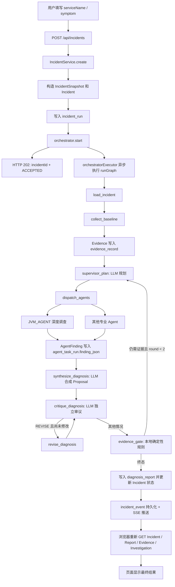
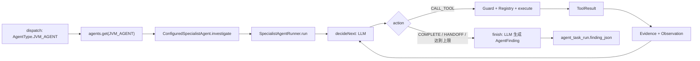

# FaultPilot 端到端代码阅读指南：JVM Agent 详解

> 适用代码版本：2026-08-11 当前工作区
> 阅读目标：沿一次 Incident 从浏览器输入一直追踪到最终诊断回显，并重点掌握 `JVM_AGENT` 内部的模型决策、工具调用、证据生成和 Finding 产出。
> 范围约束：`DATABASE_AGENT`、`CACHE_AGENT`、`DEPENDENCY_AGENT` 只说明统一输入和输出，不展开各自工具实现。

## 1. 先建立四个边界

阅读这个项目时，最容易混淆的是“方法返回了什么”和“用户最终看到了什么”。先把数据分成四类：

| 边界 | 典型数据 | 去向 |
|---|---|---|
| HTTP 返回 | `202 ACCEPTED`、`Incident`、`DiagnosisDecision` | 浏览器 |
| Java 方法返回 | `ToolResult`、`AgentFinding`、`DiagnosisProposal` | 当前进程内的下一段代码 |
| LangGraph 状态补丁 | `Map.of("outcome", ...)` | 合并进 `IncidentGraphState`，控制下一节点 |
| PostgreSQL 持久化 | `Evidence`、`AgentFinding`、Proposal、Critique、Decision | 后续节点按 `incidentId` 重新查询 |

核心结论：

1. 用户创建 Incident 时，服务器立即返回 `202`，不会等待诊断完成。
2. LangGraph 状态主要保存流程控制字段，不承载完整 Evidence 和 Finding。
3. Evidence、Finding、Proposal、Critique 和最终报告通过 PostgreSQL 在节点间传递。
4. 浏览器通过 SSE 接收进度事件，并在每个关键事件后重新调用查询接口刷新页面。

## 2. 一张图看完整主链路



## 3. 请求过程中数据结构如何变化

| 阶段 | 数据结构 | 关键字段 |
|---|---|---|
| 浏览器提交 | JSON | `serviceName`、`symptom`、`allowRemediation` |
| Controller 接收 | `IncidentRequest` | 还支持时间、实例、接口、告警等可选字段 |
| 标准化 | `IncidentSnapshot` | 补齐 `incidentId`、`TimeRange`、`normalizedAt` |
| Incident 主记录 | `Incident` | `incidentId`、`status`、`snapshot` |
| 工具原始结果 | `ToolResult` | `success`、`summary`、`data`、`evidenceType`、`source` |
| 审计证据 | `Evidence` | `evidenceId`、类型、来源、摘要、时间窗、哈希 |
| 路由提示 | `RoutingSignal` | `agentType`、`score`、`evidenceIds`、`reasonCode` |
| Supervisor 输出 | `InvestigationPlan` | `List<AgentTaskDraft>`、`reason` |
| 专业 Agent 任务 | `AgentTask` | `taskId`、`agentType`、`objective`、`maxSteps`、`round` |
| Agent 单步决策 | `AgentStepDecision` | `CALL_TOOL / COMPLETE / HANDOFF`、工具名、摘要 |
| Agent 最终结论 | `AgentFinding` | 原因、支持/反证 ID、完成/缺失检查、摘要 |
| 诊断候选 | `DiagnosisProposal` | 原因、证据引用、缺失证据、后续请求 |
| 独立审议 | `DiagnosisCritique` | `PASS / REVISE / FOLLOW_UP / REJECT`、问题列表 |
| 本地门禁结果 | `EvidenceGateResult` | `CONFIRMED / SUPPORTED / INSUFFICIENT / CONTRADICTED` |
| 最终报告 | `DiagnosisDecision` | 页面中 `Diagnosis` 区域展示的 JSON |

对应 record 定义可以先快速浏览：

- [`IncidentRequest.java:8`](../faultpilot-server/src/main/java/com/astrayzjt/faultpilot/incident/api/IncidentRequest.java#L8)
- [`IncidentSnapshot.java:6`](../faultpilot-server/src/main/java/com/astrayzjt/faultpilot/common/domain/IncidentSnapshot.java#L6)
- [`ToolResult.java:7`](../faultpilot-server/src/main/java/com/astrayzjt/faultpilot/tool/registry/ToolResult.java#L7)
- [`Evidence.java:6`](../faultpilot-server/src/main/java/com/astrayzjt/faultpilot/common/domain/Evidence.java#L6)
- [`AgentTask.java:6`](../faultpilot-server/src/main/java/com/astrayzjt/faultpilot/common/domain/AgentTask.java#L6)
- [`AgentStepDecision.java:8`](../faultpilot-server/src/main/java/com/astrayzjt/faultpilot/common/domain/AgentStepDecision.java#L8)
- [`AgentFinding.java:6`](../faultpilot-server/src/main/java/com/astrayzjt/faultpilot/common/domain/AgentFinding.java#L6)
- [`DiagnosisProposal.java:6`](../faultpilot-server/src/main/java/com/astrayzjt/faultpilot/common/domain/DiagnosisProposal.java#L6)
- [`DiagnosisCritique.java:6`](../faultpilot-server/src/main/java/com/astrayzjt/faultpilot/common/domain/DiagnosisCritique.java#L6)
- [`DiagnosisDecision.java:6`](../faultpilot-server/src/main/java/com/astrayzjt/faultpilot/common/domain/DiagnosisDecision.java#L6)

## 4. 请求到来之前：工具和 Agent 已经注册

### 4.1 为什么执行时能按名字取工具

以生产只读模式为例，Spring 启动时扫描 [`ProductionDiagnosticToolsConfiguration.java:28`](../faultpilot-server/src/main/java/com/astrayzjt/faultpilot/tool/http/ProductionDiagnosticToolsConfiguration.java#L28)，其中每个 `@Bean` 方法都会创建一个 `DiagnosticTool<Map<String,Object>>` 对象。

例如 CPU 工具 Bean 在 [`ProductionDiagnosticToolsConfiguration.java:73`](../faultpilot-server/src/main/java/com/astrayzjt/faultpilot/tool/http/ProductionDiagnosticToolsConfiguration.java#L73)，它声明：

```text
工具名: query_prometheus_process_cpu
owner: JVM_AGENT
risk: READ_ONLY
execute(): 运行 CPU Probe
```

Spring 收集所有 `DiagnosticTool<?>` Bean，并传给 [`ToolRegistry.java:17`](../faultpilot-server/src/main/java/com/astrayzjt/faultpilot/tool/registry/ToolRegistry.java#L17) 的构造函数。Registry 建立两张内存映射：

```text
toolsByName:
  query_prometheus_process_cpu -> CPU 工具对象
  query_arthas_waiting_threads -> Arthas 等待线程工具对象

toolsByAgent:
  JVM_AGENT -> [query_prometheus_process_cpu, query_prometheus_thread_pool, ...]
```

因此后面：

```java
toolRegistry.require("query_prometheus_process_cpu", AgentType.JVM_AGENT)
```

返回的是已经创建好的 CPU 工具对象，而不是返回工具名。`require()` 同时检查这个工具是否属于指定 Agent，见 [`ToolRegistry.java:33`](../faultpilot-server/src/main/java/com/astrayzjt/faultpilot/tool/registry/ToolRegistry.java#L33)。

### 4.2 JVM Agent 本身也在启动时注册

[`SpecialistAgentConfiguration.java:11`](../faultpilot-server/src/main/java/com/astrayzjt/faultpilot/agent/runner/SpecialistAgentConfiguration.java#L11) 创建四个实现相同接口的 Agent Bean。其中 JVM Bean 是：

```java
new ConfiguredSpecialistAgent(runner, AgentType.JVM_AGENT)
```

`IncidentOrchestrator` 构造时把 `List<SpecialistAgent>` 转成：

```text
Map<AgentType, SpecialistAgent>
JVM_AGENT -> jvmAgent Bean
DATABASE_AGENT -> databaseAgent Bean
...
```

代码在 [`IncidentOrchestrator.java:104`](../faultpilot-server/src/main/java/com/astrayzjt/faultpilot/orchestration/IncidentOrchestrator.java#L104)。所以指派阶段可以执行 `agents.get(AgentType.JVM_AGENT)`。

## 5. 阶段一：浏览器提交 Incident

### 5.1 页面实际发送什么

入口在 [`console.js:91`](../faultpilot-server/src/main/resources/static/console.js#L91)。用户点击开始后，浏览器执行：

```javascript
POST /api/incidents
{
  "serviceName": "order-service",
  "symptom": "订单接口卡住",
  "allowRemediation": false
}
```

虽然 `IncidentRequest` 还支持 `alertId`、`startTime`、`endTime`、`endpointName`、`instanceName`、`requestId`，当前页面表单只提交上面三个字段。

校验规则在 [`IncidentRequest.java:19`](../faultpilot-server/src/main/java/com/astrayzjt/faultpilot/incident/api/IncidentRequest.java#L19)：`serviceName` 必填，`symptom` 和 `alertId` 至少有一个。

### 5.2 Controller 先保存，再启动异步流程

调用入口是 [`IncidentController.java:31`](../faultpilot-server/src/main/java/com/astrayzjt/faultpilot/incident/api/IncidentController.java#L31)：

```java
Incident incident = incidentService.create(request);
orchestrator.start(incident.incidentId());
return ResponseEntity.accepted() ...;
```

顺序很重要：

1. 先把 Incident 写入数据库。
2. 再把诊断任务提交给异步线程池。
3. 当前 HTTP 请求线程返回 `202 Accepted`。

返回给浏览器的是：

```json
{
  "incidentId": "...",
  "status": "ACCEPTED"
}
```

这个响应只表示“已经受理”，不是诊断结果。

## 6. 阶段二：构造不可变快照并持久化

### 6.1 标准化请求

[`IncidentService.create():36`](../faultpilot-server/src/main/java/com/astrayzjt/faultpilot/incident/application/IncidentService.java#L36) 依次执行：

1. `catalog.require(serviceName)`：确认服务已接入 Service Catalog。
2. `UUID.randomUUID()`：生成 `incidentId`。
3. `normalizeTimeRange()`：补齐调查时间窗。
4. 创建 `IncidentSnapshot`。
5. 创建状态为 `ACCEPTED` 的 `Incident`。
6. 调用 Repository 插入数据库。

页面没有传时间时，默认时间窗是“当前时间往前 10 分钟”，见 [`IncidentService.java:61`](../faultpilot-server/src/main/java/com/astrayzjt/faultpilot/incident/application/IncidentService.java#L61)。时间窗最多一小时。

### 6.2 为什么 Snapshot 可视为不可变

`IncidentSnapshot` 是 Java `record`，字段都是 `final`，没有 setter，见 [`IncidentSnapshot.java:6`](../faultpilot-server/src/main/java/com/astrayzjt/faultpilot/common/domain/IncidentSnapshot.java#L6)。创建后不能在原对象上修改字段，只能创建新对象。

同时 Repository 把它序列化到 `incident_run.normalized_snapshot_json`，并把关键字段拆列保存，见 [`IncidentRepository.java:34`](../faultpilot-server/src/main/java/com/astrayzjt/faultpilot/incident/persistence/IncidentRepository.java#L34)。后续节点只用 `incidentId` 重新加载它。

### 6.3 此时数据库得到什么

`incident_run` 中至少包含：

```text
id, status, service_name, symptom,
start_time, end_time, endpoint_name, instance_name,
allow_remediation, raw_request_json, normalized_snapshot_json
```

这一步完成后，即使异步线程尚未运行，用户也已经可以通过 `GET /api/incidents/{id}` 查询到 Incident。

## 7. 阶段三：异步启动 LangGraph

### 7.1 “异步启动”具体是什么意思

[`IncidentOrchestrator.start():126`](../faultpilot-server/src/main/java/com/astrayzjt/faultpilot/orchestration/IncidentOrchestrator.java#L126) 执行：

```java
orchestratorExecutor.execute(() -> runGraph(incidentId));
```

当前 HTTP 线程只负责把 `Runnable` 放入 `orchestratorExecutor`。线程池中的另一个线程稍后执行 `runGraph()`。因此 Controller 可以立即返回 `202`。

如果线程池拒绝任务，Incident 会改成 `FAILED`，并记录 `ORCHESTRATOR_REJECTED` 事件。

### 7.2 Graph 初始输入

[`runGraph():145`](../faultpilot-server/src/main/java/com/astrayzjt/faultpilot/orchestration/IncidentOrchestrator.java#L145) 首次调用图时传入：

```java
Map.of(
    "incidentId", incidentId.toString(),
    "round", 0,
    "plannedAgents", List.of(),
    "outcome", "FOLLOW_UP"
)
```

如果已经存在 checkpoint，则使用 `GraphInput.resume()` 恢复，而不是重新开始。

### 7.3 GraphState 只保存控制字段

[`IncidentGraphState.java:9`](../faultpilot-server/src/main/java/com/astrayzjt/faultpilot/orchestration/IncidentGraphState.java#L9) 提供以下读取方法：

```text
incidentId
round
plannedAgents
outcome
proposalId
critiqueId
revision
critiqueVerdict
gateStatus
```

它没有 `List<Evidence>`、`List<AgentFinding>` 等大对象。后续节点需要这些数据时，会使用 `incidentId` 从 PostgreSQL 查询。

每个图节点接收完整 `IncidentGraphState`，但返回一个局部 `Map<String,Object>`。例如：

```java
return Map.of("outcome", "EVALUATING");
```

这不是 HTTP 响应，也不是给下一个方法直接传参，而是 LangGraph 的“状态补丁”。LangGraph 把该 Map 合并进已有状态，下一节点再读取合并后的 `IncidentGraphState`。

### 7.4 图如何编排

图构建代码在 [`IncidentOrchestrator.buildGraph():173`](../faultpilot-server/src/main/java/com/astrayzjt/faultpilot/orchestration/IncidentOrchestrator.java#L173)。主节点顺序是：

```text
START
  -> load_incident
  -> collect_baseline
  -> supervisor_plan
  -> dispatch_agents
  -> synthesize_diagnosis
  -> critique_diagnosis
  -> revise_diagnosis 或 evidence_gate
  -> supervisor_plan 或 END
```

`PostgresSaver` 在 [`IncidentOrchestrator.java:176`](../faultpilot-server/src/main/java/com/astrayzjt/faultpilot/orchestration/IncidentOrchestrator.java#L176) 保存 LangGraph checkpoint。它解决的是“流程执行到哪个节点”，业务表解决的是“已经采集了什么 Evidence、Finding 和诊断结果”。

## 8. 阶段四：加载 Incident 和采集 Baseline

### 8.1 load_incident

[`loadIncidentNode():214`](../faultpilot-server/src/main/java/com/astrayzjt/faultpilot/orchestration/IncidentOrchestrator.java#L214)：

1. 根据 `state.incidentId()` 查 `incident_run`。
2. 把状态改为 `INVESTIGATING`。
3. 写入 `INVESTIGATION_STARTED` 事件。
4. 返回空 Map，因为没有需要修改的 GraphState 字段。

### 8.2 Baseline 的双层循环

调用位置：[`collectBaselineNode():236`](../faultpilot-server/src/main/java/com/astrayzjt/faultpilot/orchestration/IncidentOrchestrator.java#L236)。
实现位置：[`BaselineCollector.collect():42`](../faultpilot-server/src/main/java/com/astrayzjt/faultpilot/triage/BaselineCollector.java#L42)。

`PROBES` 在 [`BaselineCollector.java:22`](../faultpilot-server/src/main/java/com/astrayzjt/faultpilot/triage/BaselineCollector.java#L22) 定义了四个调查方向和候选工具名：

```text
JVM_AGENT        -> CPU、线程池、JVM overview
DATABASE_AGENT   -> Hikari、数据库 overview
DEPENDENCY_AGENT -> 下游延迟、下游 health
CACHE_AGENT      -> Redis 客户端池、缓存 overview
```

双层循环的准确含义：

```text
第一层：遍历四个 BaselineProbe，也就是四个故障方向
第二层：遍历当前方向配置的候选工具名
过滤器：只保留当前运行模式实际注册到 ToolRegistry 的工具
require：按“工具名 + owner”取出真实 DiagnosticTool 对象
execute：执行工具对象
record：把 ToolResult 转成 Evidence
```

这里不是“注册到一半再注册”。注册发生在 Spring 启动期；Baseline 运行时只是查 Registry。

### 8.3 以 CPU 工具完整追踪一次

Baseline 执行 [`BaselineCollector.execute():63`](../faultpilot-server/src/main/java/com/astrayzjt/faultpilot/triage/BaselineCollector.java#L63)：

```java
DiagnosticTool<Map<String,Object>> tool =
    toolRegistry.require("query_prometheus_process_cpu", JVM_AGENT);

ToolResult result = tool.execute(
    Map.of(),
    new ToolExecutionContext(
        incidentId,
        null,
        JVM_AGENT,
        "order-service",
        deadline
    )
);
```

`Map.of()` 表示模型或调用方没有传动态工具参数。服务名来自 `IncidentSnapshot.serviceName`，不是这个空 Map。

项目用匿名类加 Lambda 压缩了工具代码。把 CPU 工具还原成普通独立类，等价结构如下：

```java
final class QueryPrometheusProcessCpuTool
        implements DiagnosticTool<Map<String, Object>> {

    private final PrometheusClient client;
    private final ObservabilityProperties properties;

    @Override
    public String name() {
        return "query_prometheus_process_cpu";
    }

    @Override
    public AgentType owner() {
        return AgentType.JVM_AGENT;
    }

    @Override
    public ToolRisk risk() {
        return ToolRisk.READ_ONLY;
    }

    @Override
    public Class<Map<String, Object>> argumentType() {
        return (Class<Map<String, Object>>) (Class<?>) Map.class;
    }

    @Override
    public ToolResult execute(Map<String, Object> arguments,
                              ToolExecutionContext context) {
        context.throwIfExpired();
        String service = context.serviceName();
        List<Sample> samples =
                client.queryMetric("process_cpu_usage", service);

        if (samples.isEmpty()) {
            return ToolResult.failure(
                    "prometheus:" + service + ":process_cpu_usage",
                    "Prometheus process CPU metric is unavailable");
        }

        double value = samples.get(samples.size() - 1).value();
        boolean high = value >= properties.getProcessCpuHighThreshold();

        return new ToolResult(
                true,
                high ? "Process CPU usage is above the configured threshold"
                     : "Process CPU usage is within normal range",
                Map.of("metric", "process_cpu_usage",
                       "value", value,
                       "threshold", properties.getProcessCpuHighThreshold()),
                high ? EvidenceType.PROCESS_CPU_HIGH
                     : EvidenceType.PROCESS_CPU_NORMAL,
                "prometheus:" + service + ":process_cpu_usage");
    }
}
```

实际压缩写法在 [`ProductionDiagnosticToolsConfiguration.java:74`](../faultpilot-server/src/main/java/com/astrayzjt/faultpilot/tool/http/ProductionDiagnosticToolsConfiguration.java#L74)，通用外壳 `tool()` 在 [`ProductionDiagnosticToolsConfiguration.java:568`](../faultpilot-server/src/main/java/com/astrayzjt/faultpilot/tool/http/ProductionDiagnosticToolsConfiguration.java#L568)。

### 8.4 PromQL 如何一步步得到

CPU Lambda 明确传入：

```text
metric = process_cpu_usage
serviceName = order-service
additionalMatchers = ""
```

[`PrometheusClient.queryMetric():42`](../faultpilot-server/src/main/java/com/astrayzjt/faultpilot/observability/PrometheusClient.java#L42) 先校验指标名，再调用 `selector("order-service")`。

Service Catalog 配置在 [`application.yml:60`](../faultpilot-server/src/main/resources/application.yml#L60)：

```yaml
order-service:
  prometheus-labels:
    job: faultpilot-lab-order
```

[`PrometheusClient.selector():79`](../faultpilot-server/src/main/java/com/astrayzjt/faultpilot/observability/PrometheusClient.java#L79) 把 Map 转成：

```text
job="faultpilot-lab-order"
```

然后拼接：

```text
metric + "{" + selector + "}"
= process_cpu_usage{job="faultpilot-lab-order"}
```

最后 [`PrometheusClient.query():51`](../faultpilot-server/src/main/java/com/astrayzjt/faultpilot/observability/PrometheusClient.java#L51) 发出：

```http
GET http://localhost:9090/api/v1/query?query=process_cpu_usage%7B...
```

Prometheus 返回即时向量。Client 把每条序列解析成：

```java
record Sample(Map<String,String> labels, double value)
```

同一指标可以因 `instance`、`uri`、`pool` 等标签组合不同而有多条序列。额外 matcher，例如 `,uri!~"/actuator.*"`，由某个具体工具在调用 `queryMetric()` 时明确加入，用于排除监控端点，不是 Service Catalog 自动生成。

### 8.5 Baseline 得到 ToolResult 后做什么

CPU 工具返回的 `ToolResult` 示例：

```json
{
  "success": true,
  "summary": "Process CPU usage is above the configured threshold",
  "data": {
    "metric": "process_cpu_usage",
    "value": 0.91,
    "threshold": 0.75
  },
  "evidenceType": "PROCESS_CPU_HIGH",
  "source": "prometheus:order-service:process_cpu_usage"
}
```

`BaselineCollector` 随后调用 [`EvidenceService.record():29`](../faultpilot-server/src/main/java/com/astrayzjt/faultpilot/evidence/EvidenceService.java#L29)：

1. `evidenceType == null` 时返回 `null`，不创建 Evidence。
2. 用 `summary + 序列化后的 data` 计算 SHA-256。
3. 创建新的 `Evidence`。
4. [`EvidenceRepository.saveOrReuse():22`](../faultpilot-server/src/main/java/com/astrayzjt/faultpilot/evidence/EvidenceRepository.java#L22) 按 `incidentId + type + source + contentHash` 去重。
5. 写入 `evidence_record`。

这里的哈希用于避免同一 Incident 多轮调用同一工具时插入完全相同的证据。模型最终只会看到数据库查询得到的去重结果。

### 8.6 Baseline 之后已有的输出

`collectBaselineNode` 写入两个事件：

```text
BASELINE_COLLECTED
ROUTING_SIGNALS_COMPUTED
```

但节点返回空 Map。Evidence 已经在 PostgreSQL，不需要再塞入 GraphState。

## 9. 阶段五：RoutingAdvisor 和 Supervisor 规划

### 9.1 本地路由信号不是最终调度

[`RoutingAdvisor.derive():20`](../faultpilot-server/src/main/java/com/astrayzjt/faultpilot/triage/RoutingAdvisor.java#L20) 把 EvidenceType 转成各 Agent 的分数。例如 [`RoutingAdvisor.java:51`](../faultpilot-server/src/main/java/com/astrayzjt/faultpilot/triage/RoutingAdvisor.java#L51)：

```text
PROCESS_CPU_HIGH              -> JVM_AGENT +5
THREAD_POOL_ACTIVE_AT_MAX     -> JVM_AGENT +5
PROCESS_CPU_NORMAL            -> JVM_AGENT -3
THREAD_POOL_NORMAL            -> JVM_AGENT -3
```

它的输出是 `List<RoutingSignal>`，作用是给 Supervisor 模型提供结构化提示，不直接决定一定调用哪个 Agent。

### 9.2 Supervisor 的输入

调用位置：[`IncidentOrchestrator.supervisorNode():222`](../faultpilot-server/src/main/java/com/astrayzjt/faultpilot/orchestration/IncidentOrchestrator.java#L222)。
模型 Prompt 实现：[`SupervisorPlanner.plan():42`](../faultpilot-server/src/main/java/com/astrayzjt/faultpilot/orchestration/SupervisorPlanner.java#L42)。

节点先按 `incidentId` 查询：

```text
IncidentSnapshot
当前全部 Evidence
当前全部 AgentFinding
最新 DiagnosisCritique
RoutingSignal
round
```

Supervisor 被要求选择最小有用 Agent 集合，通常只选一个，用户 symptom 只作为弱提示，结构化 Evidence 优先。

### 9.3 模型返回和 Jackson 转换

模型预期返回：

```json
{
  "tasks": [
    {
      "agentType": "JVM_AGENT",
      "objective": "定位线程池饱和背后的阻塞任务",
      "evidenceIds": ["..."]
    }
  ],
  "reason": "线程池异常信号最强"
}
```

[`SupervisorPlanner.java:53`](../faultpilot-server/src/main/java/com/astrayzjt/faultpilot/orchestration/SupervisorPlanner.java#L53) 调用 `RemoteModelClient.complete()` 得到模型原始字符串。随后 [`SupervisorPlanner.parse():86`](../faultpilot-server/src/main/java/com/astrayzjt/faultpilot/orchestration/SupervisorPlanner.java#L86) 执行：

```java
JsonNode root = objectMapper.readTree(extractJson(raw));
```

再手动读取字段并构造：

```text
AgentTaskDraft
InvestigationPlan
```

第一次 JSON 无法解析时，会再调用一次模型修复格式；第二次仍失败，抛出 `ModelOutputInvalidException`。

### 9.4 PlanValidator 校验什么

[`PlanValidator.validate():16`](../faultpilot-server/src/main/java/com/astrayzjt/faultpilot/orchestration/PlanValidator.java#L16) 检查：

1. 每轮任务数必须是 1 到 3。
2. `agentType` 不能为 null。
3. `objective` 不能为空。
4. 不能有相同 `agentType + objective` 的重复任务。
5. 任务引用的 Evidence ID 必须属于当前 Incident。

### 9.5 当前代码的一处重要边界

`InvestigationPlan` 已经包含每个 `AgentTaskDraft` 的 `objective` 和 `evidenceIds`。但 [`supervisorNode():230`](../faultpilot-server/src/main/java/com/astrayzjt/faultpilot/orchestration/IncidentOrchestrator.java#L230) 目前只把 `agentType.name()` 放入 GraphState：

```java
List<String> plannedAgents = plan.tasks()
        .stream()
        .map(task -> task.agentType().name())
        .toList();
```

到 [`dispatch():361`](../faultpilot-server/src/main/java/com/astrayzjt/faultpilot/orchestration/IncidentOrchestrator.java#L361) 时，又重新生成通用 objective：

```text
Investigate order-service incident
```

因此当前真实实现中，Supervisor 返回的精细 `objective` 和 `evidenceIds` 没有传入最终 `AgentTask`。Agent 仍可看到 Incident 的全部 Evidence，但任务目标丢失了。这是现有实现边界，不要在阅读时误以为 `AgentTask` 保留了完整 Draft。

## 10. 阶段六：dispatch_agents 指派任务

### 10.1 节点如何并发调用 Agent

[`dispatchNode():247`](../faultpilot-server/src/main/java/com/astrayzjt/faultpilot/orchestration/IncidentOrchestrator.java#L247) 读取 `state.plannedAgents()`：

```java
List<CompletableFuture<AgentFinding>> futures =
    state.plannedAgents().stream()
        .map(AgentType::valueOf)
        .map(type -> dispatch(type, incident, state.round()))
        .toList();

CompletableFuture.allOf(...).join();
```

阅读这段 Stream 时，从左到右理解：

```text
List<String>
-> 每个 String 转 AgentType
-> 每个 AgentType 启动一个 CompletableFuture<AgentFinding>
-> 收集成 List
-> 等所有任务结束
```

专业 Agent 在 `specialistExecutor` 中并行运行，Graph 的 `dispatch_agents` 节点会等待这些 Future 完成后再进入合成节点。

### 10.2 AgentTask 如何创建

[`dispatch():361`](../faultpilot-server/src/main/java/com/astrayzjt/faultpilot/orchestration/IncidentOrchestrator.java#L361) 创建：

```text
taskId              = 新 UUID
incidentId          = 当前 Incident ID
taskKey             = jvm_agent-round-1
agentType           = JVM_AGENT
objective           = Investigate order-service incident
maxSteps            = 4
investigationRound  = 1
status              = PENDING
```

先写入 `agent_task_run`，再改为 `RUNNING`。然后执行：

```java
agents.get(type).investigate(
    task,
    incident.snapshot(),
    evidenceService.findByIncident(incidentId)
);
```

### 10.3 其他三个专业 Agent 在本文中的边界

`DATABASE_AGENT`、`CACHE_AGENT`、`DEPENDENCY_AGENT` 使用相同接口：

```java
AgentFinding investigate(
    AgentTask task,
    IncidentSnapshot snapshot,
    List<Evidence> existingEvidence
);
```

本文不展开它们内部工具。只需要记住它们最终返回一个 `AgentFinding`，并由 [`AgentTaskRepository.complete():41`](../faultpilot-server/src/main/java/com/astrayzjt/faultpilot/orchestration/persistence/AgentTaskRepository.java#L41) 序列化到：

```text
agent_task_run.finding_json
```

后续合成节点不关心 Finding 来自哪个工具，只按统一结构读取。

## 11. 阶段七：JVM Agent 内部完整执行

### 11.1 JVM Agent 的入口链路



入口接口是 [`SpecialistAgent.java:10`](../faultpilot-server/src/main/java/com/astrayzjt/faultpilot/agent/protocol/SpecialistAgent.java#L10)。JVM Bean 的包装器 [`ConfiguredSpecialistAgent.investigate():26`](../faultpilot-server/src/main/java/com/astrayzjt/faultpilot/agent/runner/ConfiguredSpecialistAgent.java#L26) 只做一件事：

```java
return runner.run(task, snapshot, evidence);
```

真正逻辑在 [`SpecialistAgentRunner.run():70`](../faultpilot-server/src/main/java/com/astrayzjt/faultpilot/agent/runner/SpecialistAgentRunner.java#L70)。

### 11.2 run() 初始化的四组运行时数据

```java
List<Evidence> collected = new ArrayList<>(existingEvidence);
List<Observation> observations = new ArrayList<>();
Set<String> calledTools = new HashSet<>();
AgentStepDecision lastDecision = null;
```

含义：

- `collected`：Baseline 和之前轮次已经落库的 Evidence，加上本任务新证据。
- `observations`：当前任务工具调用摘要，只在内存中存在。
- `calledTools`：防止同一任务重复调用同一工具。
- `lastDecision`：生成最终 Finding 时告诉模型最后一步为何停止。

JVM 任务最多 4 步，见 [`IncidentOrchestrator.java:62`](../faultpilot-server/src/main/java/com/astrayzjt/faultpilot/orchestration/IncidentOrchestrator.java#L62)。默认总 deadline 是 120 秒，并被限制在 30 到 300 秒，见 [`SpecialistAgentRunner.java:54`](../faultpilot-server/src/main/java/com/astrayzjt/faultpilot/agent/runner/SpecialistAgentRunner.java#L54)。

### 11.3 每一步先让模型决定下一动作

[`decideNext():104`](../faultpilot-server/src/main/java/com/astrayzjt/faultpilot/agent/runner/SpecialistAgentRunner.java#L104) 组装 Prompt。模型能看到：

```text
AgentType
step
Task objective
IncidentSnapshot
AvailableTools
CalledTools
全部 collected Evidence
当前 observations
```

模型必须返回：

```json
{
  "action": "CALL_TOOL",
  "toolName": "query_arthas_waiting_threads",
  "arguments": {},
  "evidenceIds": ["..."],
  "suggestedAgent": null,
  "decisionSummary": "线程池已饱和，需要检查等待线程的业务栈"
}
```

三种动作：

| action | 含义 |
|---|---|
| `CALL_TOOL` | 再执行一个只读工具，然后进入下一步模型决策 |
| `COMPLETE` | 已有证据足够，停止工具循环 |
| `HANDOFF` | 当前领域无法继续，建议其他 Agent，停止工具循环 |

原始字符串在 [`parseDecision():245`](../faultpilot-server/src/main/java/com/astrayzjt/faultpilot/agent/runner/SpecialistAgentRunner.java#L245) 用 Jackson `readTree()` 转成 `AgentStepDecision`。第一次格式错误时，会再调用一次模型修复 JSON。

每个决定都由 [`AgentStepRepository.recordDecision():31`](../faultpilot-server/src/main/java/com/astrayzjt/faultpilot/orchestration/persistence/AgentStepRepository.java#L31) 写入 `agent_step_run`，所以页面能展示 `Agent Steps`。

当前 `AgentStepDecision.evidenceIds` 会被 Jackson 解析，但 `invokeTool()` 不使用它，`agent_step_run` 也不保存这组模型引用。步骤表最终关联的是该工具实际产生的 `evidence_id`。因此阅读现有代码时，不要把 decision 中的 `evidenceIds` 当成已经生效的工具输入。

### 11.4 模型调用本身在哪里发生

所有角色最终都调用 [`RemoteModelClient.complete():37`](../faultpilot-server/src/main/java/com/astrayzjt/faultpilot/common/model/RemoteModelClient.java#L37)。它把字符串组装为：

```java
List.of(
    SystemMessage.from(systemPrompt),
    UserMessage.from(userPrompt)
)
```

然后在 [`RemoteModelClient.java:50`](../faultpilot-server/src/main/java/com/astrayzjt/faultpilot/common/model/RemoteModelClient.java#L50) 执行：

```java
model.chat(ChatRequest.builder().messages(messages) ... .build())
```

这里使用 LangChain4j 的 `ChatModel`。[`RemoteModelConfiguration.java:22`](../faultpilot-server/src/main/java/com/astrayzjt/faultpilot/common/model/RemoteModelConfiguration.java#L22) 通过 OpenAI compatible `baseUrl + apiKey + modelName` 构建 `OpenAiChatModel`。

要区分两种重试：

1. `RemoteModelClient` 对网络或远程调用失败最多尝试 2 次。
2. Specialist、Supervisor、Synthesizer、Critic 对“返回文本不是合法约束 JSON”各有一次 repair 模型调用。

### 11.5 CALL_TOOL 之前的安全校验

[`ToolInvocationGuard.validate():21`](../faultpilot-server/src/main/java/com/astrayzjt/faultpilot/agent/runner/ToolInvocationGuard.java#L21) 检查：

1. `toolName` 不为空。
2. 工具必须属于 `JVM_AGENT` 白名单。
3. 当前 task 不能重复调用同一工具。
4. `arguments` 必须是 JSON 对象。
5. 当前实现不允许模型生成任何非空参数，所以必须是 `{}`。

这意味着模型只能“选工具”，不能自行构造 PromQL、URL、Arthas 命令或数据库查询。

### 11.6 如何从工具名取对象并执行

[`invokeTool():132`](../faultpilot-server/src/main/java/com/astrayzjt/faultpilot/agent/runner/SpecialistAgentRunner.java#L132) 的真实步骤：

```java
invocationGuard.validate(...);

DiagnosticTool<?> tool =
    toolRegistry.require(decision.toolName(), task.agentType());

ToolExecutionContext context = new ToolExecutionContext(
    incidentId, taskId, JVM_AGENT, serviceName, deadline);

ToolResult result = execute(tool, decision.arguments(), context);
```

[`execute():153`](../faultpilot-server/src/main/java/com/astrayzjt/faultpilot/agent/runner/SpecialistAgentRunner.java#L153) 先把 JSON `{}` 转成工具声明的 `argumentType()`，然后调用真实工具对象的 `execute()`：

```java
return ((DiagnosticTool<Object>) tool).execute(value, context);
```

所以完整调用链是：

```text
模型返回工具名
-> ToolRegistry.require() 取出 DiagnosticTool 对象
-> SpecialistAgentRunner.execute()
-> DiagnosticTool.execute()
-> 具体 Probe Lambda
-> PrometheusClient 或 ArthasClient
-> ToolResult
```

## 12. JVM Agent 可用工具逐项展开

生产只读模式下，JVM Agent 主要可见：

```text
query_prometheus_process_cpu
query_prometheus_jvm_memory
query_prometheus_thread_pool
query_arthas_waiting_threads
query_arthas_hot_threads
query_actuator_health
query_actuator_jvm_threads
```

Baseline 默认执行 CPU 和线程池；Arthas 等工具由 JVM Agent 按证据需要动态选择。

### 12.1 CPU 工具

实现：[`ProductionDiagnosticToolsConfiguration.java:74`](../faultpilot-server/src/main/java/com/astrayzjt/faultpilot/tool/http/ProductionDiagnosticToolsConfiguration.java#L74)。

```text
入参:
  arguments = {}
  context.serviceName = order-service

查询:
  process_cpu_usage{job="faultpilot-lab-order"}

判断:
  value >= processCpuHighThreshold

输出:
  高 -> PROCESS_CPU_HIGH
  正常 -> PROCESS_CPU_NORMAL
```

`PrometheusClient` 会按 value 排序，工具取最后一个 Sample，因此多个实例/序列存在时，当前代码实际取最大值。

### 12.2 JVM 堆内存工具

实现：[`ProductionDiagnosticToolsConfiguration.java:95`](../faultpilot-server/src/main/java/com/astrayzjt/faultpilot/tool/http/ProductionDiagnosticToolsConfiguration.java#L95)。

```text
查询:
  jvm_memory_used_bytes{...,area="heap"}
  jvm_memory_max_bytes{...,area="heap"}

计算:
  ratio = sum(used) / sum(max)
```

当前工具会把使用率写入 `ToolResult.data` 和摘要，但成功结果的 `evidenceType` 是 `null`。因此 `EvidenceService.record()` 不会把它保存成 Evidence，只会作为当前 Agent 的 Observation 摘要存在。这是当前实现边界。

### 12.3 线程池工具

实现：[`ProductionDiagnosticToolsConfiguration.java:118`](../faultpilot-server/src/main/java/com/astrayzjt/faultpilot/tool/http/ProductionDiagnosticToolsConfiguration.java#L118)。

```text
查询:
  executor_active_threads
  executor_pool_size_threads
  executor_queued_tasks

计算:
  active = 最大 active 样本
  size   = 最大 pool size 样本
  queued = 最大 queued 样本
  ratio  = active / size

判断:
  ratio >= threadPoolSaturationRatio

输出:
  饱和 -> THREAD_POOL_ACTIVE_AT_MAX
  正常 -> THREAD_POOL_NORMAL
```

`queued` 当前会放入 `ToolResult.data`，但没有参与 `saturated` 判断，也不会单独产生 `THREAD_POOL_QUEUE_GROWING`。

实验服务的线程池指标不是 JVM 自动指标。它在 [`FaultScenarioManager.java:70`](../faultpilot-lab-order/src/main/java/com/astrayzjt/faultpilot/lab/order/fault/FaultScenarioManager.java#L70) 手动执行：

```java
ExecutorServiceMetrics.monitor(
    meterRegistry,
    exhaustedPool,
    "labBlockedExecutor"
);
```

Micrometer 才会暴露 `executor_active_threads`、`executor_pool_size_threads`、`executor_queued_tasks` 等序列给 Prometheus 抓取。

### 12.4 Arthas 等待线程工具

工具入口：[`ProductionDiagnosticToolsConfiguration.java:143`](../faultpilot-server/src/main/java/com/astrayzjt/faultpilot/tool/http/ProductionDiagnosticToolsConfiguration.java#L143)。
Client 入口：[`ArthasClient.inspectWaitingThreads():56`](../faultpilot-server/src/main/java/com/astrayzjt/faultpilot/observability/ArthasClient.java#L56)。

固定命令在 [`ArthasClient.java:31`](../faultpilot-server/src/main/java/com/astrayzjt/faultpilot/observability/ArthasClient.java#L31)：

```text
thread --state WAITING -n 50
```

完整定位逻辑：

1. 根据 `serviceName` 从 Service Catalog 读取 Arthas URL、账号、密码和业务包名前缀。
2. 把 base URL 转成 `/api` 地址。
3. [`ArthasClient.java:350`](../faultpilot-server/src/main/java/com/astrayzjt/faultpilot/observability/ArthasClient.java#L350) 发送 HTTP POST：

```json
{
  "action": "exec",
  "command": "thread --state WAITING -n 50"
}
```

4. 解析返回 JSON 中的线程和 `stackTrace`。
5. 只保留状态为 `WAITING` 的线程。
6. 在每个线程栈中找第一个匹配业务包名前缀的栈帧。
7. 再查找 `CountDownLatch.await`、`Object.wait`、`LockSupport.park` 等阻塞栈帧。
8. 提取线程 ID、线程名、状态、类、方法、文件名、源码行和阻塞操作。

业务栈过滤在 [`ArthasClient.java:226`](../faultpilot-server/src/main/java/com/astrayzjt/faultpilot/observability/ArthasClient.java#L226)，阻塞调用识别在 [`ArthasClient.java:231`](../faultpilot-server/src/main/java/com/astrayzjt/faultpilot/observability/ArthasClient.java#L231)，源码位置格式化在 [`ArthasClient.java:240`](../faultpilot-server/src/main/java/com/astrayzjt/faultpilot/observability/ArthasClient.java#L240)。

找到业务等待线程时返回：

```text
EvidenceType = BLOCKING_TASK_FOUND
source = arthas:order-service:waiting-threads
summary = Arthas found 4 WAITING application thread(s);
          first application location: ...FaultScenarioManager.java:276;
          blocking operation: java.util.concurrent.locks.LockSupport.park
```

它定位的是“哪些业务线程在什么源码位置等待，以及底层阻塞操作是什么”。它不自动等价于 Java 死锁，也不能仅凭一条 WAITING 栈解释业务语义；但和线程池饱和证据组合后，可以建立“任务阻塞导致工作线程被占满”的因果链。

实验场景的真实阻塞代码在 [`FaultScenarioManager.java:271`](../faultpilot-lab-order/src/main/java/com/astrayzjt/faultpilot/lab/order/fault/FaultScenarioManager.java#L271)，具体等待是第 276 行：

```java
blockedTasks.await();
```

### 12.5 Arthas 热线程工具

工具入口：[`ProductionDiagnosticToolsConfiguration.java:176`](../faultpilot-server/src/main/java/com/astrayzjt/faultpilot/tool/http/ProductionDiagnosticToolsConfiguration.java#L176)。
Client 入口：[`ArthasClient.inspectHotThreads():81`](../faultpilot-server/src/main/java/com/astrayzjt/faultpilot/observability/ArthasClient.java#L81)。

固定执行：

```text
thread -n 8
```

Arthas 返回忙线程和栈后，Client 仍按业务包名前缀找第一个应用栈帧，并生成：

```text
CPU_HOT_METHOD_FOUND
类名.方法名(文件名:源码行)
```

例如 CPU 故障场景会定位到 [`FaultScenarioManager.java:257`](../faultpilot-lab-order/src/main/java/com/astrayzjt/faultpilot/lab/order/fault/FaultScenarioManager.java#L257) 附近的循环。

这个工具回答“CPU 正忙时，热点线程当前运行在哪个业务方法和代码行”。它不会自动阅读该方法源码并证明算法复杂度或业务设计错误，进一步的代码原因仍需要结合源码审查。

## 13. ToolResult 如何变成 JVM Agent 的 Evidence 和 Observation

工具返回后，继续回到 [`SpecialistAgentRunner.run():88`](../faultpilot-server/src/main/java/com/astrayzjt/faultpilot/agent/runner/SpecialistAgentRunner.java#L88)：

```java
ToolResult result = invokeTool(...);

Evidence evidence = evidenceService.record(
    task.incidentId(),
    task.taskId(),
    result,
    snapshot.timeRange().start(),
    snapshot.timeRange().end()
);
```

随后：

1. 新 Evidence 加入内存 `collected`。
2. 在 `agent_task_evidence_link` 写入 `PRODUCED` 关联。
3. 给 `agent_step_run.evidence_id` 挂上证据 ID。
4. 创建内存 `Observation(toolName, success, summary, evidenceId)`。
5. 回到下一轮 `decideNext()`，模型看到新增 Evidence 和 Observation。

要注意当前持久化细节：

- `ToolResult.data` 参与 `contentHash` 计算。
- `evidence_record` 当前只保存摘要、来源、类型、时间窗、哈希等字段。
- `rawDataReference` 当前写入 `null`。
- 也就是说，完整 `ToolResult.data` 没有持久化为 JSON；Arthas 的首个源码位置之所以能进入后续模型和页面，是因为它也被写进了 `summary`。

### 13.1 Incident 时间窗是否真的用于 Prometheus 查询

当前 `PrometheusClient` 调用的是：

```text
GET /api/v1/query
```

这是即时查询，不是 `/api/v1/query_range`。`IncidentSnapshot.timeRange` 当前只写入 Evidence 的 `windowStart/windowEnd` 元数据，没有作为 Prometheus 查询参数。因此页面上的时间窗不代表 CPU 工具真的扫描了这十分钟的全部历史样本。这也是当前实现边界。

## 14. JVM Agent 如何结束并生成 AgentFinding

### 14.1 工具循环停止条件

以下任一条件会停止：

1. 模型返回 `COMPLETE`。
2. 模型返回 `HANDOFF`。
3. 已用完 `maxSteps = 4`。
4. 超过 specialist deadline。

然后调用 [`finish():160`](../faultpilot-server/src/main/java/com/astrayzjt/faultpilot/agent/runner/SpecialistAgentRunner.java#L160)。

### 14.2 Finding 模型看到什么

```text
AgentType
Task objective
IncidentSnapshot
全部 collected Evidence
全部 Observation 摘要
LastDecision
```

模型被要求返回：

```json
{
  "status": "SUCCEEDED",
  "causeCode": "JVM_THREAD_POOL_EXHAUSTED",
  "supportingEvidenceIds": ["线程池证据ID", "阻塞任务证据ID"],
  "counterEvidenceIds": ["CPU正常证据ID"],
  "completedChecks": [
    "THREAD_POOL_ACTIVE_AT_MAX",
    "BLOCKING_TASK_FOUND"
  ],
  "missingChecks": [],
  "suggestedAgent": null,
  "summary": "线程池饱和并发现阻塞业务线程"
}
```

### 14.3 Finding 的本地校验

[`parseFinding():263`](../faultpilot-server/src/main/java/com/astrayzjt/faultpilot/agent/runner/SpecialistAgentRunner.java#L263) 用 Jackson 转换，并执行：

1. 只保留当前 Evidence 集合真实存在的 ID。
2. 解析 `FindingStatus` 和 `CauseCode`。
3. 如果模型声称 `SUCCEEDED`，但 cause 是 `UNKNOWN` 或没有 supporting Evidence，则降为 `INSUFFICIENT_EVIDENCE`。
4. 构造统一 `AgentFinding`。

线程池场景还有一条确定性保护：[`normalizeDirectJvmFinding():209`](../faultpilot-server/src/main/java/com/astrayzjt/faultpilot/agent/runner/SpecialistAgentRunner.java#L209)。如果模型误给出 `INSUFFICIENT_EVIDENCE + UNKNOWN`，但已有：

```text
THREAD_POOL_ACTIVE_AT_MAX
BLOCKING_TASK_FOUND
```

本地代码会纠正为：

```text
SUCCEEDED + JVM_THREAD_POOL_EXHAUSTED
```

如果 Finding 模型远程不可用或两次 JSON 均无效，代码不会删除已采集证据，而是用 [`safeFallbackFinding():285`](../faultpilot-server/src/main/java/com/astrayzjt/faultpilot/agent/runner/SpecialistAgentRunner.java#L285) 返回 `INSUFFICIENT_EVIDENCE + UNKNOWN`。

### 14.4 Finding 怎么回到 dispatch_agents

Java 调用返回链是：

```text
SpecialistAgentRunner.finish()
-> SpecialistAgentRunner.run()
-> ConfiguredSpecialistAgent.investigate()
-> CompletableFuture<AgentFinding>
-> dispatchNode 等待完成
```

但 `dispatchNode` 不把 `AgentFinding` 放进 GraphState。`dispatch()` 在 [`IncidentOrchestrator.java:379`](../faultpilot-server/src/main/java/com/astrayzjt/faultpilot/orchestration/IncidentOrchestrator.java#L379) 调用 Repository，把 Finding 作为 JSONB 写入 `agent_task_run.finding_json`。

`dispatchNode` 最终只返回：

```java
Map.of("outcome", "EVALUATING")
```

## 15. 阶段八：重新查库并合成 DiagnosisProposal

[`synthesizeNode():258`](../faultpilot-server/src/main/java/com/astrayzjt/faultpilot/orchestration/IncidentOrchestrator.java#L258) 不接收上一步 Future 里的 Finding，而是重新查询：

```java
List<Evidence> evidence =
    evidenceService.findByIncident(incidentId);

List<AgentFinding> findings =
    taskRepository.findFindingsByIncident(incidentId);
```

`findFindingsByIncident()` 在 [`AgentTaskRepository.java:56`](../faultpilot-server/src/main/java/com/astrayzjt/faultpilot/orchestration/persistence/AgentTaskRepository.java#L56) 从 `finding_json` 反序列化。

然后调用 [`DiagnosisSynthesizer.propose():40`](../faultpilot-server/src/main/java/com/astrayzjt/faultpilot/diagnosis/DiagnosisSynthesizer.java#L40)。Prompt 包含：

```text
IncidentSnapshot
RoutingSignal
全部 Evidence
全部 AgentFinding
前一次 Critique（修改时）
round 和 revision
```

模型输出 `DiagnosisProposal`。本地解析代码只接受当前 Incident 内真实存在的 Evidence ID，陌生或格式错误的 ID 会被丢弃，见 [`DiagnosisSynthesizer.java:124`](../faultpilot-server/src/main/java/com/astrayzjt/faultpilot/diagnosis/DiagnosisSynthesizer.java#L124)。

Proposal 写入 `diagnosis_proposal`，GraphState 只保存 `proposalId` 和 `revision`。

## 16. 阶段九：Critic 自我反思和重新规划

### 16.1 Critic 是谁在反思

[`critiqueNode():271`](../faultpilot-server/src/main/java/com/astrayzjt/faultpilot/orchestration/IncidentOrchestrator.java#L271) 调用独立的 [`DiagnosisCritic.review():40`](../faultpilot-server/src/main/java/com/astrayzjt/faultpilot/diagnosis/DiagnosisCritic.java#L40)。这是另一个模型角色，不是本地规则假装成 Agent。

Critic 重新看到：

```text
IncidentSnapshot
DiagnosisProposal
原始 Evidence
AgentFinding
```

它检查：

```text
无证据支撑的因果声明
未处理的反证
替代原因
缺失的高价值检查
虚构 Evidence ID
不安全的处置声明
```

返回 `DiagnosisCritique`：

```text
PASS       -> 当前 Proposal 可以进入 EvidenceGate
REVISE     -> 修改 Proposal
FOLLOW_UP  -> 需要追加专业调查
REJECT     -> Proposal 被否定
```

### 16.2 REVISE 如何执行

图条件在 [`IncidentOrchestrator.java:203`](../faultpilot-server/src/main/java/com/astrayzjt/faultpilot/orchestration/IncidentOrchestrator.java#L203)：

```text
CriticVerdict == REVISE 且 revision == 0
-> revise_diagnosis
```

[`reviseNode():283`](../faultpilot-server/src/main/java/com/astrayzjt/faultpilot/orchestration/IncidentOrchestrator.java#L283) 把上一版 Proposal 和 Critique 再传给 DiagnosisSynthesizer，生成 revision 1，然后再次进入 Critic。

因此“自我反思”包含一次独立审议和最多一次 Proposal 修改。

### 16.3 FOLLOW_UP 如何重新规划

`FOLLOW_UP` 不是从 Critic 节点直接跳 Supervisor。它仍先进入 EvidenceGate。Gate 后如果结果不终结，并且 Proposal、Critique 或 Gate 指出缺失检查，且 `round < 2`，则：

```text
evidence_gate
-> outcome = FOLLOW_UP
-> supervisor_plan
-> 第二轮定向 Agent 调查
```

第二轮 Supervisor 会同时看到上一轮 Finding 和最新 Critique。项目最多两轮调查，见 [`IncidentOrchestrator.java:62`](../faultpilot-server/src/main/java/com/astrayzjt/faultpilot/orchestration/IncidentOrchestrator.java#L62)。

## 17. 阶段十：EvidenceGate 给最终置信状态

### 17.1 为什么不能只信模型

Critic 完成后，[`gateNode():297`](../faultpilot-server/src/main/java/com/astrayzjt/faultpilot/orchestration/IncidentOrchestrator.java#L297) 再次查询当前 Evidence，并调用 [`EvidenceGate.evaluate():29`](../faultpilot-server/src/main/java/com/astrayzjt/faultpilot/diagnosis/EvidenceGate.java#L29)。

EvidenceGate 是本地确定性规则，负责：

1. 检查 Proposal 引用的 Evidence 是否属于当前 Incident。
2. 要求 Critic 存在并根据 verdict 限制结果。
3. 检查根因所需直接信号。
4. 检查最新反证。
5. 检查独立佐证。
6. 给出最终 `DiagnosisStatus`。

### 17.2 JVM CPU 的门禁规则

定义在 [`EvidenceGate.java:107`](../faultpilot-server/src/main/java/com/astrayzjt/faultpilot/diagnosis/EvidenceGate.java#L107)：

```text
直接信号:
  PROCESS_CPU_HIGH

独立佐证（满足任一）:
  REPEATED_RUNNABLE_STACK
  CPU_HOT_METHOD_FOUND

反证:
  PROCESS_CPU_NORMAL
```

因此：

```text
PROCESS_CPU_HIGH                    -> SUPPORTED
PROCESS_CPU_HIGH + CPU_HOT_METHOD   -> CONFIRMED
当前 Evidence 集合含 PROCESS_CPU_NORMAL -> CONTRADICTED
```

`latestTypes()` 当前按 `EvidenceType` 去重，但不会把 `PROCESS_CPU_HIGH` 和 `PROCESS_CPU_NORMAL` 视为同一指标的互斥新旧状态。因此同一 Incident 若跨轮同时保留 high 和 normal 两种 Evidence，normal 仍会成为反证。这个方法名表达的是设计意图，具体行为要以 [`EvidenceGate.java:94`](../faultpilot-server/src/main/java/com/astrayzjt/faultpilot/diagnosis/EvidenceGate.java#L94) 的实现为准。

### 17.3 JVM 线程池的门禁规则

定义在 [`EvidenceGate.java:111`](../faultpilot-server/src/main/java/com/astrayzjt/faultpilot/diagnosis/EvidenceGate.java#L111)：

```text
直接信号（满足任一）:
  THREAD_POOL_ACTIVE_AT_MAX
  THREAD_POOL_QUEUE_GROWING

独立佐证:
  BLOCKING_TASK_FOUND

反证:
  THREAD_POOL_NORMAL
```

所以你看到：

```text
THREAD_POOL_ACTIVE_AT_MAX
+ BLOCKING_TASK_FOUND
= CONFIRMED JVM_THREAD_POOL_EXHAUSTED
```

若只有线程池饱和而没有 Arthas 阻塞位置，则通常是 `SUPPORTED`，不是 `CONFIRMED`。

### 17.4 最终状态如何落库

Gate 结果先转为 `DiagnosisDecision`，再由 [`DiagnosisRepository.save():25`](../faultpilot-server/src/main/java/com/astrayzjt/faultpilot/diagnosis/DiagnosisRepository.java#L25) upsert 到 `diagnosis_report`。

`gateNode` 是先保存 Decision，再判断是否需要第二轮。因此第一轮若返回 `INSUFFICIENT` 或需要补充调查，数据库里也可能暂时存在一份中间报告；第二轮 Gate 完成后会用同一个 `incidentId` 覆盖它。

随后 `gateNode` 决定：

```text
CONFIRMED / SUPPORTED
  -> IncidentStatus.DIAGNOSED
  -> DIAGNOSIS_COMPLETED

仍缺证据且 round < 2
  -> FOLLOW_UP
  -> 再次 supervisor_plan

无法继续
  -> IncidentStatus.INCONCLUSIVE
  -> DIAGNOSIS_INCONCLUSIVE
```

如果远程模型在到达 Gate 之前失败，`runGraph()` 会把 Incident 改成 `INCONCLUSIVE`，但没有 `DiagnosisDecision` 可写，因此 `/report` 可能是 404。这和“EvidenceGate 已经给出 INSUFFICIENT 并保存了报告”是两种不同情况。

### 17.5 处置分支

只有同时满足以下条件才准备处置：

```text
gate.status == CONFIRMED
IncidentSnapshot.allowRemediation == true
RemediationService.canPrepare(decision) == true
```

代码在 [`IncidentOrchestrator.java:324`](../faultpilot-server/src/main/java/com/astrayzjt/faultpilot/orchestration/IncidentOrchestrator.java#L324)。`SUPPORTED` 不会自动准备处置；生产只读模式或无预注册动作时会记录 `ACTION_SKIPPED`。

## 18. 阶段十一：最终结果如何回到页面

### 18.1 不是 Graph 直接返回给最初 HTTP 请求

最初的 `POST /api/incidents` 已经在数秒前返回 `202`。最终结果通过“持久化查询 + SSE 通知”回到浏览器。

每次 [`IncidentEventService.append():29`](../faultpilot-server/src/main/java/com/astrayzjt/faultpilot/incident/event/IncidentEventService.java#L29)：

1. 先把事件写入 `incident_event`。
2. 再发布 Spring ApplicationEvent。
3. [`IncidentEventStreamService.publish():28`](../faultpilot-server/src/main/java/com/astrayzjt/faultpilot/incident/event/IncidentEventStreamService.java#L28) 推给当前 SSE 订阅者。

SSE 接口在 [`IncidentEventController.java:27`](../faultpilot-server/src/main/java/com/astrayzjt/faultpilot/incident/api/IncidentEventController.java#L27)：

```text
GET /api/incidents/{incidentId}/events
Content-Type: text/event-stream
```

断线重连时可以根据 `Last-Event-ID` 从 `incident_event` 重放，因此页面所写的 `Persisted and replayable` 是真实行为。

### 18.2 页面收到事件后查哪些接口

[`console.js:43`](../faultpilot-server/src/main/resources/static/console.js#L43) 建立 `EventSource`。收到关键事件后调用 `render()`，然后查询：

| 接口 | 数据来源 | 页面区域 |
|---|---|---|
| `GET /api/incidents/{id}` | `incident_run` | ID、Status、Service |
| `GET /api/incidents/{id}/report` | `diagnosis_report` | Diagnosis JSON |
| `GET /api/incidents/{id}/evidence` | `evidence_record` | Evidence 列表 |
| `GET /api/incidents/{id}/investigation` | task、step、proposal、critique、gate 表 | Investigation、Agent Tasks、Agent Steps |
| `GET /api/pending-actions/incident/{id}` | `pending_action` | Pending action |

具体调用在 [`console.js:24`](../faultpilot-server/src/main/resources/static/console.js#L24)。

`/report` 入口是 [`DiagnosisController.java:22`](../faultpilot-server/src/main/java/com/astrayzjt/faultpilot/diagnosis/DiagnosisController.java#L22)，`/evidence` 入口是 [`EvidenceController.java:23`](../faultpilot-server/src/main/java/com/astrayzjt/faultpilot/incident/api/EvidenceController.java#L23)，`/investigation` 在 [`InvestigationDetailController.java:25`](../faultpilot-server/src/main/java/com/astrayzjt/faultpilot/incident/api/InvestigationDetailController.java#L25)。

## 19. 用线程池耗尽场景串一次真实数据

假设用户只写一个模糊描述：

```text
order-service 接口经常卡住
```

运行链路可能是：

### 19.1 Baseline

```text
PROCESS_CPU_NORMAL
THREAD_POOL_ACTIVE_AT_MAX
REDIS_CLIENT_POOL_NORMAL
```

这些 Evidence 写入 `evidence_record`。

### 19.2 Supervisor

RoutingAdvisor 给 JVM 正向异常信号。Supervisor 选择：

```text
plannedAgents = [JVM_AGENT]
```

### 19.3 JVM Agent 第一步

模型看到线程池饱和，返回：

```text
CALL_TOOL query_arthas_waiting_threads
```

### 19.4 Arthas 工具

固定命令发现 4 个 WAITING 应用线程，业务位置是：

```text
FaultScenarioManager.lambda$startBlockedTasks$...(FaultScenarioManager.java:276)
blockingOperation = LockSupport.park
```

工具生成 `BLOCKING_TASK_FOUND` Evidence。

### 19.5 JVM Finding

JVM Agent 引用两个 Evidence ID：

```text
THREAD_POOL_ACTIVE_AT_MAX
BLOCKING_TASK_FOUND
```

返回：

```text
status = SUCCEEDED
causeCode = JVM_THREAD_POOL_EXHAUSTED
```

### 19.6 Diagnosis Agent 和 Critic

DiagnosisSynthesizer 生成 `READY_FOR_REVIEW` Proposal；Critic 对照原始证据后返回 `PASS`。

### 19.7 EvidenceGate

```text
线程池直接信号存在
阻塞任务佐证存在
没有 THREAD_POOL_NORMAL 反证
Critic PASS
```

得到：

```json
{
  "status": "CONFIRMED",
  "primaryCause": "JVM_THREAD_POOL_EXHAUSTED",
  "missingEvidenceTypes": [],
  "summary": "JVM worker pool saturation has a blocking-task explanation"
}
```

这说明系统不是因为用户写了“线程池耗尽”才输出该结论。即使 symptom 模糊，结构化指标和 Arthas 栈仍能把结论修正到 JVM 线程池根因。

## 20. PostgreSQL 在整条链路中的职责

| 表 | 保存内容 | 主要写入方 | 主要读取方 |
|---|---|---|---|
| `incident_run` | Incident 和 Snapshot | `IncidentService` | 所有图节点、Incident API |
| `incident_event` | 可重放事件流 | `IncidentEventService` | SSE 重放 |
| `evidence_record` | 去重后的 Evidence | `EvidenceService` | Supervisor、Agent、Synthesizer、Gate、UI |
| `agent_task_run` | AgentTask 和 Finding JSON | `dispatch()` | Synthesizer、Investigation API |
| `agent_step_run` | 每步模型决策和关联 Evidence | `SpecialistAgentRunner` | Investigation API |
| `agent_task_evidence_link` | Task 和 Evidence 关系 | `EvidenceService` | 审计 |
| `tool_call_trace` | 工具调用状态与耗时 | Baseline、Specialist Runner | 追踪/审计 |
| `model_call_trace` | 模型角色、版本、状态与耗时 | `RemoteModelClient` | 追踪/审计 |
| `diagnosis_proposal` | 合成器候选结论 | `synthesize/revise` | Critic、Gate、Investigation API |
| `diagnosis_critique` | Critic 结果 | `critiqueNode` | revise、Gate、Investigation API |
| `evidence_gate_result` | 本地门禁结果 | `gateNode` | Investigation API |
| `diagnosis_report` | 最终 `DiagnosisDecision` | `gateNode` | `/report`、UI |
| `pending_action` | 待确认处置 | `RemediationService` | Pending Action API、UI |

Graph checkpoint 是另一类持久化，由 `PostgresSaver` 管理。不要把 checkpoint 表和上面的业务审计表混为一张表。

## 21. 当前实现中必须知道的边界

1. **Supervisor 任务细节丢失**：GraphState 只保留 AgentType，`objective/evidenceIds` 没进入真正 `AgentTask`。
2. **Prometheus 是即时查询**：Incident 时间窗目前只是 Evidence 元数据，不是 `query_range` 参数。
3. **ToolResult.data 未完整落库**：它参与哈希，但 Evidence 表没有保存这份 JSON。
4. **JVM heap 成功结果不生成 Evidence**：因为当前工具的 `evidenceType=null`。
5. **Arthas 是按需查询**：不是持续指标采集；等待线程工具只筛 `WAITING`，不是完整死锁检测器。
6. **源码行依赖运行时栈信息**：目标 Jar 需要保留可用的文件名/行号调试信息，且业务包名前缀配置正确。
7. **Agent 是逻辑隔离，不是进程隔离**：四个 Specialist Agent 当前部署在同一个 Spring Boot 服务内，共用 Runner、数据库和线程池接口。
8. **SSE 流的是事件，不是模型 Token**：页面实时看到阶段事件，但模型响应本身不是流式回传。
9. **最终权威层是 EvidenceGate**：当前图不调用注入的 `DiagnosisPolicy` 字段，实际终态规则在 `EvidenceGate`。
10. **步骤决策中的 evidenceIds 尚未形成约束**：字段会被解析，但目前不参与调用校验或步骤持久化。
11. **互斥指标不会自动淘汰旧类型**：同一 Incident 同时存在 HIGH 和 NORMAL Evidence 时，Gate 可能把 NORMAL 视为有效反证。

## 22. 推荐按这个顺序逐文件阅读

### 第一遍：只看主链路

1. [`console.js:91`](../faultpilot-server/src/main/resources/static/console.js#L91)：前端提交。
2. [`IncidentController.java:31`](../faultpilot-server/src/main/java/com/astrayzjt/faultpilot/incident/api/IncidentController.java#L31)：保存、异步启动、返回 202。
3. [`IncidentService.java:36`](../faultpilot-server/src/main/java/com/astrayzjt/faultpilot/incident/application/IncidentService.java#L36)：标准化 Snapshot。
4. [`IncidentOrchestrator.java:126`](../faultpilot-server/src/main/java/com/astrayzjt/faultpilot/orchestration/IncidentOrchestrator.java#L126)：异步入口。
5. [`IncidentOrchestrator.java:173`](../faultpilot-server/src/main/java/com/astrayzjt/faultpilot/orchestration/IncidentOrchestrator.java#L173)：整张 LangGraph。
6. [`IncidentOrchestrator.java:214`](../faultpilot-server/src/main/java/com/astrayzjt/faultpilot/orchestration/IncidentOrchestrator.java#L214)：按顺序阅读每个节点。

### 第二遍：看 Baseline 到调度

1. [`BaselineCollector.java:22`](../faultpilot-server/src/main/java/com/astrayzjt/faultpilot/triage/BaselineCollector.java#L22)：PROBES。
2. [`BaselineCollector.java:42`](../faultpilot-server/src/main/java/com/astrayzjt/faultpilot/triage/BaselineCollector.java#L42)：双层循环。
3. [`ToolRegistry.java:17`](../faultpilot-server/src/main/java/com/astrayzjt/faultpilot/tool/registry/ToolRegistry.java#L17)：启动期注册。
4. [`EvidenceService.java:29`](../faultpilot-server/src/main/java/com/astrayzjt/faultpilot/evidence/EvidenceService.java#L29)：ToolResult 转 Evidence。
5. [`RoutingAdvisor.java:20`](../faultpilot-server/src/main/java/com/astrayzjt/faultpilot/triage/RoutingAdvisor.java#L20)：结构化路由信号。
6. [`SupervisorPlanner.java:42`](../faultpilot-server/src/main/java/com/astrayzjt/faultpilot/orchestration/SupervisorPlanner.java#L42)：模型规划。
7. [`PlanValidator.java:16`](../faultpilot-server/src/main/java/com/astrayzjt/faultpilot/orchestration/PlanValidator.java#L16)：本地校验。
8. [`IncidentOrchestrator.java:247`](../faultpilot-server/src/main/java/com/astrayzjt/faultpilot/orchestration/IncidentOrchestrator.java#L247)：并发指派。

### 第三遍：专攻 JVM Agent

1. [`SpecialistAgentConfiguration.java:11`](../faultpilot-server/src/main/java/com/astrayzjt/faultpilot/agent/runner/SpecialistAgentConfiguration.java#L11)：JVM Agent Bean。
2. [`ConfiguredSpecialistAgent.java:26`](../faultpilot-server/src/main/java/com/astrayzjt/faultpilot/agent/runner/ConfiguredSpecialistAgent.java#L26)：委托入口。
3. [`SpecialistAgentRunner.java:70`](../faultpilot-server/src/main/java/com/astrayzjt/faultpilot/agent/runner/SpecialistAgentRunner.java#L70)：Agent 循环。
4. [`SpecialistAgentRunner.java:104`](../faultpilot-server/src/main/java/com/astrayzjt/faultpilot/agent/runner/SpecialistAgentRunner.java#L104)：单步 Prompt。
5. [`ToolInvocationGuard.java:21`](../faultpilot-server/src/main/java/com/astrayzjt/faultpilot/agent/runner/ToolInvocationGuard.java#L21)：工具白名单和参数限制。
6. [`SpecialistAgentRunner.java:132`](../faultpilot-server/src/main/java/com/astrayzjt/faultpilot/agent/runner/SpecialistAgentRunner.java#L132)：取工具并执行。
7. [`ProductionDiagnosticToolsConfiguration.java:73`](../faultpilot-server/src/main/java/com/astrayzjt/faultpilot/tool/http/ProductionDiagnosticToolsConfiguration.java#L73)：CPU、内存、线程池、Arthas 工具。
8. [`PrometheusClient.java:38`](../faultpilot-server/src/main/java/com/astrayzjt/faultpilot/observability/PrometheusClient.java#L38)：PromQL 和 HTTP 查询。
9. [`ArthasClient.java:56`](../faultpilot-server/src/main/java/com/astrayzjt/faultpilot/observability/ArthasClient.java#L56)：等待线程定位。
10. [`SpecialistAgentRunner.java:160`](../faultpilot-server/src/main/java/com/astrayzjt/faultpilot/agent/runner/SpecialistAgentRunner.java#L160)：Finding 生成。
11. [`AgentTaskRepository.java:41`](../faultpilot-server/src/main/java/com/astrayzjt/faultpilot/orchestration/persistence/AgentTaskRepository.java#L41)：Finding 落库。

### 第四遍：看自我反思和最终返回

1. [`DiagnosisSynthesizer.java:40`](../faultpilot-server/src/main/java/com/astrayzjt/faultpilot/diagnosis/DiagnosisSynthesizer.java#L40)：Proposal。
2. [`DiagnosisCritic.java:40`](../faultpilot-server/src/main/java/com/astrayzjt/faultpilot/diagnosis/DiagnosisCritic.java#L40)：独立 Critic。
3. [`IncidentOrchestrator.java:283`](../faultpilot-server/src/main/java/com/astrayzjt/faultpilot/orchestration/IncidentOrchestrator.java#L283)：修改 Proposal。
4. [`EvidenceGate.java:29`](../faultpilot-server/src/main/java/com/astrayzjt/faultpilot/diagnosis/EvidenceGate.java#L29)：权威门禁。
5. [`IncidentOrchestrator.java:297`](../faultpilot-server/src/main/java/com/astrayzjt/faultpilot/orchestration/IncidentOrchestrator.java#L297)：终态和第二轮分支。
6. [`DiagnosisRepository.java:25`](../faultpilot-server/src/main/java/com/astrayzjt/faultpilot/diagnosis/DiagnosisRepository.java#L25)：最终报告落库。
7. [`IncidentEventService.java:29`](../faultpilot-server/src/main/java/com/astrayzjt/faultpilot/incident/event/IncidentEventService.java#L29)：事件持久化。
8. [`console.js:24`](../faultpilot-server/src/main/resources/static/console.js#L24)：页面查询并渲染最终结果。

## 23. 学完这条链路后应能回答的问题

1. 为什么 Controller 返回 `202` 后诊断仍能继续？
2. 为什么图节点返回 `Map`，下个节点却能接收 `IncidentGraphState`？
3. `PROBES`、`ToolRegistry` 和真实 `DiagnosticTool` 对象各自解决什么问题？
4. `process_cpu_usage`、`order-service`、`job=faultpilot-lab-order` 分别从哪里来？
5. `ToolResult` 和 `Evidence` 为什么不能当成同一个对象？
6. JVM Agent 为什么不是固定顺序执行所有工具？
7. 模型选中 Arthas 工具后，具体哪段代码发出 HTTP POST？
8. `BLOCKING_TASK_FOUND` 如何从线程 JSON 中提取到源码行？
9. `AgentFinding` 为什么不通过 GraphState 直接传给 Synthesizer？
10. Critic 的 `REVISE` 和 `FOLLOW_UP` 在图上的路径有何不同？
11. 为什么只有 CPU 高可能是 `SUPPORTED`，再有热点方法才是 `CONFIRMED`？
12. 最初 HTTP 已结束后，页面如何得到最终 Diagnosis？

能不看文档、沿代码完整回答这 12 个问题，就已经掌握了项目主链路和 JVM Agent 的核心实现。
