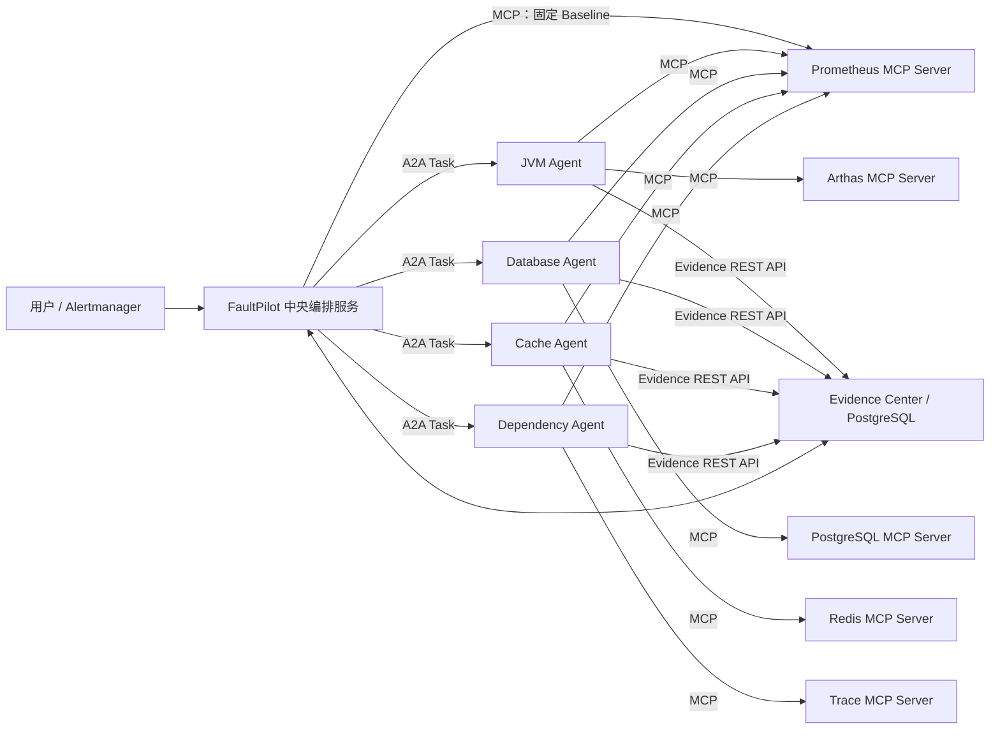
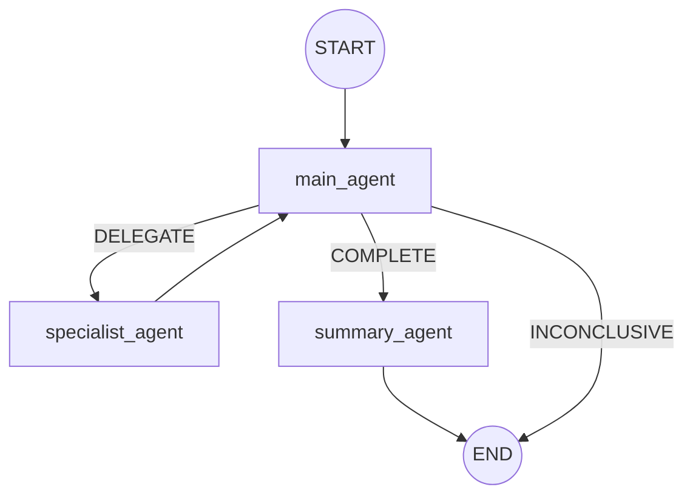
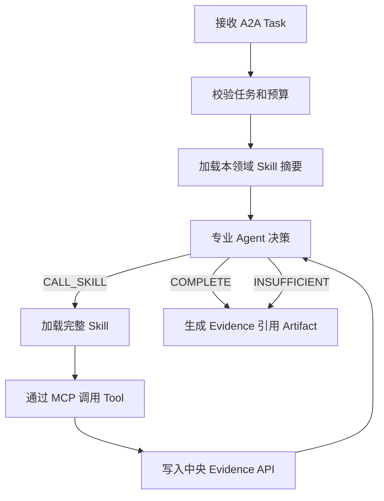

# FaultPilot A2A + MCP 分布式多 Agent 改造设计书

> 文档状态：已被替代，仅保留为设计演进记录。当前实施请以 [FaultPilot A2A + YAML 声明式 HTTP 分布式多 Agent 改造设计书](./FaultPilot-A2A-YAML声明式HTTP分布式多Agent改造设计书.md) 为准。

> 文档状态：待实施  
> 适用项目：FaultPilot  
> 目标版本：V3  
> 编写日期：2026-08-13  
> 说明：本文档是新增设计，不覆盖 `设计.md`、`设计思路.md` 或现有 V2 设计书。

## 1. 改造目标

将当前“单个 Spring Boot 进程内的 Plan-Execute 多 Agent”改造为“中央 Main Agent 循环 + 远程专业 Agent + 标准化远程工具”的分布式诊断系统。

改造后应满足：

1. Main Agent 根据 Incident、Agent 能力概要和已有 Evidence，自主决定委派、继续调查、完成或保守结束。
2. JVM、Database、Cache、Dependency 等专业 Agent 可以独立部署，并在各自领域内自主选择 Skill 和工具。
3. FaultPilot 与专业 Agent 使用 A2A 协议通信；专业 Agent与诊断工具使用 MCP 协议通信。
4. 所有诊断事实统一转换为 Evidence 并存入 FaultPilot PostgreSQL；Main Agent 只根据可审计 Evidence 作判断。
5. LangGraph4j 负责主循环、条件跳转和 Checkpoint 恢复，不负责远程协议细节。
6. 保留本地确定性校验、只读安全、幂等、预算、超时和事件回放，不能把系统安全完全交给模型。
7. 先打通 JVM Agent 垂直切片，再迁移其他专业 Agent，实施期间允许新旧架构并存和回滚。

### 1.1 不在本次范围内

1. 不实现任意模型生成 SQL、Shell、Arthas 命令或 URL 后直接执行。
2. 不引入分布式事务。
3. 不建设中央 MCP Gateway。
4. 不让 Main Agent读取所有专业 Agent 内部 Skill 和 Tool 细节。
5. 不在本次改造中开放生产自动处置；生产环境继续保持只读诊断。
6. 不删除旧架构，直到新架构完成端到端验收并具备回滚能力。

## 2. 现状与主要问题

当前 `faultpilot-server` 已具备以下资产：

- Incident、IncidentSnapshot、Evidence、AgentTask、AgentFinding 等领域对象。
- PostgreSQL 持久化、Incident Event、SSE、诊断报告和处置审计。
- LangGraph4j 主图和 PostgreSQL Checkpoint。
- 专业 Agent 受限工具循环、工具白名单、Evidence 引用校验、模型 JSON 修复。
- Prometheus、Arthas、PostgreSQL、Redis、Trace 等生产只读适配器。

当前主要限制：

1. 四类 Agent 与 Tool 都以 Spring Bean 运行在同一进程，独立部署和跨语言扩展困难。
2. 主图固定为 8 个阶段节点，规划、合成、Critic、Gate 的职责有重叠，循环意图不够直接。
3. 本地 `ToolRegistry` 只注册进程内 Java 对象，不能发现和调用远程工具。
4. Main Agent与专业 Agent的通信是 Java 方法调用，不具备标准任务状态、远程取消和 Evidence 引用 Artifact。
5. 能力变化与 Checkpoint 恢复之间缺少显式版本边界。

## 3. 总体架构



### 3.1 三条通信边界

| 调用关系 | 协议 | 传递内容 | 不传递内容 |
| --- | --- | --- | --- |
| FaultPilot -> 专业 Agent | A2A | 调查目标、Incident 引用、Evidence ID、预算、上下文 | 数据库凭据、工具认证、完整 Skill |
| FaultPilot BaselineCollector -> Prometheus MCP | MCP | 固定的低成本基线 Tool 和受信服务名 | 模型生成的 PromQL、任意 Tool |
| 专业 Agent -> MCP Server | MCP | Tool 名、符合 Schema 的参数、调用上下文 | Main Agent Prompt、最终诊断权限 |
| 专业 Agent -> FaultPilot Evidence Center | 内部 REST | 结构化 Evidence 写入请求 | 模型思维链、工具密钥 |
| 专业 Agent -> FaultPilot Main Agent | A2A Artifact | Task 状态和新产生的 Evidence ID | `causeCode`、根因结论、完整 Evidence 内容 |

A2A 解决 Agent 之间的能力发现、任务委派、状态和 Artifact；MCP 解决工具发现、参数 Schema 和工具调用。两者不能互相替代。

### 3.2 部署单元

| 模块 | 职责 | 首版部署形式 |
| --- | --- | --- |
| `faultpilot-server` | API、Main Agent、LangGraph、Evidence、Summary、事件流、固定 Baseline MCP Client | 独立 Spring Boot 服务 |
| `faultpilot-agent-jvm` | JVM 领域 Loop、Skill、MCP Client、A2A Server | 独立 Spring Boot 服务 |
| `faultpilot-agent-database` | 数据库领域 Loop | 第二阶段独立服务 |
| `faultpilot-agent-cache` | Redis/Cache 领域 Loop | 第二阶段独立服务 |
| `faultpilot-agent-dependency` | 下游和 Trace 领域 Loop | 第二阶段独立服务 |
| MCP Servers | 包装 Prometheus、Arthas、PostgreSQL、Redis、Trace 的只读能力 | 可独立部署或贴近数据源部署 |
| `faultpilot-protocol` | A2A DTO、Evidence DTO、公共枚举和版本契约 | 纯 Java Library，不启动服务 |

首个可运行版本只拆 JVM Agent。其他 Agent 继续通过本地适配器执行，避免一次性分布式重写。

## 4. LangGraph4j 主图

主图只保留真正改变业务阶段的节点：



`BaselineCollector`、能力目录读取、Evidence 加载、A2A 调用、结果合并和本地校验属于节点内部服务，不单独画为图节点。第一次进入 `main_agent` 时，节点前置逻辑先运行一次固定、低成本、只读的 Baseline；恢复或后续轮次根据 Run 中的 `baselineStatus=COMPLETED` 跳过，避免重复采集。

Baseline 是唯一允许中央服务直接调用 MCP Tool 的诊断路径，并且 Tool 集合写死为进程 CPU、线程池、数据库连接池、下游延迟和 Redis 客户端池等低成本路由指标。它不调用 LLM、不加载 Skill、不允许动态 PromQL；深入调查仍必须委派给专业 Agent。迁移期可由现有 `BaselineCollector + ToolRegistry` 执行，最终切换为相同契约的 `McpBaselineGateway`。

### 4.1 `main_agent` 节点

输入：

- `IncidentSnapshot`
- 当前 Run 的 Agent 能力快照
- 当前 Incident 的 ACTIVE Evidence
- 已完成/失败的 Delegation 摘要
- 当前轮次、剩余步骤和 Deadline

输出 `MainAgentDecision`：

```java
public record MainAgentDecision(
        MainDecisionType decision,
        List<DelegationRequest> delegations,
        DiagnosisDraft diagnosis,
        List<UUID> evidenceIds,
        String decisionSummary) {
}

public enum MainDecisionType {
    DELEGATE, COMPLETE, INCONCLUSIVE
}

public record DiagnosisDraft(
        DiagnosisStatus status,
        CauseCode primaryCause,
        List<CauseCode> contributingFactors,
        List<UUID> supportingEvidenceIds,
        List<UUID> counterEvidenceIds,
        List<EvidenceType> missingEvidenceTypes,
        String rationale) {
}
```

行为：

- `DELEGATE`：选择一个或多个独立专业 Agent，并给出每个 Agent 的调查目标。
- `COMPLETE`：证据已经足够，输出诊断骨架和引用的 Evidence ID。
- `INCONCLUSIVE`：预算耗尽、关键能力不可用或证据仍不足，保守结束。

Main Agent 同时完成“反思”和“下一步规划”：每次专业 Agent 返回后，按 Artifact 中的 ID 从 PostgreSQL 重新读取 Evidence，判断原假设是否成立、缺什么、是否需要换领域或结束。系统不暴露模型思维链，只持久化 `decisionSummary` 和结构化 `DiagnosisDraft`。

发送给 Main Agent LLM 的上下文只包含以下结构化字段：

```text
incident: IncidentSnapshot
capabilities: [{agentId, agentType, description, availability, capabilityVersion}]
evidence: [{evidenceId, evidenceType, source, entity, window, summary, structuredData}]
delegationHistory: [{taskId, agentId, objective, status, returnedEvidenceIds}]
budget: {round, maxRounds, stepsUsed, maxSteps, deadline}
```

模型必须返回符合 `MainAgentDecision` JSON Schema 的单个对象。Jackson 负责反序列化，`MainAgentDecisionValidator` 再执行枚举、Evidence 归属、Agent 可用性、重复任务和预算校验；格式修复只允许一次。

### 4.2 `specialist_agent` 节点

该节点是中央 A2A 代理，不执行领域诊断：

1. 读取 `pendingDelegations`。
2. 根据 `agentType` 从能力快照找到 Agent A2A 地址。
3. 为每个 Delegation 创建稳定的 `taskId` 和 `idempotencyKey`。
4. 独立任务可在有界线程池内并行发送；同一轮结束前统一汇总。
5. 等待 A2A Task 到达终态或本轮 Deadline。
6. 校验 Artifact 中 Evidence ID 的归属和状态。
7. 将任务摘要写入 GraphState，返回 `main_agent` 重新判断。

它不读取专业 Agent 内部 Skill，不替专业 Agent 决定调用哪个 MCP Tool。

### 4.3 `summary_agent` 节点

输入为 Main Agent 已确定的诊断骨架和 Evidence 内容，输出用户可读的 `DiagnosisReport`。

Summary Agent只能：

- 组织根因、支持证据、反证、缺失证据和摘要。
- 引用 Main Agent 已选择的 Evidence ID。

Summary Agent不能：

- 新增或修改主根因。
- 将 `INCONCLUSIVE` 提升为 `SUPPORTED/CONFIRMED`。
- 引用当前 Run 之外或不存在的 Evidence。

Summary Agent接收 `IncidentSnapshot + DiagnosisDraft + draft 引用的完整 Evidence`，返回现有 `DiagnosisDecision`/`DiagnosisReport` 兼容结构。Summary 调用失败时，服务端可直接用 `DiagnosisDraft` 生成最小结构化报告，但不得添加任何语义事实。

## 5. GraphState 设计

GraphState 只保存控制状态和 ID，不保存完整 Evidence、Agent Card 或模型原文：

```java
public final class IncidentLoopState extends AgentState {
    UUID incidentId();
    UUID runId();
    int round();
    int stepsUsed();
    String baselineStatus();
    String capabilitySnapshotId();
    List<DelegationRef> pendingDelegations();
    List<DelegationRef> completedDelegations();
    String mainDecision();
    List<UUID> selectedEvidenceIds();
    String diagnosisDraftId();
    String outcome();
}
```

完整对象在节点开始时按 ID 从 PostgreSQL 加载。这样可以控制 Checkpoint 大小，并确保恢复后的数据来自持久化事实源。

## 6. 启动时能力发现

### 6.1 生命周期

FaultPilot 启动并完成配置加载后执行一次能力发现：

```text
读取专业 Agent 静态端点配置
-> 请求每个 Agent Card
-> 校验协议版本、Agent ID、能力版本和认证
-> 生成 CapabilitySnapshot
-> 保存数据库并发布为当前快照
-> 之后才接受新的 Incident
```

能力发现不在每个 Incident 中重复执行。若某个 Agent 启动时不可达，可以按配置决定：

- `required=true`：FaultPilot readiness 失败，不接收 Incident。
- `required=false`：标记该 Agent `UNAVAILABLE`，Main Agent不可委派给它。

### 6.2 Agent Card

每个专业 Agent 暴露标准 A2A Agent Card。Main Agent只使用以下粗粒度信息：

```json
{
  "agentId": "jvm-agent",
  "name": "FaultPilot JVM Agent",
  "description": "Investigates JVM CPU, thread pools, blocked threads, heap and runtime anomalies.",
  "url": "http://jvm-agent:8091/a2a",
  "protocolVersion": "1.0",
  "capabilityVersion": "jvm-agent-1.0.0",
  "domains": ["JVM"],
  "acceptedInputModes": ["application/json"],
  "producedArtifactTypes": ["application/vnd.faultpilot.evidence-refs+json"],
  "supportsStreaming": false,
  "supportsCancel": true
}
```

`description` 告诉 Main Agent“这个 Agent 能调查什么”；具体 Skill 和 MCP Tool 只在专业 Agent 内部可见。

### 6.3 CapabilitySnapshot

每次 FaultPilot 启动生成一条不可变能力快照：

```java
public record CapabilitySnapshot(
        UUID snapshotId,
        Map<String, AgentCapability> agents,
        Instant discoveredAt) {
}
```

不计算全局 Registry Hash。每个 Agent Card 必须提供显式 `capabilityVersion`；它代表该 Agent 的 Skill、Prompt、Evidence 映射和可调用工具契约版本。部署者修改这些能力后必须升级版本并重启 FaultPilot。

## 7. A2A 契约

实现优先采用兼容官方 A2A 规范的 SDK；若 Java SDK 与当前 Spring Boot/LangGraph4j 版本不兼容，则先实现协议兼容的 HTTP Adapter，并将协议细节封装在 `A2aAgentClient` 中，业务层不依赖具体 SDK。

### 7.1 委派请求

A2A Message 的业务 DataPart：

```json
{
  "schemaVersion": "faultpilot.delegation/v1",
  "taskId": "c067eeb9-31d1-4d62-a42f-2e46675d2b85",
  "idempotencyKey": "<runId>:<round>:JVM_AGENT:<objectiveHash>",
  "incident": {
    "incidentId": "63c7b840-5157-4ab1-94cb-4f3cc4e79a08",
    "runId": "5bdf...",
    "serviceName": "order-service",
    "symptom": "order API times out",
    "timeRange": {
      "start": "2026-08-13T08:00:00Z",
      "end": "2026-08-13T08:05:00Z"
    },
    "endpointName": "/api/orders/{orderNumber}",
    "instanceName": "order-service-1"
  },
  "objective": "Determine whether JVM CPU or worker-thread blocking explains the timeout.",
  "availableEvidenceIds": ["..."],
  "limits": {
    "maxSteps": 4,
    "deadline": "2026-08-13T08:06:00Z"
  }
}
```

专业 Agent通过内部 Evidence API 按 ID 读取必要 Evidence。它不能通过 `incidentId` 无限制读取其他 Incident 数据。

### 7.2 返回 Evidence 引用 Artifact

```json
{
  "schemaVersion": "faultpilot.evidence-refs/v1",
  "taskId": "c067eeb9-31d1-4d62-a42f-2e46675d2b85",
  "agentId": "jvm-agent",
  "capabilityVersion": "jvm-agent-1.0.0",
  "executionStatus": "COMPLETED",
  "evidenceIds": ["2f499e68-...", "ff699307-...", "af1ba4c5-..."],
  "stepsUsed": 2
}
```

Artifact 不返回 `causeCode`、支持/反证分类、领域 Finding 或自然语言根因总结。专业 Agent只负责完成领域调查并返回 Evidence ID；Main Agent校验这些 ID 后从中央 PostgreSQL 加载完整 Evidence，再自行判断根因和证据角色。

### 7.3 A2A 任务状态映射

| A2A 状态 | FaultPilot `AgentTaskStatus` | 处理 |
| --- | --- | --- |
| submitted / working | RUNNING | 继续等待或恢复后查询 |
| completed | SUCCEEDED | 校验 Artifact；允许 Evidence ID 列表为空，由 Main Agent判断证据不足 |
| failed | FAILED | 保留已有 Evidence，Main Agent决定是否改派 |
| canceled | CANCELLED | 不再等待 |
| input-required | FAILED | 诊断 Agent不允许向终端用户追问，记录协议错误 |

### 7.4 A2A 幂等

`taskId` 由 FaultPilot 在生成 Delegation 时创建，不由 LLM 创建，也不是 `incidentId`。

```text
idempotencyKey = runId + round + agentId + SHA-256(normalizedObjective)
```

专业 Agent持久化 `idempotencyKey -> A2A taskId/result`。重复请求返回同一任务状态和 Artifact，不重复调用工具。

## 8. 专业 Agent 内部 Loop

每个专业 Agent内部流程一致，但拥有不同 Skill 和 MCP Server：



专业 Agent 的模型决策是串行 Loop；同一决策轮内只有互不依赖、无副作用且预算允许的工具才可并行。首版 JVM Agent保持单工具串行，降低实现和审计复杂度。

专业 Agent每一步模型输入为：

```text
delegation: {taskId, objective, incident摘要, deadline}
skillSummaries: [{name, description, triggerEvidenceTypes, producesEvidenceTypes}]
activeSkill: 当前选中 Skill 的完整受信内容，未选择时为空
availableTools: Skill 白名单与 MCP tools/list 的交集及其参数 Schema
evidence: 委派时允许读取的 Evidence + 本任务新产生的 Evidence
observations: [{toolName, success, evidenceId, boundedSummary}]
budget: {step, maxSteps, deadline}
```

模型每步只可返回 `CALL_SKILL`、`CALL_TOOL`、`COMPLETE` 或 `INSUFFICIENT`。专业 Agent本地 Guard 验证后执行；最终只生成 Evidence 引用 Artifact，不生成根因 Finding。

### 8.1 Skill 的作用

MCP 只说明“有哪些工具、参数是什么、如何调用”；Skill 说明“何时调用、允许组合哪些工具、什么证据算完成”。因此使用 MCP 后仍需要 Skill。

建议结构：

```text
faultpilot-agent-jvm/
  src/main/resources/skills/
    jvm-cpu-hotspot/
      skill.yaml
      SKILL.md
    jvm-thread-pool-exhausted/
      skill.yaml
      SKILL.md
```

`skill.yaml`：

```yaml
apiVersion: faultpilot/v1
kind: DiagnosticSkill
metadata:
  name: jvm-thread-pool-exhausted
  version: 1.0.0
spec:
  ownerAgent: JVM_AGENT
  description: Diagnose worker pool saturation and locate blocking application threads.
  triggerEvidenceTypes:
    - THREAD_POOL_ACTIVE_AT_MAX
  producesEvidenceTypes:
    - BLOCKING_TASK_FOUND
  allowedMcpTools:
    - prometheus.query_executor_pool
    - arthas.inspect_waiting_threads
  completion:
    anyOf:
      - allOf: [THREAD_POOL_ACTIVE_AT_MAX, BLOCKING_TASK_FOUND]
  limits:
    maxSteps: 3
    timeoutSeconds: 60
  riskLevel: READ_ONLY
```

`SKILL.md` 保存给专业 Agent 的领域策略、证据解释、停止条件和反证要求，不保存认证信息，也不直接拼接任意 URL。

## 9. MCP 工具调用

### 9.1 运行方式

专业 Agent 是 MCP Host，在进程内为每个 MCP Server建立 MCP Client：

```text
专业 Agent 启动
-> 根据配置连接允许的 MCP Server
-> tools/list 获取工具和 JSON Schema
-> 本地校验 Tool 名、风险等级和 Schema
-> 缓存当前进程的工具目录
-> 专业 Agent选中 Skill 后执行 tools/call
```

工具 URL 和认证来自专业 Agent部署配置，不进入 Skill，也不发送给模型：

```yaml
faultpilot:
  mcp:
    servers:
      prometheus:
        transport: streamable-http
        url: ${PROMETHEUS_MCP_URL:http://prometheus-mcp:9101/mcp}
        credential-ref: ${PROMETHEUS_MCP_CREDENTIAL_REF:}
      arthas:
        transport: streamable-http
        url: ${ARTHAS_MCP_URL:http://arthas-mcp:9102/mcp}
        credential-ref: ${ARTHAS_MCP_CREDENTIAL_REF:}
```

不能让 LLM 从 YAML 中读取任意 URL 并发起请求。URL 必须由受信配置绑定到已注册的 MCP Server ID，防止 SSRF 和越权访问。

### 9.2 Tool Schema 示例

`arthas.inspect_waiting_threads`：

```json
{
  "name": "arthas.inspect_waiting_threads",
  "description": "Inspect bounded WAITING JVM application threads for a configured service.",
  "inputSchema": {
    "type": "object",
    "required": ["serviceName", "limit"],
    "properties": {
      "serviceName": {"type": "string", "maxLength": 128},
      "limit": {"type": "integer", "minimum": 1, "maximum": 50}
    },
    "additionalProperties": false
  },
  "annotations": {
    "readOnlyHint": true,
    "destructiveHint": false
  }
}
```

MCP Server内部根据 `serviceName` 查询受信 Service Catalog，获得 Arthas 地址、认证和业务包前缀；模型不能传地址、认证或任意 Arthas 命令。

### 9.3 MCP 返回与 Evidence 转换

MCP Tool返回结构化结果：

```json
{
  "status": "FOUND",
  "source": "arthas:order-service:waiting-threads",
  "evidenceType": "BLOCKING_TASK_FOUND",
  "summary": "Found 4 WAITING application threads at FaultScenarioManager.java:276",
  "data": {
    "threadCount": 4,
    "firstThreadName": "faultpilot-worker-1",
    "className": "com.astrayzjt.faultpilot.lab.order.fault.FaultScenarioManager",
    "methodName": "lambda$startBlockedTasks$9",
    "fileName": "FaultScenarioManager.java",
    "lineNumber": 276,
    "blockingOperation": "java.util.concurrent.locks.LockSupport.park"
  }
}
```

专业 Agent中的 `EvidenceMapper` 根据受信 Tool ID 和返回 Schema 映射 EvidenceType，模型无权指定 EvidenceType。完成脱敏、截断、Hash 和归属字段后调用中央 Evidence API。

## 10. Evidence Center API

### 10.1 写入

```http
POST /internal/v1/incidents/{incidentId}/runs/{runId}/evidence
Authorization: Bearer <agent-service-token>
Idempotency-Key: <taskId>:<stepIndex>:<toolCallId>
```

请求：

```json
{
  "producerTaskId": "c067eeb9-...",
  "agentId": "jvm-agent",
  "toolId": "arthas.inspect_waiting_threads",
  "toolCallId": "2d63...",
  "evidenceType": "BLOCKING_TASK_FOUND",
  "source": "arthas:order-service:waiting-threads",
  "entity": "order-service",
  "windowStart": "2026-08-13T08:00:00Z",
  "windowEnd": "2026-08-13T08:05:00Z",
  "summary": "Found 4 WAITING application threads at FaultScenarioManager.java:276",
  "data": {"lineNumber": 276, "blockingOperation": "LockSupport.park"}
}
```

服务端必须校验：

- Agent 身份是否与 `producerTaskId` 的目标 Agent一致。
- Incident、Run、Task 三者是否关联。
- Tool 是否属于该 Agent当前能力版本，EvidenceType 是否是固定映射允许值。
- 时间窗是否在 Incident 窗口和允许偏移内。
- 请求是否满足大小限制、字段白名单和脱敏要求。

### 10.2 读取

```http
POST /internal/v1/evidence:batchGet
```

请求必须同时包含 `incidentId`、`runId` 和 `evidenceIds`。服务端只返回同时属于三者且状态为 ACTIVE 的记录，防止跨 Incident 引用。

### 10.3 Evidence 生命周期

Evidence 增加：

```text
run_id
agent_id
tool_id
tool_call_id
capability_version
status: ACTIVE | STALE | REVOKED
structured_data_json
```

- `ACTIVE`：可用于当前 Run 推理和最终报告。
- `STALE`：因能力版本变化或新 Run 重启而保留审计，但不能参与新诊断。
- `REVOKED`：发现来源错误或校验失败，只保留审计。

## 11. 数据模型与迁移

保留现有表，新增或调整如下：

### 11.1 `capability_snapshot`

```sql
CREATE TABLE capability_snapshot (
    id UUID PRIMARY KEY,
    status VARCHAR(32) NOT NULL,
    agents_json JSONB NOT NULL,
    discovered_at TIMESTAMPTZ NOT NULL
);
```

### 11.2 `incident_investigation_run`

```sql
CREATE TABLE incident_investigation_run (
    id UUID PRIMARY KEY,
    incident_id UUID NOT NULL REFERENCES incident_run(id),
    capability_snapshot_id UUID NOT NULL REFERENCES capability_snapshot(id),
    status VARCHAR(32) NOT NULL,
    restart_reason VARCHAR(64),
    started_at TIMESTAMPTZ NOT NULL,
    completed_at TIMESTAMPTZ,
    version BIGINT NOT NULL DEFAULT 0
);
```

一个 Incident 可以有多个 Run；同一时间最多一个 ACTIVE Run。Incident 是用户问题，Run 是一次采用固定能力快照的调查执行。

### 11.3 `agent_delegation`

```sql
CREATE TABLE agent_delegation (
    id UUID PRIMARY KEY,
    run_id UUID NOT NULL REFERENCES incident_investigation_run(id),
    incident_id UUID NOT NULL REFERENCES incident_run(id),
    round INTEGER NOT NULL,
    agent_id VARCHAR(128) NOT NULL,
    agent_type VARCHAR(64) NOT NULL,
    capability_version VARCHAR(128) NOT NULL,
    objective TEXT NOT NULL,
    objective_hash VARCHAR(128) NOT NULL,
    idempotency_key VARCHAR(256) NOT NULL UNIQUE,
    remote_task_id VARCHAR(256),
    status VARCHAR(32) NOT NULL,
    artifact_json JSONB,
    started_at TIMESTAMPTZ,
    completed_at TIMESTAMPTZ,
    error_code VARCHAR(64),
    error_message TEXT
);
```

`agent_task_run` 在兼容期继续保留；新链路可先双写，稳定后再决定是否由 `agent_delegation` 完全替代。`artifact_json` 只保存任务状态、Evidence ID、能力版本和步数，不保存专业 Agent生成的根因结论。

### 11.4 现有表调整

```sql
ALTER TABLE evidence_record
    ADD COLUMN run_id UUID REFERENCES incident_investigation_run(id),
    ADD COLUMN agent_id VARCHAR(128),
    ADD COLUMN tool_id VARCHAR(192),
    ADD COLUMN tool_call_id VARCHAR(256),
    ADD COLUMN capability_version VARCHAR(128),
    ADD COLUMN evidence_status VARCHAR(32) NOT NULL DEFAULT 'ACTIVE',
    ADD COLUMN structured_data_json JSONB NOT NULL DEFAULT '{}'::jsonb;
```

### 11.5 专业 Agent 本地任务表

每个独立专业 Agent拥有自己的轻量持久化库，至少保存 A2A Task 和幂等结果：

```sql
CREATE TABLE remote_agent_task (
    task_id UUID PRIMARY KEY,
    idempotency_key VARCHAR(256) NOT NULL UNIQUE,
    incident_id UUID NOT NULL,
    run_id UUID NOT NULL,
    objective_hash VARCHAR(128) NOT NULL,
    capability_version VARCHAR(128) NOT NULL,
    status VARCHAR(32) NOT NULL,
    step_index INTEGER NOT NULL DEFAULT 0,
    evidence_ids_json JSONB NOT NULL DEFAULT '[]'::jsonb,
    artifact_json JSONB,
    deadline TIMESTAMPTZ NOT NULL,
    started_at TIMESTAMPTZ NOT NULL,
    updated_at TIMESTAMPTZ NOT NULL,
    completed_at TIMESTAMPTZ
);
```

专业 Agent每次模型决策、MCP 调用和 Evidence 发布完成后更新任务状态。中央服务只保存 Delegation 状态；远程任务的真实执行状态由专业 Agent自己的任务表负责。两者通过稳定的 `taskId` 和 `idempotencyKey` 对账，不使用分布式事务。

事件表继续作为前端实时展示和审计时间线；模型原始思维链不入库。

## 12. Checkpoint 与重启恢复

### 12.1 恢复原则

Checkpoint 的 thread ID 使用稳定键：

```text
threadId = "incident:" + incidentId + ":run:" + runId
```

服务重启后：

1. 读取未终态的 `incident_investigation_run`。
2. 获取该 Run 绑定的 `capability_snapshot`。
3. 将快照中的全部 Agent ID、可用状态和 `capabilityVersion` 与本次启动发现结果逐项比较。
4. 版本完全一致：恢复原 Checkpoint；对 RUNNING Delegation 先查询 A2A 远程 Task 状态，再继续图。
5. 任一 Agent新增、删除、可用状态改变或版本变化：原 Run 标记 `STALE`，其 Evidence 标记 `STALE`，创建新 Run，从 `main_agent` 重新规划。

该规则故意不分析“变化是否影响当前计划”，以换取简单、可解释的恢复行为。“重新规划”不是重新创建 Incident，也不是覆盖旧证据；旧 Run 完整保留用于审计，但新 Run 不把旧 Evidence 当成有效事实。

### 12.2 远程任务恢复

- 远程任务已完成：拉取 Artifact，校验并继续。
- 远程任务仍运行：在剩余 Deadline 内继续等待。
- 远程 Agent无任务记录：使用相同 `idempotencyKey` 重发。
- 远程能力版本改变：不复用任务，触发新 Run。
- 全局 Deadline 已过：将任务标记 TIMED_OUT，交给 Main Agent保守结束或选择其他能力。

## 13. 本地校验与安全边界

本地校验不重复做模型的语义诊断，只保证模型不能越权、伪造或破坏系统。

### 13.1 Main Agent 输出校验

1. `decision` 只能是 `DELEGATE / COMPLETE / INCONCLUSIVE`。
2. `DELEGATE` 的 Agent 必须存在于当前 CapabilitySnapshot 且状态 AVAILABLE。
3. `objective` 非空、有长度上限，不能携带 URL、凭据、SQL 或命令。
4. Evidence ID 必须存在，属于当前 Incident、当前 Run 且状态 ACTIVE。
5. 相同 Agent + 规范化 objective 在同一 Run 内不能重复执行，除非引用了新增 Evidence。
6. 不能超过最大轮次、总步骤数、模型调用数和 Deadline。
7. `COMPLETE` 必须有有效 Evidence；否则降级为 `INCONCLUSIVE`。

### 13.2 专业 Agent 调用校验

1. Skill 必须属于当前专业 Agent。
2. MCP Tool 必须位于 Skill 白名单并由当前 MCP Server `tools/list` 返回。
3. 参数必须通过 MCP JSON Schema；服务名只能来自任务上下文。
4. Tool 必须标记只读，生产模式拒绝写能力。
5. 单工具超时、响应大小、结果条数和 Agent步骤数必须有上限。
6. 工具结果中的文本视为不可信数据，不能改变 Prompt、权限或下一步工具清单。

### 13.3 Summary 输出校验

1. 不能引用不存在、STALE、跨 Incident 或跨 Run Evidence。
2. 不能增加 Main Agent未确定的新根因。
3. 不能把 `INCONCLUSIVE` 提升为 `SUPPORTED/CONFIRMED`。
4. JSON 必须符合 Schema；只允许一次格式修复，仍失败则保留证据并返回结构化失败原因。

### 13.4 身份与网络

- A2A 和 Evidence API 使用服务身份认证，生产建议 mTLS + 短期 Token。
- MCP Server 仅对允许的专业 Agent网络开放。
- 每个 Agent、MCP Server 使用最小权限账号，不共享数据库、Redis 或 Arthas 凭据。
- 日志、事件、Trace 和模型上下文不得记录密钥、Cookie、Authorization Header 或完整业务参数。

## 14. 超时、重试、并发与熔断

建议默认预算：

| 层级 | 默认值 |
| --- | ---: |
| Incident Run 总时限 | 180 秒 |
| Main Agent 最大轮次 | 4 |
| Main Agent 总委派数 | 8 |
| 单 A2A Delegation | 60 秒 |
| 单专业 Agent 最大步骤 | 4 |
| 单 MCP Tool | 8 秒 |
| 单模型调用 | 45 秒 |
| 同一 Incident 并发专业 Agent | 2 |

失败策略：

| 失败点 | 行为 |
| --- | --- |
| Agent Card 获取失败 | 标记 Agent不可用；required Agent导致 readiness 失败 |
| A2A 连接失败/5xx | 同一幂等键指数退避重试，最多 2 次；之后交回 Main Agent |
| A2A 超时 | 尝试 cancel；任务标记 TIMED_OUT，保留已写 Evidence |
| MCP 网络失败 | ToolResult 失败；按映射可写 `DATA_UNAVAILABLE` Evidence |
| MCP JSON 非法 | 拒绝结果，不让模型直接解释原始非法内容 |
| 模型非法 JSON | 一次格式修复；仍失败则该节点保守失败 |
| Summary 失败 | 不丢失 Main Decision 和 Evidence，报告状态为 INCONCLUSIVE/REPORT_FAILED |

重试只针对网络瞬态错误和幂等读取；参数错误、权限错误、Schema 错误不重试。A2A、MCP、模型调用使用独立有界线程池和 Bulkhead，防止一个依赖拖垮中央服务。

## 15. 配置设计

中央服务只配置 Agent 端点和中央预算：

```yaml
faultpilot:
  orchestration:
    mode: LOOP
    max-rounds: 4
    max-delegations: 8
    run-timeout-seconds: 180
  agents:
    endpoints:
      jvm-agent:
        card-url: ${JVM_AGENT_CARD_URL:http://localhost:8091/.well-known/agent-card.json}
        required: true
      database-agent:
        card-url: ${DATABASE_AGENT_CARD_URL:http://localhost:8092/.well-known/agent-card.json}
        required: false
  transport:
    specialist: ${FAULTPILOT_SPECIALIST_TRANSPORT:LOCAL} # LOCAL | A2A
```

专业 Agent配置自己的 MCP Server，不由中央服务管理：

```yaml
faultpilot:
  agent:
    id: jvm-agent
    type: JVM_AGENT
    capability-version: jvm-agent-1.0.0
  tools:
    transport: ${FAULTPILOT_TOOL_TRANSPORT:LOCAL} # LOCAL | MCP
  evidence:
    base-url: ${FAULTPILOT_EVIDENCE_URL:http://localhost:8080/internal/v1}
```

兼容开关用于迁移和回滚，不应长期形成两套业务规则。相同 DTO、Guard 和 EvidenceMapper 应被 LOCAL 与远程 Adapter 共用。

## 16. 代码模块与接口改造

### 16.1 推荐 Maven 模块

```text
IncidentPilot/
  faultpilot-protocol/
  faultpilot-server/
  faultpilot-agent-core/
  faultpilot-agent-jvm/
  faultpilot-agent-database/
  faultpilot-agent-cache/
  faultpilot-agent-dependency/
  faultpilot-mcp-prometheus/
  faultpilot-mcp-arthas/
  faultpilot-mcp-postgres/
  faultpilot-mcp-redis/
  faultpilot-mcp-trace/
```

第一阶段只创建 `faultpilot-protocol`、`faultpilot-agent-core`、`faultpilot-agent-jvm` 和 JVM 所需 MCP Server；后续模块按领域复制成熟骨架。

### 16.2 中央服务新接口

```java
public interface AgentCapabilityProvider {
    CapabilitySnapshot discover();
}

public interface SpecialistGateway {
    DelegationHandle submit(DelegationRequest request);
    DelegationResult await(DelegationHandle handle, Instant deadline);
    Optional<DelegationResult> query(String remoteTaskId);
    void cancel(String remoteTaskId);
}

public interface MainAgent {
    MainAgentDecision decide(MainAgentContext context);
}

public interface SummaryAgent {
    DiagnosisDecision summarize(SummaryContext context);
}
```

实现：

- `LocalSpecialistGateway`：调用现有 `SpecialistAgentRunner`，并通过兼容映射只向 Main Agent返回 Evidence ID。
- `A2aSpecialistGateway`：调用远程 Agent。
- `CompositeSpecialistGateway`：按 Agent 配置选择 LOCAL 或 A2A，供迁移期使用。

### 16.3 专业 Agent 新接口

```java
public interface SkillCatalog {
    List<SkillSummary> summaries();
    DiagnosticSkill require(String skillName);
}

public interface DiagnosticToolGateway {
    List<RemoteToolDefinition> listTools(String serverId);
    RemoteToolResult call(String serverId, String toolName, JsonNode arguments,
                          ToolCallContext context);
}

public interface EvidencePublisher {
    UUID publish(EvidenceWriteRequest request);
}
```

实现：

- `LocalDiagnosticToolGateway`：复用当前 `ToolRegistry` 和 `DiagnosticTool.execute()`。
- `McpDiagnosticToolGateway`：通过 MCP Client执行 `tools/list` 和 `tools/call`。

### 16.4 现有类迁移映射

| 当前类/职责 | 改造后 |
| --- | --- |
| `IncidentOrchestrator` 8 节点图 | 改为 3 节点 Loop 图；保留启动、异常状态和 Checkpoint 外壳 |
| `SupervisorPlanner` | 语义合并到 `MainAgent.decide()` |
| `SpecialistAgentRunner` | 迁移到 `faultpilot-agent-core`，成为远程 Agent内部 Loop；移除最终 Finding 根因生成，只返回 Evidence 引用结果 |
| `ToolRegistry` | 仅作为 `LocalDiagnosticToolGateway` 的实现 |
| `ProductionDiagnosticToolsConfiguration` | 首阶段保留；逐项迁移到 MCP Server Handler |
| `DiagnosisSynthesizer` | 拆为 Main Agent的诊断骨架 + `SummaryAgent` 文本整理 |
| `DiagnosisCritic` | 移除独立节点；反思由 Main Agent每轮决策完成 |
| `EvidenceGate` | 删除复杂语义裁决；保留最小引用、状态和置信等级约束 Guard |
| `EvidenceService/Repository` | 扩展为中央 Evidence Center，继续作为唯一事实源 |
| `AgentTaskRepository` | 兼容期双写 `agent_delegation`，最终按实际需要收敛 |

## 17. 事件与前端兼容

现有 Incident 查询、Evidence、Investigation、Report、Pending Action 和 SSE 接口保持兼容。新增事件：

```text
CAPABILITY_SNAPSHOT_BOUND
MAIN_AGENT_DECIDED
DELEGATION_SUBMITTED
DELEGATION_PROGRESS
DELEGATION_COMPLETED
DELEGATION_FAILED
EVIDENCE_PUBLISHED
RUN_RESTARTED_CAPABILITY_CHANGED
SUMMARY_COMPLETED
```

前端继续通过 SSE 接收增量事件，通过现有查询接口按 Incident ID 重建页面。刷新或重新打开页面时，先查询当前 ACTIVE Run，再拉取已持久化结果；不依赖浏览器一直在线。

## 18. 分阶段实施

### 阶段 0：契约和特性开关

1. 新建 `faultpilot-protocol`，定义能力、Delegation、Evidence 引用 Artifact、Evidence API DTO。
2. 新增 `runId`、CapabilitySnapshot 和 AgentDelegation 数据表。
3. 引入 `SpecialistGateway`、`DiagnosticToolGateway` 抽象。
4. 保持默认 `LOCAL`，所有现有测试必须通过。

完成标准：零业务行为变化；新旧 DTO 映射测试通过。

### 阶段 1：中央 Main Agent Loop

1. 新增 `IncidentLoopState`。
2. 将主图改为 `main_agent -> specialist_agent -> main_agent -> summary_agent`。
3. 将规划和证据充分性判断合并为 `MainAgentDecision`。
4. 保留旧图配置开关，便于 A/B 回归。

完成标准：LOCAL 模式下 7 类故障结果不低于当前基线；至少一个场景发生两轮定向调查。

### 阶段 2：JVM Agent A2A 垂直切片

1. 创建 `faultpilot-agent-core` 和 `faultpilot-agent-jvm`。
2. 实现 JVM Agent Card、A2A Task Handler、幂等任务表和 Evidence 引用 Artifact。
3. 将 JVM `SpecialistAgentRunner` 移至独立进程。
4. 中央 `A2aSpecialistGateway` 接入 JVM Agent，其他 Agent继续 LOCAL。

完成标准：CPU 热点和线程池耗尽均通过 A2A 完成；中央进程不直接运行 JVM 专业 Loop。

### 阶段 3：Prometheus/Arthas MCP

1. 实现只读 Prometheus MCP Server 和 Arthas MCP Server。
2. JVM Agent接入 MCP Client、SkillCatalog、Tool Guard 和 EvidencePublisher。
3. 将 JVM 工具从本地 Bean 切换为 MCP；保留 `LOCAL/MCP` 回滚开关。

完成标准：线程池场景产生 `THREAD_POOL_ACTIVE_AT_MAX + BLOCKING_TASK_FOUND`，并包含线程名、方法、文件和源码行；CPU 场景产生 `PROCESS_CPU_HIGH + CPU_HOT_METHOD_FOUND`。

### 阶段 4：迁移其他专业 Agent

按 Database -> Cache -> Dependency 顺序迁移 A2A 和 MCP。每迁移一个 Agent，都必须先通过本地/远程契约一致性测试，再切换默认传输。

完成标准：四个专业 Agent均可独立部署；Main Agent不感知内部 Skill 和 MCP Tool 变化。

### 阶段 5：恢复、安全和生产硬化

1. 实现 CapabilitySnapshot 版本恢复策略。
2. 增加 mTLS/服务 Token、限流、熔断、Bulkhead 和审计。
3. 完成 Agent/MCP 不可用、重启、重复请求和能力变更演练。
4. 删除过渡期重复业务实现，保留协议 Adapter 和明确回滚版本。

## 19. 测试策略

### 19.1 单元测试

- MainAgentDecisionValidator：枚举、Agent、objective、Evidence、预算、去重。
- SkillCatalog：YAML/Markdown 解析、版本、归属、白名单、完成条件。
- McpToolGuard：Schema、只读、服务名、超时、结果大小。
- Evidence API：身份、Incident/Run/Task 归属、幂等、STALE 拒绝。
- SummaryValidator：根因和置信等级不能被提升，Evidence 引用 100% 有效。
- CapabilityRecoveryPolicy：版本一致恢复、版本变化新建 Run。

### 19.2 契约测试

- FaultPilot `A2aSpecialistGateway` 与每个 Agent A2A Server 使用同一组 JSON Fixture。
- 专业 Agent MCP Client 与 MCP Server 使用 `tools/list`、Schema、`tools/call` 契约测试。
- LOCAL 与 A2A、LOCAL 与 MCP 对同一固定输入产生等价 Evidence 引用和 Evidence 结构。

### 19.3 集成与故障测试

1. JVM Agent正常完成、超时、崩溃后恢复、返回非法 Artifact。
2. MCP Server超时、断连、返回超大内容、Schema 不匹配、提示注入文本。
3. FaultPilot 在 A2A 任务执行中重启，版本不变时从 Checkpoint 继续。
4. FaultPilot 重启且 Agent `capabilityVersion` 变化，旧 Run/Evidence 变 STALE，新 Run重新规划。
5. 两个专业 Agent并行时一个成功一个超时，Main Agent能基于现有 Evidence继续或 INCONCLUSIVE。
6. 重复提交相同 `idempotencyKey` 不重复调用 MCP Tool。

### 19.4 业务场景回归

| 场景 | 关键验收证据 | 预期结论 |
| --- | --- | --- |
| JVM CPU 热点 | `PROCESS_CPU_HIGH` + `CPU_HOT_METHOD_FOUND` | CONFIRMED |
| JVM 线程池耗尽 | `THREAD_POOL_ACTIVE_AT_MAX` + `BLOCKING_TASK_FOUND` | CONFIRMED |
| DB 慢 SQL | 慢 SQL + 时间关联或执行计划证据 | SUPPORTED/CONFIRMED |
| DB 连接池耗尽 | 池饱和 + 连接持有证据 | SUPPORTED/CONFIRMED |
| Redis 服务端延迟 | 命令延迟 + Slowlog/Trace | SUPPORTED/CONFIRMED |
| Redis 客户端池耗尽 | 客户端池等待 + 服务端反证 | SUPPORTED/CONFIRMED |
| 下游超时 | 下游延迟 + Trace Span | SUPPORTED/CONFIRMED |

缺少关键数据源时必须返回 `INCONCLUSIVE`，不得由 Summary Agent补造结论。

## 20. 可观测性

新增指标：

```text
faultpilot_main_agent_decisions_total{decision}
faultpilot_delegations_total{agent,status}
faultpilot_a2a_latency_seconds{agent,operation}
faultpilot_mcp_calls_total{agent,server,tool,status}
faultpilot_mcp_latency_seconds{agent,server,tool}
faultpilot_evidence_published_total{agent,type,status}
faultpilot_checkpoint_resumes_total{outcome}
faultpilot_runs_restarted_total{reason}
faultpilot_budget_exhausted_total{level}
```

Trace 统一传播 `traceId`，并在 A2A、MCP 和 Evidence 请求中携带：

```text
incidentId, runId, delegationId/taskId, toolCallId
```

日志只记录结构化摘要和 ID，不记录模型思维链、密钥或未经脱敏的原始工具结果。

## 21. 验收标准

改造完成必须同时满足：

1. 中央 LangGraph 主图只有 `main_agent`、`specialist_agent`、`summary_agent` 三个业务节点。
2. Main Agent能基于专业 Agent返回的新 Evidence 进行至少一次真实的继续调查或结束判断。
3. JVM Agent独立部署，通过 A2A 接收任务，通过 MCP 调用 Prometheus 和 Arthas。
4. Main Agent只看到 Agent Card 摘要，不读取 JVM Agent内部 Skill 和 Tool 清单。
5. 专业 Agent只返回有效 Evidence ID；最终报告的 Evidence 引用有效率为 100%。
6. 所有生产 MCP Tool 为只读，模型不能传 URL、认证、SQL、Shell 或任意 Arthas 命令。
7. A2A 重试不会重复执行诊断工具；Evidence 写入具有幂等性。
8. FaultPilot 重启且能力版本不变时可恢复；版本变化时创建新 Run 并重新规划。
9. CPU 热点、线程池耗尽等 7 类场景回归通过；数据缺失时不伪造确定结论。
10. `mvn verify`、协议契约测试、安全测试和分布式恢复测试全部通过。

## 22. 实施顺序与提交建议

```text
feat: add distributed agent protocol contracts
feat: persist capability snapshots and investigation runs
feat: introduce main agent loop graph
feat: add a2a specialist gateway
feat: extract jvm specialist agent service
feat: expose prometheus and arthas mcp tools
feat: connect jvm agent skills to mcp
feat: migrate database cache and dependency agents
test: verify distributed agent recovery and safety
```

每个阶段独立提交。不得提交 `.env`、Token、数据库密码、Arthas 凭据、原始线程栈或生产查询数据。

## 23. 最终设计结论

FaultPilot 改造后的核心不是“把原有 Java 方法换成 HTTP”，而是明确三个自治和治理边界：

1. **Main Agent自治**：只理解 Incident、专业 Agent能力和 Evidence，负责跨领域循环决策。
2. **专业 Agent自治**：理解本领域 Skill，根据目标自主选择 MCP Tool，发布结构化 Evidence 并只返回 Evidence ID。
3. **工具确定性执行**：MCP Server只执行预注册、参数受限、只读的诊断操作，并产出可映射 Evidence 的结构化结果。

LangGraph4j 管理中央循环和恢复，A2A 管理 Agent 间任务，MCP 管理工具调用，PostgreSQL 管理 Evidence 和审计事实。本地 Guard 则保证模型的每一次决策都停留在已注册能力、有效证据和预算边界之内。
