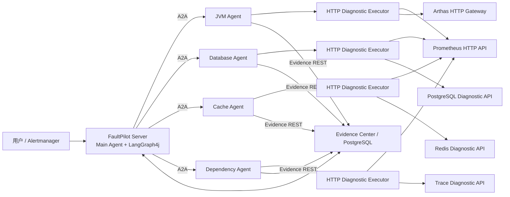
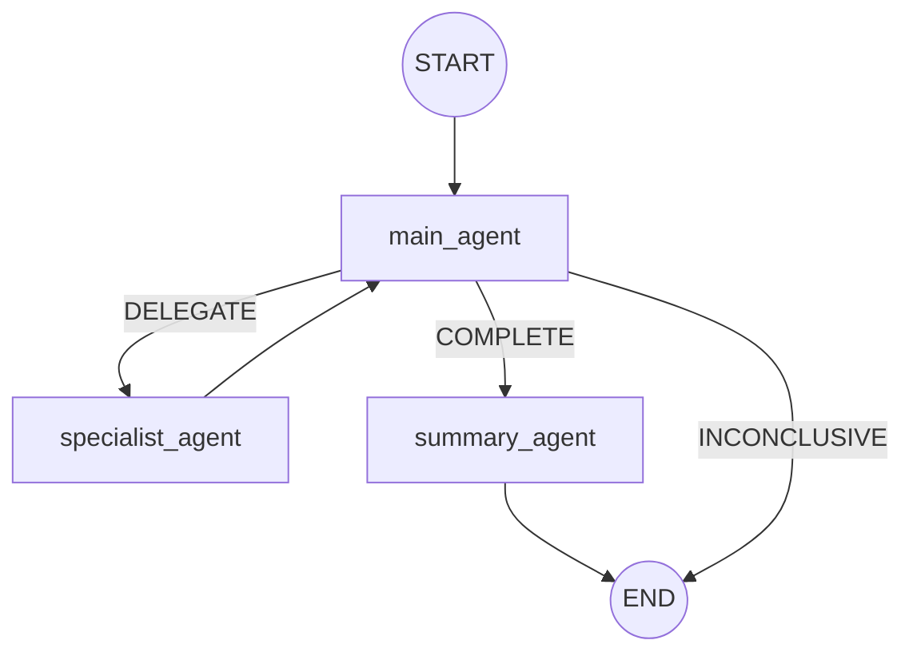
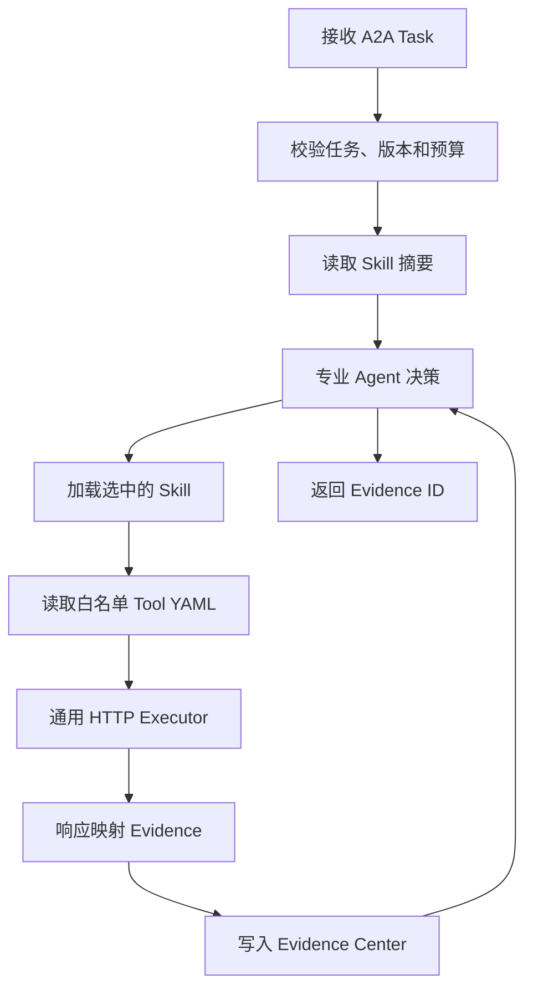

# FaultPilot A2A + YAML 声明式 HTTP 分布式多 Agent 改造设计书

> 文档状态：当前实施基线  
> 目标版本：V3-YAML  
> 编写日期：2026-08-13  
> 说明：本文档是新增替代设计，不覆盖现有 LOOP、V2 或 A2A+MCP 文档。

## 1. 核心方案

FaultPilot 改造为：

```text
FaultPilot Main Agent
        │ A2A
        ▼
JVM / Database / Cache / Dependency Agent
        │ 自主选择 Skill
        ▼
YAML ToolDefinition
        │ 通用 HTTP Executor
        ▼
Prometheus / Arthas Gateway / PostgreSQL Diagnostic API /
Redis Diagnostic API / Trace API
        │
        ▼
结构化 Evidence → FaultPilot PostgreSQL
```

本方案不使用 MCP，不引入 MCP Client、MCP Server、MCP Host 或 MCP Gateway。

专业 Agent 根据调查任务自主选择 Skill；Skill 限定允许使用的工具；工具的 HTTP 方法、逻辑端点、路径、参数来源、响应解析和 Evidence 映射由 YAML 声明；Java 通用执行器负责确定性请求，不为每个指标单独编写工具类。

### 1.1 职责边界

| 组件 | 负责 | 不负责 |
| --- | --- | --- |
| Main Agent | 跨领域规划、证据充分性判断、继续或结束 | 不选择专业 Agent 内部工具 |
| 专业 Agent | 领域内选择 Skill、工具和停止时机 | 不输出最终根因 |
| Skill | 诊断顺序、工具白名单、完成条件、预算 | 不保存真实 URL 和凭据 |
| ToolDefinition YAML | HTTP 请求和响应到 Evidence 的映射 | 不决定业务根因 |
| HTTP Executor | 校验定义、生成请求、超时、解析响应 | 不进行 LLM 推理 |
| HTTP Diagnostic Adapter | 包装受限只读诊断能力 | 不接受任意 SQL、命令或 URL |
| Evidence Center | Evidence 持久化、归属和去重 | 不执行诊断工具 |

## 2. 改造目标

1. 中央 Main Agent 根据 Incident、Agent 能力概要和 Evidence 循环规划。
2. 专业 Agent 可独立部署，并通过 A2A 接收调查任务。
3. 新增普通诊断工具时，主要新增 YAML 与 Skill，不修改 Main Agent 和通用 Executor。
4. Prometheus、Arthas、PostgreSQL、Redis 和 Trace 统一通过受控 HTTP 方式调用。
5. 所有工具结果先转换成结构化 Evidence，专业 Agent 只向 Main Agent 返回 Evidence ID。
6. 保留 LangGraph4j Checkpoint、版本恢复、幂等、预算、超时和生产只读限制。
7. 先完成 JVM Agent 垂直切片，再迁移数据库、缓存和依赖 Agent。

### 2.1 非目标

1. 不允许模型生成完整 URL 后直接访问。
2. 不允许模型生成 SQL、Redis 命令、Shell 或 Arthas 原始命令。
3. 不使用分布式事务。
4. 不让 Main Agent 读取全部 Skill 和 ToolDefinition。
5. 不在本次改造中开放生产自动处置。

## 3. 总体架构



### 3.1 通信边界

| 调用关系 | 协议 | 内容 |
| --- | --- | --- |
| FaultPilot -> 专业 Agent | A2A | 调查目标、Incident 摘要、Evidence ID、预算 |
| 专业 Agent -> 诊断接口 | HTTP | YAML 生成的受限只读请求 |
| 专业 Agent -> FaultPilot | REST | 结构化 Evidence 写入 |
| 专业 Agent -> Main Agent | A2A Artifact | Task 状态和新 Evidence ID |

A2A 只负责 Agent 之间的任务、状态和 Artifact；声明式 HTTP 工具负责真实诊断数据查询。

### 3.2 部署单元

```text
faultpilot-server
faultpilot-protocol
faultpilot-agent-core
faultpilot-agent-jvm
faultpilot-agent-database
faultpilot-agent-cache
faultpilot-agent-dependency
faultpilot-diagnostic-http
faultpilot-arthas-gateway
faultpilot-postgres-diagnostic-api
faultpilot-redis-diagnostic-api
faultpilot-trace-diagnostic-api
```

`faultpilot-agent-core` 提供 Skill 加载、YAML ToolCatalog、HTTP Executor、Guard 和 EvidencePublisher。各专业 Agent 只提供自己的 Prompt、Skill、Tool YAML 和 Agent Card。

## 4. LangGraph4j 主图



Baseline、能力快照读取、Evidence 查询、A2A 调用、结果合并和本地校验是节点内部服务，不单独作为图节点。

### 4.1 Main Agent

输入：

```text
IncidentSnapshot
CapabilitySnapshot 中的 Agent 摘要
当前 Run 的 ACTIVE Evidence
Delegation 历史
轮次、步骤、委派数和 Deadline
```

输出：

```java
public record MainAgentDecision(
        MainDecisionType decision,
        List<DelegationRequest> delegations,
        DiagnosisDraft diagnosis,
        List<UUID> evidenceIds,
        String decisionSummary) {
}

public enum MainDecisionType {
    DELEGATE, COMPLETE, INCONCLUSIVE
}
```

- `DELEGATE`：选择一个或多个专业 Agent 和调查目标。
- `COMPLETE`：Evidence 足够，输出诊断骨架。
- `INCONCLUSIVE`：证据不足、能力不可用或预算耗尽。

每次专业 Agent 返回后，Main Agent 按 Evidence ID 从 PostgreSQL 重新加载事实，再决定继续或结束，这就是主循环的反思。

### 4.2 Specialist Agent 节点

中央图中的节点只是 A2A 代理：

1. 为委派生成 `taskId` 和 `idempotencyKey`。
2. 根据 CapabilitySnapshot 找到远程 Agent。
3. 发送 A2A Task 并等待终态。
4. 校验 Artifact 中的 Evidence ID。
5. 持久化 Delegation 摘要并返回 Main Agent。

该节点不加载 Skill，也不调用诊断 HTTP 接口。

### 4.3 Summary Agent

Summary Agent 只把 Main Agent 已确定的 DiagnosisDraft 和 Evidence 整理成现有 DiagnosisReport。它不能新增根因、提升可信等级或引用跨 Run Evidence。

## 5. GraphState 与 Run

```java
public final class IncidentLoopState extends AgentState {
    UUID incidentId();
    UUID runId();
    int round();
    int stepsUsed();
    String baselineStatus();
    String capabilitySnapshotId();
    List<DelegationRef> pendingDelegations();
    List<DelegationRef> completedDelegations();
    String mainDecision();
    List<UUID> selectedEvidenceIds();
    String diagnosisDraftId();
    String outcome();
}
```

GraphState 只保存控制状态和 ID，完整 Evidence、ToolDefinition 和模型原文不进入 Checkpoint。

```text
Incident = 用户提交的故障问题
Run = 绑定一个 CapabilitySnapshot 的一次调查执行
```

同一 Incident 可以有多个 Run。能力变化后创建新 Run，旧 Run 只用于审计。

## 6. 启动时能力发现

FaultPilot 启动时执行一次：

```text
读取 Agent Card 地址
→ 请求所有专业 Agent Card
→ 校验 Agent ID、状态、协议版本和 capabilityVersion
→ 生成不可变 CapabilitySnapshot
→ 保存数据库
→ 开始接收 Incident
```

每个新 Incident 直接绑定当前 CapabilitySnapshot，不重复发现能力。

### 6.1 Agent Card

```json
{
  "agentId": "jvm-agent",
  "agentType": "JVM_AGENT",
  "name": "FaultPilot JVM Agent",
  "description": "Investigates JVM CPU, executor saturation and blocked application threads.",
  "url": "http://jvm-agent:8091/a2a",
  "protocolVersion": "1.0",
  "capabilityVersion": "jvm-agent-1.0.0",
  "status": "AVAILABLE",
  "supportsCancel": true
}
```

Main Agent 只看 Agent 描述，不读取它内部有哪些 Skill 或 Tool。

### 6.2 能力版本

版本配置在专业 Agent 中：

```yaml
faultpilot:
  agent:
    id: jvm-agent
    type: JVM_AGENT
    capability-version: ${JVM_AGENT_CAPABILITY_VERSION:1.0.0}
```

Skill、Prompt、Tool YAML、Evidence 映射、Loop 逻辑或 A2A 契约改变时，完成测试后统一升级 `capabilityVersion`。只修改端口、扩容或轮换凭据通常不升级。

## 7. A2A 契约

### 7.1 委派请求

```json
{
  "schemaVersion": "faultpilot.delegation/v1",
  "taskId": "c067eeb9-31d1-4d62-a42f-2e46675d2b85",
  "idempotencyKey": "run-id:1:jvm-agent:objective-hash",
  "capabilityVersion": "jvm-agent-1.0.0",
  "incident": {
    "incidentId": "63c7b840-5157-4ab1-94cb-4f3cc4e79a08",
    "runId": "5bdf0000-0000-0000-0000-000000000001",
    "serviceName": "order-service",
    "symptom": "order API times out",
    "timeRange": {
      "start": "2026-08-13T08:00:00Z",
      "end": "2026-08-13T08:05:00Z"
    }
  },
  "objective": "Determine whether JVM worker threads are blocked.",
  "availableEvidenceIds": ["..."],
  "limits": {
    "maxSteps": 4,
    "deadline": "2026-08-13T08:06:00Z"
  }
}
```

请求不携带监控 URL、凭据、SQL、Redis 命令或 Arthas 命令。

### 7.2 Evidence 引用 Artifact

```json
{
  "schemaVersion": "faultpilot.evidence-refs/v1",
  "taskId": "c067eeb9-31d1-4d62-a42f-2e46675d2b85",
  "agentId": "jvm-agent",
  "capabilityVersion": "jvm-agent-1.0.0",
  "executionStatus": "COMPLETED",
  "evidenceIds": [
    "2f499e68-d2c1-4d22-a936-e4ddc78a5393",
    "ff699307-ace0-4b25-bed5-fdb9cc8dd84b"
  ],
  "stepsUsed": 2
}
```

专业 Agent 不返回 `causeCode` 或最终根因，Main Agent 根据 Evidence 自己判断。

### 7.3 幂等

```text
objectiveHash = SHA-256(normalizedObjective)
idempotencyKey = runId + round + agentId + objectiveHash
```

`taskId` 由 FaultPilot 创建，不是 Incident ID，也不由模型生成。专业 Agent 对 idempotencyKey 建唯一索引，重复请求返回原任务状态，不重复执行 HTTP 工具。

## 8. 专业 Agent 内部 Loop



模型每步接收：Task、Skill 摘要、当前 Skill、允许的 Tool 摘要、已有 Evidence、调用观察和剩余预算。

模型只能返回：

```json
{
  "action": "USE_TOOL",
  "skillName": "jvm-thread-pool-exhausted",
  "toolName": "query_arthas_waiting_threads",
  "arguments": {
    "serviceName": "order-service"
  },
  "reason": "Thread pool saturation requires a source-level blocking check"
}
```

允许动作是 `USE_TOOL / COMPLETE / INSUFFICIENT`。模型不能返回 URL、Header、SQL 或命令。

## 9. Skill 设计

```text
Skill：什么时候查、按什么顺序、允许哪些工具、什么证据算完成
Tool：HTTP 请求如何生成、响应如何映射
Executor：执行请求、超时、解析和审计
```

目录：

```text
faultpilot-agent-jvm/src/main/resources/diagnostic/
  skills/
    jvm-cpu-hotspot/
      skill.yaml
      SKILL.md
    jvm-thread-pool-exhausted/
      skill.yaml
      SKILL.md
  tools/
    prometheus-process-cpu.yaml
    prometheus-thread-pool.yaml
    arthas-hot-threads.yaml
    arthas-waiting-threads.yaml
```

### 9.1 skill.yaml

```yaml
apiVersion: faultpilot/v1
kind: DiagnosticSkill
metadata:
  name: jvm-thread-pool-exhausted
  version: 1.0.0
spec:
  ownerAgent: JVM_AGENT
  description: Diagnose executor saturation and locate blocked application threads.
  triggerEvidenceTypes:
    - THREAD_POOL_ACTIVE_AT_MAX
    - THREAD_POOL_QUEUE_GROWING
  producesEvidenceTypes:
    - BLOCKING_TASK_FOUND
  allowedTools:
    - query_prometheus_thread_pool
    - query_arthas_waiting_threads
  completion:
    allOf:
      - THREAD_POOL_ACTIVE_AT_MAX
      - BLOCKING_TASK_FOUND
  limits:
    maxSteps: 3
    timeoutSeconds: 60
  riskLevel: READ_ONLY
```

### 9.2 SKILL.md

```markdown
# JVM thread pool exhausted

## Goal
确认 worker executor 饱和，并定位 WAITING 或 BLOCKED 的业务线程。

## Investigation order
1. 先确认 active 是否接近 max。
2. 再检查等待线程。
3. 找到业务包方法和源码行后结束。

## Stop conditions
- THREAD_POOL_ACTIVE_AT_MAX + BLOCKING_TASK_FOUND：完成。
- 工具不可用：记录 DATA_UNAVAILABLE，不伪造源码位置。
- 达到 maxSteps 或 deadline：返回 INSUFFICIENT。
```

## 10. ToolDefinition YAML

ToolDefinition 是固定、只读、参数受限的 HTTP 调用定义。

### 10.1 Prometheus CPU 示例

```yaml
apiVersion: faultpilot/v1
kind: DiagnosticTool
metadata:
  name: query_prometheus_process_cpu
  version: 1.0.0
spec:
  ownerAgent: JVM_AGENT
  description: Query process CPU for the target service.
  endpoint:
    ref: prometheus
    path: /api/v1/query
    method: GET
  input:
    type: object
    required: [serviceName]
    properties:
      serviceName:
        type: string
        source: task.serviceName
        maxLength: 128
  request:
    prometheus:
      metric: process_cpu_usage
      selectorFrom: service.prometheusLabels
      extraMatchers: []
  response:
    resultPath: data.result
    valuePath: value[1]
    aggregation: max
    emptyStatus: DATA_UNAVAILABLE
    evidence:
      rule: threshold
      thresholdFrom: observability.processCpuHighThreshold
      trueType: PROCESS_CPU_HIGH
      falseType: PROCESS_CPU_NORMAL
      trueSummary: Process CPU usage is above the configured threshold
      falseSummary: Process CPU usage is within normal range
  limits:
    timeoutSeconds: 5
    maxResponseBytes: 65536
    maxItems: 20
  riskLevel: READ_ONLY
```

### 10.2 排除 Actuator URL 示例

```yaml
apiVersion: faultpilot/v1
kind: DiagnosticTool
metadata:
  name: query_prometheus_http_latency
  version: 1.0.0
spec:
  ownerAgent: DEPENDENCY_AGENT
  endpoint:
    ref: prometheus
    path: /api/v1/query
    method: GET
  request:
    prometheus:
      metric: http_server_requests_seconds_max
      selectorFrom: service.prometheusLabels
      extraMatchers:
        - 'uri!~"/actuator.*"'
  response:
    resultPath: data.result
    valuePath: value[1]
    aggregation: max
    evidence:
      rule: threshold
      thresholdFrom: observability.httpLatencyHighSeconds
      trueType: DOWNSTREAM_LATENCY_HIGH
      falseType: null
  limits:
    timeoutSeconds: 5
    maxResponseBytes: 65536
    maxItems: 20
  riskLevel: READ_ONLY
```

`uri!~"/actuator.*"` 是 YAML 的固定过滤器，不由模型临时生成。

### 10.3 YAML 声明范围

```text
工具身份：name、version、ownerAgent
端点：逻辑 endpoint.ref、固定 path、HTTP method
入参：字段、类型、来源和约束
请求：query、path、header、body 的白名单模板
响应：JsonPath、聚合、空结果和异常映射
Evidence：固定类型、阈值来源、摘要模板
限制：超时、响应大小、返回条数、风险等级
```

YAML 不允许写任意外部 URL，只能引用 EndpointCatalog 中的逻辑端点。

## 11. 通用 HTTP Executor

### 11.1 完整调用链

```text
专业 Agent 选择 Skill 和 toolName
→ SkillCatalog.require(skillName)
→ ToolCatalog.require(toolName)
→ Guard 检查 ownerAgent 和 allowedTools
→ 参数通过 JSON Schema
→ EndpointCatalog.resolve(endpoint.ref)
→ RequestBuilder 生成受限 HTTP 请求
→ HttpDiagnosticExecutor 执行
→ ResponseMapper 解析
→ EvidenceMapper 生成 EvidenceDraft
→ EvidencePublisher 写入中央 Evidence Center
→ 返回 Evidence ID 给专业 Agent Loop
```

### 11.2 Java 接口

```java
public interface DiagnosticToolExecutor {
    ToolExecutionResult execute(ToolDefinition definition,
                                ToolExecutionContext context,
                                Map<String, Object> arguments);
}

public interface ToolCatalog {
    ToolDefinition require(String toolName);
    List<ToolSummary> summaries(AgentType owner);
}

public interface EvidenceMapper {
    Optional<EvidenceDraft> map(ToolDefinition definition,
                                ToolExecutionResult result,
                                ToolExecutionContext context);
}
```

```java
public final class HttpDiagnosticExecutor implements DiagnosticToolExecutor {

    private final EndpointCatalog endpoints;
    private final DiagnosticHttpClient httpClient;
    private final ResponseMapper responseMapper;

    @Override
    public ToolExecutionResult execute(ToolDefinition definition,
                                       ToolExecutionContext context,
                                       Map<String, Object> arguments) {
        context.throwIfExpired();
        Endpoint endpoint = endpoints.resolve(definition.endpoint().ref());
        DiagnosticHttpRequest request = RequestBuilder.build(
                definition, endpoint, context, arguments);
        DiagnosticHttpResponse response = httpClient.execute(
                request, definition.limits());
        return responseMapper.map(definition, response, context);
    }
}
```

实际实现还必须执行 URL 规范化、Header 白名单、响应截断、JsonPath 白名单、异常映射和审计，不能绕过 Guard。

### 11.3 地址来源

Tool YAML：

```yaml
endpoint:
  ref: prometheus
  path: /api/v1/query
```

专业 Agent 配置：

```yaml
faultpilot:
  endpoints:
    prometheus:
      base-url: ${PROMETHEUS_URL:http://localhost:9090}
    arthas:
      base-url: ${ARTHAS_GATEWAY_URL:http://localhost:8093}
    postgres:
      base-url: ${POSTGRES_DIAGNOSTIC_API_URL:http://localhost:8094}
    redis:
      base-url: ${REDIS_DIAGNOSTIC_API_URL:http://localhost:8095}
```

执行时由逻辑引用拼接：

```text
prometheus -> http://localhost:9090
+ /api/v1/query
= http://localhost:9090/api/v1/query
```

认证来自环境变量或 Secret，不进入 YAML、Skill 或模型上下文。

### 11.4 PromQL 生成

YAML 提供指标：

```text
metric = process_cpu_usage
```

Service Catalog：

```yaml
order-service:
  prometheus-labels:
    job: faultpilot-lab-order
```

RequestBuilder 生成：

```promql
process_cpu_usage{job="faultpilot-lab-order"}
```

如果 YAML 还有固定 matcher：

```promql
http_server_requests_seconds_max{
  job="faultpilot-lab-order",
  uri!~"/actuator.*"
}
```

模型只传受限 `serviceName`，不能传完整 PromQL。

## 12. 诊断 HTTP 接口

### 12.1 Prometheus

直接调用原生只读 API：

```http
GET /api/v1/query?query=<executor-generated-promql>
```

### 12.2 Arthas Gateway

不直接暴露任意 Arthas 命令，提供固定接口：

```http
POST /diagnostics/waiting-threads
POST /diagnostics/hot-threads
```

等待线程请求：

```json
{
  "serviceName": "order-service",
  "limit": 50
}
```

Gateway 根据 Service Catalog 获取 Arthas 地址、认证和代码包前缀，内部固定执行等待线程查询，提取线程名、类、方法、文件、源码行和阻塞操作。

### 12.3 PostgreSQL Diagnostic API

PostgreSQL 不是 HTTP 服务，需要只读 Adapter：

```http
POST /diagnostics/slow-statements
POST /diagnostics/connection-holders
POST /diagnostics/execution-plan
```

Adapter 使用独立只读账号、固定 SQL、statement timeout 和最大行数。模型不能传 SQL，执行计划默认禁止 `EXPLAIN ANALYZE`。

### 12.4 Redis Diagnostic API

Redis 不是 HTTP 服务，需要只读 Adapter：

```http
GET /diagnostics/info?serviceName=order-service
GET /diagnostics/slowlog?serviceName=order-service&limit=20
```

Adapter 仅允许白名单 INFO section 和有界 SLOWLOG，禁止 `KEYS`、`MONITOR`、`CONFIG`、`FLUSH*`、`DEL`、`EVAL` 等命令。

### 12.5 Trace Diagnostic API

```http
POST /diagnostics/slow-spans
POST /diagnostics/database-spans
POST /diagnostics/downstream-spans
```

Adapter 限制时间窗、Span 数、返回字段并进行敏感信息脱敏。

## 13. Evidence 生成与 API

```text
HTTP 响应
→ YAML response 规则解析
→ 固定 EvidenceType 映射
→ 脱敏、截断、Hash、时间窗和来源补齐
→ POST Evidence Center
```

写入接口：

```http
POST /internal/v1/incidents/{incidentId}/runs/{runId}/evidence
Idempotency-Key: {taskId}:{stepIndex}:{toolCallId}
```

Evidence Center 校验：

1. Agent 身份与 Task 目标一致。
2. Incident、Run、Task 互相关联。
3. Tool 属于该 Agent 当前能力版本。
4. EvidenceType 与 Tool YAML 的固定映射一致。
5. 时间窗、响应大小和字段满足限制。

专业 Agent 使用返回的 Evidence ID 继续 Loop，最终 A2A Artifact 只返回 ID。

## 14. 数据库设计

### 14.1 CapabilitySnapshot

```sql
CREATE TABLE capability_snapshot (
    id UUID PRIMARY KEY,
    status VARCHAR(32) NOT NULL,
    agents_json JSONB NOT NULL,
    discovered_at TIMESTAMPTZ NOT NULL
);
```

### 14.2 Investigation Run

```sql
CREATE TABLE incident_investigation_run (
    id UUID PRIMARY KEY,
    incident_id UUID NOT NULL REFERENCES incident_run(id),
    capability_snapshot_id UUID NOT NULL REFERENCES capability_snapshot(id),
    status VARCHAR(32) NOT NULL,
    baseline_status VARCHAR(32) NOT NULL DEFAULT 'PENDING',
    restart_reason VARCHAR(64),
    started_at TIMESTAMPTZ NOT NULL,
    completed_at TIMESTAMPTZ,
    version BIGINT NOT NULL DEFAULT 0
);
```

### 14.3 Agent Delegation

```sql
CREATE TABLE agent_delegation (
    id UUID PRIMARY KEY,
    run_id UUID NOT NULL REFERENCES incident_investigation_run(id),
    incident_id UUID NOT NULL REFERENCES incident_run(id),
    round INTEGER NOT NULL,
    agent_id VARCHAR(128) NOT NULL,
    agent_type VARCHAR(64) NOT NULL,
    capability_version VARCHAR(128) NOT NULL,
    objective TEXT NOT NULL,
    objective_hash VARCHAR(128) NOT NULL,
    idempotency_key VARCHAR(256) NOT NULL UNIQUE,
    remote_task_id VARCHAR(256),
    status VARCHAR(32) NOT NULL,
    artifact_json JSONB,
    started_at TIMESTAMPTZ,
    completed_at TIMESTAMPTZ,
    error_code VARCHAR(64),
    error_message TEXT
);
```

### 14.4 专业 Agent 本地 Task

```sql
CREATE TABLE remote_agent_task (
    task_id UUID PRIMARY KEY,
    idempotency_key VARCHAR(256) NOT NULL UNIQUE,
    incident_id UUID NOT NULL,
    run_id UUID NOT NULL,
    objective_hash VARCHAR(128) NOT NULL,
    capability_version VARCHAR(128) NOT NULL,
    status VARCHAR(32) NOT NULL,
    step_index INTEGER NOT NULL DEFAULT 0,
    evidence_ids_json JSONB NOT NULL DEFAULT '[]'::jsonb,
    artifact_json JSONB,
    deadline TIMESTAMPTZ NOT NULL,
    started_at TIMESTAMPTZ NOT NULL,
    updated_at TIMESTAMPTZ NOT NULL,
    completed_at TIMESTAMPTZ
);
```

### 14.5 Evidence 扩展

```sql
ALTER TABLE evidence_record
    ADD COLUMN run_id UUID REFERENCES incident_investigation_run(id),
    ADD COLUMN agent_id VARCHAR(128),
    ADD COLUMN tool_id VARCHAR(192),
    ADD COLUMN tool_call_id VARCHAR(256),
    ADD COLUMN capability_version VARCHAR(128),
    ADD COLUMN evidence_status VARCHAR(32) NOT NULL DEFAULT 'ACTIVE',
    ADD COLUMN structured_data_json JSONB NOT NULL DEFAULT '{}'::jsonb;
```

## 15. Checkpoint 恢复

```text
threadId = incident:{incidentId}:run:{runId}
```

FaultPilot 重启后：

1. 启动时重新读取全部 Agent Card，生成当前 CapabilitySnapshot。
2. 查询未完成 Run 绑定的旧 Snapshot。
3. 比较全部 Agent ID、可用状态和 capabilityVersion。

版本完全一致：

```text
恢复 Checkpoint
→ 查询 RUNNING A2A Task
→ 完成则读取 Artifact
→ 仍运行则继续等待
→ 无记录则以相同 idempotencyKey 重发
```

任一 Agent 新增、删除、状态变化或版本不一致：

```text
旧 Run → STALE
旧 Evidence → STALE
同一 Incident 创建新 Run
重新采集 Baseline
从 main_agent 重新规划
```

版本比较只在恢复未完成 Run 时执行，不在每个节点或新 Incident 中反复执行。

## 16. 本地 Guard 与安全

### 16.1 Main Agent Guard

1. 决策枚举合法。
2. Agent 已注册且 AVAILABLE。
3. objective 非空并禁止 URL、凭据、SQL 和命令。
4. Evidence 属于当前 Incident、Run 且 ACTIVE。
5. 无新增 Evidence 时禁止重复相同委派。
6. 不超过轮次、步骤、委派数和 Deadline。
7. COMPLETE 没有有效 Evidence 时降级为 INCONCLUSIVE。

### 16.2 专业 Agent 与 YAML Guard

1. Skill 属于当前专业 Agent。
2. Tool 位于 Skill 的 allowedTools。
3. YAML 通过 JSON Schema 校验。
4. endpoint.ref 存在于本地 EndpointCatalog。
5. URL 只能由受信 base URL 与固定 path 生成。
6. 参数只能来自 Task、Service Catalog、配置阈值或固定值。
7. HTTP method、Header、Query 和 Body 使用白名单。
8. 生产模式只允许 READ_ONLY。
9. 超时、响应大小、条数和 JSON 深度有上限。
10. HTTP 响应文本不能修改 Prompt、Tool 白名单或权限。

### 16.3 Adapter Guard

- Prometheus：指标和 matcher 必须来自 YAML。
- Arthas：只允许预定义接口，不接收原始命令。
- PostgreSQL：固定 SQL、只读账号、超时和最大行数。
- Redis：ACL 只读、命令白名单和结果上限。
- Trace：时间窗、Span 数、字段和脱敏限制。

## 17. 超时、重试与并发

| 层级 | 默认值 |
| --- | ---: |
| Incident Run | 180 秒 |
| Main Agent 最大轮次 | 4 |
| 最大 Delegation | 8 |
| 单 A2A Task | 60 秒 |
| 单专业 Agent 最大步骤 | 4 |
| 单 HTTP Tool | 8 秒 |
| 单模型调用 | 45 秒 |

- A2A 网络瞬态错误最多重试两次。
- HTTP 只对 GET 或明确幂等的只读 POST 重试。
- 4xx、权限错误和 Schema 错误不重试。
- A2A、模型、专业 Agent 和 HTTP Executor 使用独立有界线程池。
- 超时后保留已发布 Evidence，并由 Main Agent 决定继续或 INCONCLUSIVE。

## 18. 配置

中央 Server：

```yaml
faultpilot:
  orchestration:
    mode: LOOP
    max-rounds: 4
    max-delegations: 8
    run-timeout-seconds: 180
  agents:
    endpoints:
      jvm-agent:
        card-url: ${JVM_AGENT_CARD_URL:http://localhost:8091/.well-known/agent-card.json}
        required: true
      database-agent:
        card-url: ${DATABASE_AGENT_CARD_URL:http://localhost:8092/.well-known/agent-card.json}
        required: false
  transport:
    specialist: ${FAULTPILOT_SPECIALIST_TRANSPORT:LOCAL}
```

JVM Agent：

```yaml
faultpilot:
  agent:
    id: jvm-agent
    type: JVM_AGENT
    capability-version: ${JVM_AGENT_CAPABILITY_VERSION:1.0.0}
  evidence:
    base-url: ${FAULTPILOT_EVIDENCE_URL:http://localhost:8080/internal/v1}
  endpoints:
    prometheus:
      base-url: ${PROMETHEUS_URL:http://localhost:9090}
    arthas:
      base-url: ${ARTHAS_GATEWAY_URL:http://localhost:8093}
```

职责分离：

```text
Tool YAML：逻辑端点和请求定义
Agent 配置：真实地址和认证引用
Service Catalog：服务与 Prometheus 标签、代码包前缀等绑定
Skill：工具使用策略
```

## 19. 现有代码迁移

| 当前代码 | 新职责 |
| --- | --- |
| `IncidentOrchestrator` 八节点 | 三节点 Loop，保留 Checkpoint 外壳 |
| `SupervisorPlanner` | 合并为 MainAgentDecision |
| `SpecialistAgentRunner` | 移入专业 Agent，改为 Skill + YAML Tool Loop |
| `ToolRegistry` | 迁移期实现 LocalDiagnosticToolExecutor |
| `ProductionDiagnosticToolsConfiguration` | 逐项转换为 ToolDefinition YAML 和 HTTP Adapter |
| `BaselineCollector` | 仍是 main_agent 前置服务，最终调用 YAML HTTP Executor |
| `DiagnosisCritic` | 移除独立节点，反思由 Main Agent 每轮完成 |
| `EvidenceGate` | 收敛为 Evidence 引用、状态和可信等级 Guard |
| `EvidenceService` | 扩展成中央 Evidence Center |
| `AgentTaskRepository` | 迁移期兼容，新增 AgentDelegationRepository |

迁移期保留 `LOCAL/A2A` 和 `LOCAL/HTTP` 开关，避免一次性替换造成长时间不可运行。

## 20. 分阶段实施

### 阶段 0：声明式工具骨架

1. 新建协议 DTO、SkillDefinition、ToolDefinition。
2. 实现 YAML Loader、JSON Schema Validator 和不可变 ToolCatalog。
3. 新增 DiagnosticToolExecutor 接口。
4. 用 LocalDiagnosticToolExecutor 适配现有 ToolRegistry。
5. 保持现有 52 项测试通过。

### 阶段 1：Main Agent Loop 与 Run

1. 新增 CapabilitySnapshot、InvestigationRun 和 AgentDelegation 表。
2. 主图改为三节点 Loop。
3. 合并当前规划、证据充分性和继续调查判断。
4. 保留旧图开关用于回归。

### 阶段 2：JVM Agent A2A

1. 新建 faultpilot-agent-core 和 faultpilot-agent-jvm。
2. 实现 Agent Card、A2A Task、幂等 Task 表和 Evidence Artifact。
3. 抽取 JVM Agent Loop 到独立进程。
4. 其他 Agent 暂时保持 LOCAL。

### 阶段 3：JVM YAML HTTP 工具

1. 实现 YamlToolCatalog 和 HttpDiagnosticExecutor。
2. 迁移 CPU、线程池、热线程和等待线程工具。
3. 增加受控 Arthas Gateway。
4. 使用 LOCAL/HTTP 开关逐项切换。

验收：

```text
CPU：PROCESS_CPU_HIGH + CPU_HOT_METHOD_FOUND
线程池：THREAD_POOL_ACTIVE_AT_MAX + BLOCKING_TASK_FOUND
BLOCKING_TASK_FOUND 包含线程名、方法、文件、源码行和阻塞操作
```

### 阶段 4：其他专业 Agent

按 Database -> Cache -> Dependency 顺序增加只读 HTTP Adapter、Skill 和 Tool YAML。

### 阶段 5：恢复与生产硬化

实现能力版本恢复、mTLS 或服务 Token、限流、熔断、Bulkhead、安全测试和过渡代码清理。

## 21. 测试策略

### 21.1 YAML 与 Skill

1. 缺少 ownerAgent、endpoint、method、limits 或 response 映射时启动失败。
2. 重名 Skill/Tool、跨 Agent Tool 和未知 endpoint.ref 启动失败。
3. Tool 不在 allowedTools 时拒绝执行。
4. matcher、标签、阈值和 EvidenceType 映射正确。
5. 修改 YAML 后未升级 capabilityVersion 时由 CI 阻止发布。

CI 的判断不需要运行时 Hash：比较当前提交与目标分支的文件差异。如果某个 Agent 的 `skills/**`、`tools/**`、领域 Prompt、Evidence 映射或 A2A 契约发生变化，但该 Agent 配置中的 `capability-version` 没有变化，则构建失败；开发者完成测试并显式提升版本后才能发布。

### 21.2 HTTP Executor

1. 200、空结果、非 JSON、超大响应、超时、4xx 和 5xx。
2. URL、Header、Query、Body 白名单。
3. PromQL 指标和标签正确拼接。
4. SSRF 防护：模型参数不能成为完整 URL。
5. PostgreSQL 和 Redis Adapter 无写操作。

### 21.3 A2A 与恢复

1. 正常完成、失败、超时、取消和非法 Artifact。
2. 重复 idempotencyKey 不重复执行 HTTP Tool。
3. 版本一致恢复 Checkpoint。
4. 版本变化旧 Run 变 STALE，新 Run 重新规划。

### 21.4 业务回归

| 场景 | 关键 Evidence | 预期 |
| --- | --- | --- |
| JVM CPU 热点 | PROCESS_CPU_HIGH + CPU_HOT_METHOD_FOUND | CONFIRMED |
| JVM 线程池耗尽 | THREAD_POOL_ACTIVE_AT_MAX + BLOCKING_TASK_FOUND | CONFIRMED |
| DB 慢 SQL | SLOW_SQL_FOUND + 时间关联或执行计划 | SUPPORTED/CONFIRMED |
| DB 连接池耗尽 | 池饱和 + 持有连接证据 | SUPPORTED/CONFIRMED |
| Redis 服务端延迟 | 延迟 + Slowlog 或 Trace | SUPPORTED/CONFIRMED |
| Redis 客户端池耗尽 | 客户端等待 + 服务端正常 | SUPPORTED/CONFIRMED |
| 下游超时 | 下游延迟 + Trace Span | SUPPORTED/CONFIRMED |

## 22. 事件与可观测性

新增事件：

```text
CAPABILITY_SNAPSHOT_BOUND
MAIN_AGENT_DECIDED
DELEGATION_SUBMITTED
DELEGATION_COMPLETED
SKILL_SELECTED
HTTP_TOOL_CALLED
EVIDENCE_PUBLISHED
RUN_RESTARTED_CAPABILITY_CHANGED
SUMMARY_COMPLETED
```

新增指标：

```text
faultpilot_main_agent_decisions_total{decision}
faultpilot_a2a_tasks_total{agent,status}
faultpilot_http_tool_calls_total{agent,tool,status}
faultpilot_http_tool_latency_seconds{agent,tool}
faultpilot_yaml_definition_errors_total{agent,type}
faultpilot_evidence_published_total{agent,type,status}
faultpilot_runs_restarted_total{reason}
```

现有 REST、SSE 和前端查询保持兼容。页面关闭后，结果仍通过 PostgreSQL 和 Event 表恢复。

## 23. 验收标准

1. 中央图只有 main_agent、specialist_agent、summary_agent 三个业务节点。
2. 中央与专业 Agent 通过 A2A 通信。
3. 代码中不引入 MCP 组件。
4. 专业 Agent 根据任务自主选择 Skill。
5. Skill allowedTools 能阻止越权工具调用。
6. Tool YAML 能声明指标、标签、过滤器、HTTP 路径、超时和 Evidence 映射。
7. 通用 HTTP Executor 可执行 Prometheus 和受控 Adapter 请求。
8. 新增普通诊断工具不修改 Main Agent 和 Executor，只新增 Skill、YAML；只有新数据源协议才新增 Adapter。
9. 专业 Agent 只返回 Evidence ID，Main Agent 独立判断根因。
10. 模型不能控制任意 URL、SQL、Redis 或 Arthas 命令。
11. A2A 和 Evidence 写入具有幂等性。
12. capabilityVersion 一致恢复，不一致创建新 Run。
13. 7 类故障回归通过，缺少关键 Evidence 时返回 INCONCLUSIVE。
14. Maven、YAML Schema、A2A 契约、安全和恢复测试全部通过。

## 24. 一段话介绍

FaultPilot 采用中央编排、多 Agent 协作和声明式 HTTP 诊断架构：Main Agent 通过 A2A 将调查目标委派给 JVM、数据库、缓存和依赖 Agent；专业 Agent 根据任务自主选择 Skill，读取 YAML 声明的指标、标签、请求路径、超时与 Evidence 映射，并通过通用 HTTP Executor 调用 Prometheus、Arthas Gateway、PostgreSQL、Redis 和 Trace 诊断接口，将结果转换为结构化 Evidence 写入中央 PostgreSQL，只向 Main Agent 返回 Evidence ID。Main Agent 根据新增证据循环规划或结束，LangGraph4j 负责状态跳转与 Checkpoint 恢复，本地 Guard 负责权限、幂等、预算和证据引用校验。
